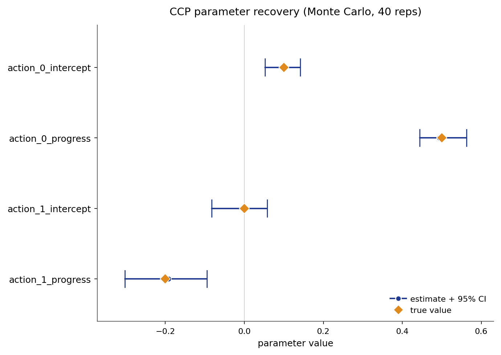

# CCP

Conditional choice probability estimation recovers primitive reward parameters from
tabular dynamic discrete choice data by replacing repeated Bellman fixed-point
computations with a single-step matrix inversion. The first stage estimates empirical
conditional choice probabilities from state-action frequencies; the Hotz-Miller
inversion theorem converts those probabilities into continuation values without solving
the Bellman equation. The Aguirregabiria-Mira nested pseudo-likelihood extension
iterates the inversion and the pseudo-likelihood to refine the structural estimate
toward full maximum likelihood efficiency.

## Source Papers

The estimator follows {ref}`Hotz and Miller (1993) <hotz-miller-1993>`, which
introduces the conditional-choice-probability inversion theorem for dynamic discrete
choice models. {ref}`Aguirregabiria and Mira (2002) <aguirregabiria-mira-2002>`
introduce the nested pseudo-likelihood algorithm that iterates the Hotz-Miller step
to approach full maximum likelihood efficiency.

## Notation

Throughout, $s$ indexes the discrete state and $a$ the discrete action, observed for
individual $i$ in period $t$. The vector $\phi(s, a)$ collects the known reward
features and $\theta$ the reward parameters to be estimated. The discount factor is
$\beta$ and the logit shock scale is $\sigma$. The additive choice-specific shock is
$\varepsilon_a$, drawn independently across choices as Type-I extreme value with scale
$\sigma$; its conditional expectation given optimality equals the emax correction
$\gamma - \log \hat\pi(a \mid s)$ (in utility units, before dividing by $\sigma$).
The transition kernel $P_a(s, s')$
gives the probability of moving to $s'$ from $s$ under action $a$, stored in
$(A, S, S)$ orientation. The first-stage empirical conditional choice probability is
$\hat\pi(a \mid s)$, estimated from state-action frequencies. The Euler-Mascheroni
constant $\gamma \approx 0.5772$ enters the logit emax correction. The
policy-weighted transition matrix $F_{\hat\pi}$, augmented feature weights
$W_\phi(s)$ and $W_e(s)$, and the pseudo choice-specific value
$\tilde{Q}_\theta(s, a;\hat\pi)$ are defined in the Model section below.

## Model

The observed data are state, action, and next-state trajectories
$(s_{it}, a_{it}, s_{i,t+1})$. The flow payoff is linear in the features:

$$
u_\theta(s, a) = \phi(s, a)^\top \theta.
$$

Given a first-stage policy $\hat\pi$, define the policy-weighted transition matrix
and the logit emax correction:

$$
F_{\hat\pi}(s, s') = \sum_a \hat\pi(a \mid s)\, P_a(s, s'),
\qquad
e_{\hat\pi}(s, a) = \gamma - \log \hat\pi(a \mid s).
$$

The emax correction $e_{\hat\pi}$ is in utility units (i.e., it enters flow payoffs
before the softmax divides by $\sigma$). For Type-I extreme value shocks with scale
$\sigma$, the Williams-Daly-Zachary theorem gives
$E[\varepsilon_a \mid a = \operatorname{argmax}_b] = \sigma(\gamma - \log \hat\pi(a \mid s))$.
This is $\sigma \cdot e_{\hat\pi}(s,a)$ in scaled units. The implementation
stores $e_{\hat\pi}$ in utility units and applies the $\sigma$ factor only when
computing the logit probabilities via $\exp(\tilde Q / \sigma)$. The two
conventions coincide at $\sigma = 1$, the scale used in the reported study.
See Rust (1994) or Hotz and Miller (1993) Lemma 1.

The integrated Bellman equation under $\hat\pi$ is:

$$
\bar{V}_{\hat\pi}(s)
= \sum_a \hat\pi(a \mid s)
  \bigl[u_\theta(s, a) + e_{\hat\pi}(s, a)
        + \beta \sum_{s'} P_a(s, s')\, \bar{V}_{\hat\pi}(s')\bigr].
$$

Collecting the $\bar{V}$ terms, this becomes
$(I - \beta F_{\hat\pi})\bar{V}_{\hat\pi} = \sum_a \hat\pi(a \mid s)\{u_\theta(s, a) + e_{\hat\pi}(s, a)\}$,
which inverts to:

$$
\bar{V}_{\hat\pi}
= (I - \beta F_{\hat\pi})^{-1}
  \sum_a \hat\pi(a \mid s)
  \bigl\{u_\theta(s, a) + e_{\hat\pi}(s, a)\bigr\}.
$$

For linear rewards, this separates into parameter-dependent and parameter-free parts:

$$
\bar{V}_{\hat\pi}(s) = W_\phi(s)^\top \theta + W_e(s),
$$

where:

$$
W_\phi = (I - \beta F_{\hat\pi})^{-1} \sum_a \hat\pi(a \mid s)\, \phi(s, a),
\qquad
W_e = (I - \beta F_{\hat\pi})^{-1} \sum_a \hat\pi(a \mid s)\, e_{\hat\pi}(s, a).
$$

The pseudo choice-specific value combines the flow utility with the discounted
continuation:

$$
\tilde{Q}_\theta(s, a; \hat\pi)
= \phi(s, a)^\top \theta
+ \beta \sum_{s'} P_a(s, s')
  \bigl\{W_\phi(s')^\top \theta + W_e(s')\bigr\}
= \tilde{z}(s,a)^\top \theta + \tilde{e}(s,a),
$$

where $\tilde{z}(s,a) = \phi(s,a) + \beta \sum_{s'} P_a(s,s') W_\phi(s')$ and
$\tilde{e}(s,a) = \beta \sum_{s'} P_a(s,s') W_e(s')$ depend on $\hat\pi$ but not on
$\theta$. One factorization of $(I - \beta F_{\hat\pi})$ per NPL step replaces the
repeated per-evaluation Bellman solves that NFXP pays at every likelihood call.

**Gradient with respect to $\theta$ (implicit-differentiation step).**
With $\hat\pi$ fixed, $W_\phi = \partial \bar{V}_{\hat\pi}/\partial\theta$
because $\bar{V}_{\hat\pi}$ is the only $\theta$-dependent quantity on the
right-hand side.  To derive the linear system for $W_\phi$ explicitly,
differentiate the fixed-$\hat\pi$ Bellman equation
$(I - \beta F_{\hat\pi})\bar{V}_{\hat\pi} = \sum_a \hat\pi(a \mid s)\,[\phi(s,a)^\top\theta + e_{\hat\pi}(s,a)]$
with respect to $\theta$:

$$
(I - \beta F_{\hat\pi})\frac{\partial \bar{V}_{\hat\pi}}{\partial\theta}
= \sum_a \hat\pi(a \mid s)\,\phi(s, a).
$$

Because $\hat\pi$ and $F_{\hat\pi}$ do not depend on $\theta$, the left-hand
side is linear in $\partial \bar{V}/\partial\theta$ and the right-hand side is
constant.  The unique solution is:

$$
W_\phi \;=\; \frac{\partial \bar{V}_{\hat\pi}}{\partial\theta}
\;=\; (I - \beta F_{\hat\pi})^{-1} \sum_a \hat\pi(a \mid s)\,\phi(s, a),
$$

which is exactly the formula already used to define $W_\phi$ above.  This shows
that $W_\phi$ is not an arbitrary matrix inversion: it is the derivative of the
CCP-implied value function with respect to $\theta$, obtained by solving the
one-shot linear system rather than differentiating through the full Bellman
iteration.  No implicit differentiation through the iteration is needed because
$\hat\pi$ is treated as a constant inside each NPL step; the nonlinear dependence
of $\hat\pi$ on $\theta$ only enters when the outer loop updates the policy.
See Aguirregabiria and Mira (2002) eqs. (4)-(5).

## Identification

CCP point-identifies the reward parameters $\theta$ under the following assumptions
and support requirements.

- **Conditional Independence (CI).** The observed state transition is Markov in the
  current state and action and does not depend on the current logit shock.
- **Additive Separability (AS).** The per-period payoff is the systematic reward plus
  an additive choice-specific shock drawn independently across choices as Type-I
  extreme value with fixed scale $\sigma$.
- **Exogenous Transitions.** The transition kernel $P_a(s, s')$ is supplied or
  estimated in a first stage, outside the payoff model.
- **Reward Normalization.** The reward level and scale need an anchor. An exit or
  absorbing action with payoff fixed to zero pins the level, and the logit scale
  $\sigma$ is held fixed.
- **Action-Dependent Feature Rank.** The reward features must vary across actions and
  have full column rank. State-only features copied across actions collapse the action
  contrasts and leave $\theta$ unidentified.
- **Action Support.** Every action must have positive empirical mass in each state
  where it is relevant. Near-zero conditional choice probabilities make the emax
  correction $\gamma - \log \hat\pi(a \mid s)$ numerically unstable.
- **State Coverage.** The first-stage policy is estimated nonparametrically by state.
  Sparsely observed states introduce approximation error into the inversion and weaken
  identification of the continuation-value terms.

These hold inside a finite discrete state space, a stationary environment with
expected-utility maximization, and a known, fixed discount factor $\beta$. Given them,
$\theta$ is point-identified. Identification weakens under thin action support, an
invalid normalization, rank-deficient action-contrast features, or sparsely observed
states.

## Estimator

CCP maximizes the pseudo log-likelihood with the policy $\hat\pi^{k-1}$ held fixed
during each inner optimization:

$$
\hat{\theta}_k
= \arg\max_\theta
  \sum_{i,t}
  \log \tilde\pi_\theta(a_{it} \mid s_{it}; \hat\pi^{k-1}),
$$

where the pseudo choice probability follows the logit rule applied to the augmented
features:

$$
\tilde\pi_\theta(a \mid s; \hat\pi)
= \frac{\exp(\tilde{Q}_\theta(s, a; \hat\pi)/\sigma)}
       {\sum_b \exp(\tilde{Q}_\theta(s, b; \hat\pi)/\sigma)}.
$$

Because $\tilde{z}(s,a)$ and $\tilde{e}(s,a)$ do not depend on $\theta$, the
gradient is a closed-form logit score and does not propagate through the inversion:

$$
\psi_i(\theta)
= \frac{1}{\sigma}
  \left[
    \tilde{z}(s_i, a_i)
    - \sum_a \tilde\pi_\theta(a \mid s_i; \hat\pi^{k-1})\, \tilde{z}(s_i, a)
  \right],
$$

where $(s_i, a_i)$ stands for a single observation $(s_{it}, a_{it})$ from the panel.

The pseudo-MLE first-order condition is:

$$
\sum_{i,t} \psi_i(\hat\theta_k) = 0,
$$

which the inner L-BFGS-B step solves numerically.

The score $\psi_i$ above drives the inner L-BFGS-B step that maximizes the
pseudo-likelihood. It is not the score used for standard errors. Those come from the
Hessian of the full structural log-likelihood, re-solving the Bellman equation at each
perturbation. That matches the NFXP convention and avoids the rank deficiency of the
pseudo-likelihood Hessian.

## System View

CCP keeps the structural target from NFXP but changes where the computation
happens. Instead of solving a new dynamic program for every trial parameter, it
first reads the policy from observed choice frequencies and uses that policy to
build a one-shot continuation-value correction.

```text
Observed panel: state, action, next state
Reward features, transition model, discount factor
        |
        v
Estimate first-stage choice probabilities by state
        |
        v
Invert the policy into continuation-value terms
        |
        v
Fit a logit pseudo-likelihood for theta
        |
        +---- stop after one Hotz-Miller step
        |
        +---- or update the policy and iterate as NPL
        |
        v
Recovered reward parameters and implied policy
```

The key tradeoff is support. CCP is fast when every relevant state-action cell
is observed often enough. Thin cells make the first-stage policy noisy, and the
inversion turns that noise into reward noise.

## Algorithm

```text
Algorithm  CCP/NPL (conditional choice probability, K-step nested pseudo-likelihood)
Input   panel {(s_it, a_it, s_{i,t+1})}, features phi, transitions P,
        discount beta, logit scale sigma, NPL steps K
Output  theta_hat, standard errors, policy pi^K, value V

1   estimate pi^0(a | s) from state-action frequencies        # first-stage CCPs
2   for k = 1, ..., K do                                      # outer NPL loop
3       F_pi(s, s') := sum_a pi^{k-1}(a | s) * P_a(s, s')   # policy-weighted transitions
4       e_pi(s, a) := gamma - log pi^{k-1}(a | s)            # emax correction (utility units)
5       W_phi, W_e := (I - beta * F_pi)^{-1} applied to      # Hotz-Miller inversion
              (sum_a pi^{k-1} * phi, sum_a pi^{k-1} * e_pi)
6       z-tilde(s, a) := phi(s, a) + beta * sum_{s'} P_a(s, s') W_phi(s')
7       e-tilde(s, a) := beta * sum_{s'} P_a(s, s') W_e(s')
8       theta_k := argmax_theta sum_{i,t} log-softmax(        # L-BFGS-B step
              (z-tilde(s_it, *)' theta + e-tilde(s_it, *)) / sigma)[a_it]
9       pi^k(a | s) := softmax(                               # update policy
              (z-tilde(s, *)' theta_k + e-tilde(s, *)) / sigma)[a]
10      if ||theta_k - theta_{k-1}|| < tol: break             # NPL convergence
11  return theta_hat = theta_K, standard errors, pi^K, V
```

The outer optimizer in step 8 is L-BFGS-B, applied to the augmented-feature logit;
the gradient is the closed-form score $\psi_i$ from the Estimator section. The
default in the public `CCP` wrapper is `num_policy_iterations=1`: the loop runs
once, giving the one-step Hotz-Miller estimator. Hotz and Miller (1993) show the one-step
estimator is root-$N$ consistent but imprecise in finite samples. Aguirregabiria
and Mira (2002, Proposition 1) show the NPL iteration recovers full
maximum-likelihood efficiency as $K$ grows. Their Monte-Carlo finding is sharper:
most of the finite-sample precision is regained by the second policy iteration,
and the further gain from iterating all the way to the MLE is small. A handful of
NPL steps is usually enough. Setting `num_policy_iterations=K` for $K > 1$ runs
the NPL iteration for $K$ steps. Setting $K = -1$ continues until parameter
convergence.

## Applicability

| Applicable when | Prefer an alternative when |
| --- | --- |
| States and actions are discrete. | Many states have weak or one-action empirical support. |
| Transitions are known or can be estimated first. | Transition estimation is the main modeling challenge. |
| The reward has a compact parametric form. | The reward must be high-dimensional or neural. |
| Rapid structural estimates are needed. | The reference nested fixed-point likelihood is required. |
| Empirical action support is strong across all states. | First-stage choice probabilities are sparse or imputed. |

CCP targets the same structural reward object as NFXP in finite tabular dynamic
discrete choice models and is preferred when the cost of repeated Bellman solves
dominates. NFXP remains the direct maximum-likelihood reference and is preferred when
first-stage policy support is a concern. MPEC reformulates the same MLE problem as a
constrained program. NNES and TD-CCP become attractive when exact matrix inversion
or exact Bellman solves are too costly. Behavioral cloning is a weaker baseline
because it stops at the first-stage policy without recovering structural rewards.

## Usage

```python
from econirl.datasets import load_rust_bus
from econirl import CCP

df = load_rust_bus()

model = CCP(
    n_states=90,
    discount=0.9999,
    utility="linear_cost",
    num_policy_iterations=10,   # NPL; set 1 for one-step Hotz-Miller
)
model.fit(df, state="mileage_bin", action="replaced", id="bus_id")

print(model.params_)
print(model.summary())
```

Counterfactual analysis re-solves the fitted dynamic program under a changed
primitive:

```python
cf = model.counterfactual(RC=4.0)      # raise the replacement cost
print(cf.params)
print(cf.policy)                        # new replacement probability by state
```

The fitted policy gives the replacement probability by state, which can be read at
specific states:

```python
print(model.predict_proba([0, 10, 50, 89]))
```

The [Quick Start](ccp/quick_start.md) page documents the full set of fitted
attributes and the full `CCPEstimator` API.

## Evidence

Parameter recovery is measured on a synthetic benchmark with known rewards,
transitions, policies, values, Q functions, and Type A, Type B, and Type C
counterfactual oracles. The figure below is a Monte-Carlo study over 40
replications: the panel is resimulated and refit on a fresh seed each time, and each
parameter is plotted as its recovered mean and 95% interval against the true value.



| Parameter | True | Recovered (mean) | 95% interval |
| --- | ---: | ---: | --- |
| `action_0_intercept` | 0.10 | 0.103 | [0.053, 0.141] |
| `action_0_progress` | 0.50 | 0.494 | [0.445, 0.562] |
| `action_1_intercept` | 0.00 | -0.003 | [-0.083, 0.058] |
| `action_1_progress` | -0.20 | -0.193 | [-0.303, -0.095] |

Across the 40 replications the true value sits inside the 95% interval for every parameter, and the mean estimate is close to the truth.

Behavioral fit and counterfactual regret on the same cell, against the known oracle
objects:

| Metric | Value |
| --- | ---: |
| Policy total variation | 0.0057 |
| Value RMSE | 0.0194 |
| Type A regret (reward shift) | 0.000213 |
| Type B regret (transition change) | 0.000362 |
| Type C regret (action removed) | 0.000086 |

The regrets are small because the recovered reward is close enough to the truth that
re-solving the intervened model reproduces almost the same policy as the oracle.
For the full cross-estimator comparison, see the
[bus engine simulation study](../simulation_studies/rust_bus.md).

## References

Source papers:

- Hotz, V. J., and Miller, R. A. (1993). "Conditional Choice Probabilities and the
  Estimation of Dynamic Models." _Review of Economic Studies_, 60(3), 497-529.
  {ref}`reference entry <hotz-miller-1993>`.
- Aguirregabiria, V., and Mira, P. (2002). "Swapping the Nested Fixed Point
  Algorithm: A Class of Estimators for Discrete Markov Decision Models."
  _Econometrica_, 70(4), 1519-1543.
  {ref}`reference entry <aguirregabiria-mira-2002>`.

Implementation and reproduction:

- Estimator source: [`econirl.estimation.ccp`](https://github.com/rawatpranjal/EconIRL/blob/main/src/econirl/estimation/ccp.py).
- sklearn wrapper: [`econirl.CCP`](https://github.com/rawatpranjal/EconIRL/blob/main/src/econirl/estimators/ccp.py).
- Validation runner: [`validation/estimators/ccp/run.py`](https://github.com/rawatpranjal/EconIRL/blob/main/validation/estimators/ccp/run.py).
- Recovery study: [`validation/estimators/ccp/recovery_mc.py`](https://github.com/rawatpranjal/EconIRL/blob/main/validation/estimators/ccp/recovery_mc.py).
- Results files: [`ccp.json`](https://github.com/rawatpranjal/EconIRL/blob/main/validation/results/ccp.json).

Pages:

- [Quick Start](ccp/quick_start.md)
- [Pre-Estimation Checks](ccp/pre_estimation.md)
- [Simulation Study](ccp/validation.md)
- [Counterfactuals](ccp/counterfactuals.md)
- [Rust Bus Engine Example](ccp/rust_bus.md)

```{toctree}
:hidden:

ccp/quick_start
ccp/pre_estimation
ccp/validation
ccp/counterfactuals
ccp/rust_bus
```
