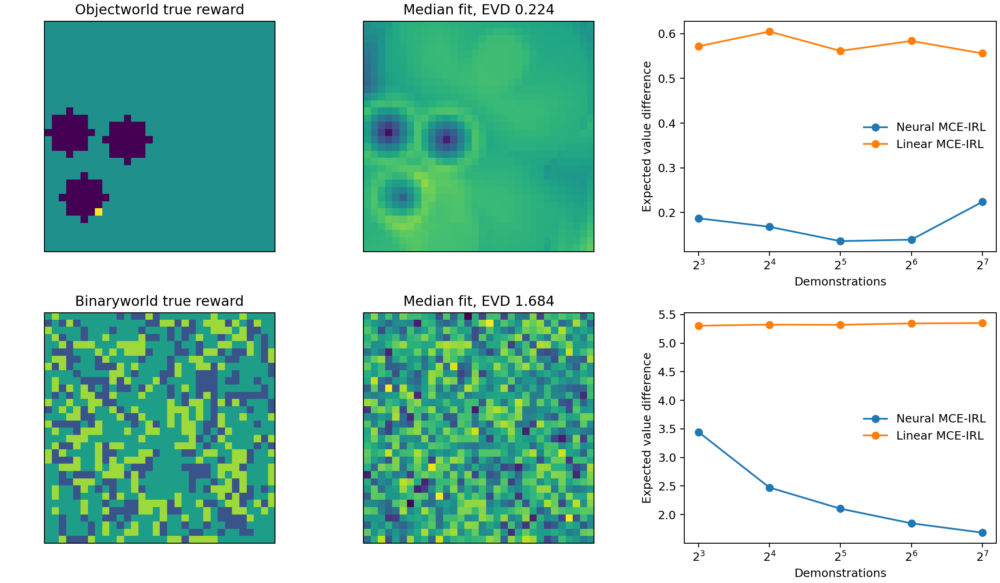

# Wulfmeier-Shaped Study

## Important Links

- [Neural MCE-IRL overview](../deep_mce_irl.md)
- [Simulation Study](validation.md)
- [Quick Start](quick_start.md)
- [Generated result file](https://github.com/rawatpranjal/EconIRL/blob/main/validation/results/deep_mce_irl_wulfmeier.json)

Wulfmeier, Ondruska, and Posner (2015) study nonlinear rewards in grid
environments. The generated comparison here follows that problem shape.

Objectworld rewards depend on distances to colored objects. Binaryworld
rewards depend on local binary features. Neural and linear MCE-IRL receive the
same task features. The neural model can combine them nonlinearly. Both
environments use a 32 by 32 grid, five actions, 30 percent random
demonstration actions, and a discount factor of 0.9.

The study varies the number of demonstrations over 8, 16, 32, 64, and 128.
Five generated panels are fitted at each sample size. Neural MCE-IRL uses three
training seeds per panel. Linear MCE-IRL is fitted once to each panel.

Each neural fit uses a 200-epoch budget. The 30 percent random-action
contamination means exact occupancy matching is not the target in this
comparison. The result file records strict convergence and termination counts.
Every linear fit used by a headline comparison must meet the feature,
occupancy, and Bellman residual tolerances. The stricter optimizer flag is
reported separately.
The controlled [Simulation Study](validation.md) provides the estimator
convergence evidence.

Expected value difference compares the true-reward value of the reference
policy with the true-reward value of each learned policy. Both values exclude
the entropy bonus. Lower values are better. An independently generated map
measures transfer through the same feature representation.

The reward panels show the true reward and the neural fit with median expected
value difference among the 15 fits at 128 demonstrations. Neural curves pool
five generated panels and three training seeds. Linear curves use the five
generated panels.

The study is a generated comparison. It is not a replication of published
numbers. The paper reports its main comparisons in figures rather than a
recoverable numerical table.

The runnable program is
[`wulfmeier.py`](https://github.com/rawatpranjal/EconIRL/blob/main/validation/estimators/deep_mce_irl/wulfmeier.py).
It checkpoints each fit and records failures instead of replacing them with
successful values.
