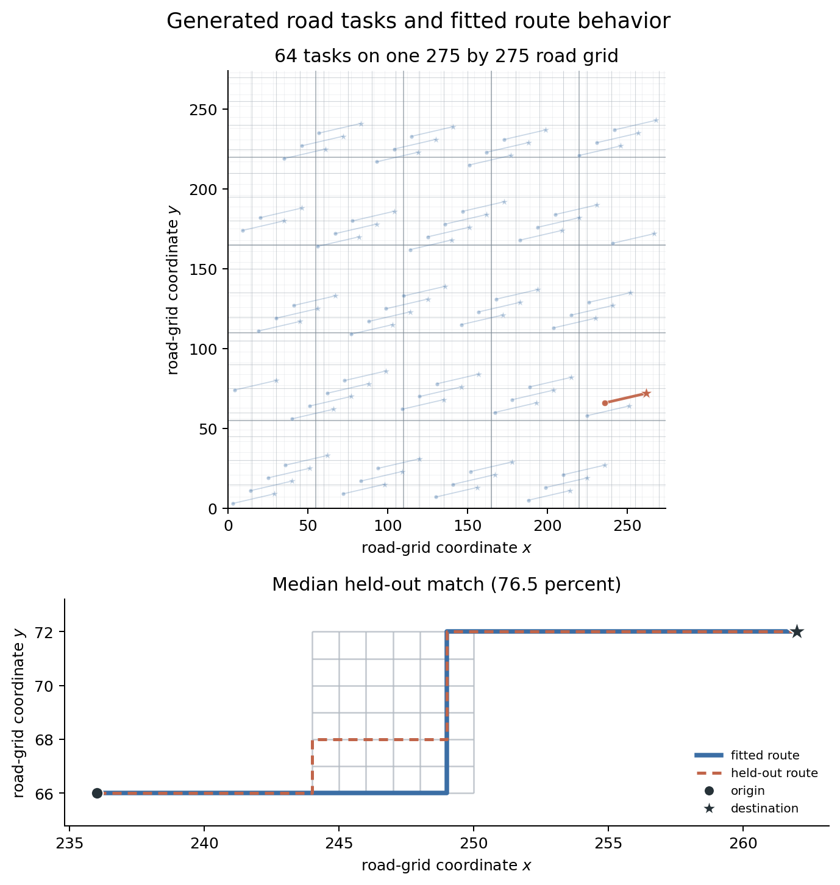

# Simulation Study

## Important Links

- [MCE-IRL overview](../mce_irl.md)
- [Quick start](quick_start.md)
- [Pre-estimation checks](pre_estimation.md)
- [Counterfactual guide](counterfactuals.md)
- [Cross-estimator simulation studies](../../simulation_studies/index.md)

MCE-IRL has three complementary checks. Estimation is tested on controlled
problems and a large generated road network. Repeated samples test inference.
Known changes to rewards and environments test counterfactual behavior.

The numerical results are in
[`mce_irl_ready.json`](https://github.com/rawatpranjal/EconIRL/blob/main/validation/results/mce_irl_ready.json),
[`mce_irl_bootstrap_calibration.json`](https://github.com/rawatpranjal/EconIRL/blob/main/validation/results/mce_irl_bootstrap_calibration.json),
[`mce_irl_ziebart_synthetic.json`](https://github.com/rawatpranjal/EconIRL/blob/main/validation/results/mce_irl_ziebart_synthetic.json),
and
[`mce_irl.json`](https://github.com/rawatpranjal/EconIRL/blob/main/validation/results/mce_irl.json).

## Three Checks

| Capability | Study design | Main result |
| --- | --- | ---: |
| Estimation | Controlled recovery and generated road tasks | Policy TV 0.00698 |
| Inference | 300 asymptotic panels and 50 bootstrap panels | Coverage 0.960 and 0.920 |
| Counterfactuals | Reward, dynamics, and choice-set changes | Maximum regret 0.000433 |

The studies use different scales for different questions. The road study checks
the application structure and route predictions. The smaller controlled
problems make repeated fitting and true counterfactual outcomes observable.

## Road Estimation

The road study follows the observable data and model structure reported by
Ziebart et al. (2008). It generates data rather than using the Pittsburgh taxi
traces or their fitted road graph.



The upper panel places all tasks on the shared road grid. The lower panel
enlarges the held-out route nearest the median distance match. The study
selects the held-out route whose distance match is nearest the held-out median.
It does not select the best-matching route.

| Road-study quantity | Generated value |
| --- | ---: |
| Directed road-segment states | 302,500 |
| Valid deterministic state-action links | 907,500 |
| Raw reward features | 22 |
| Identified fit features | 19 |
| Raw trips | 13,220 |
| Generated drivers | 25 |
| Origin-destination tasks | 64 |
| Trips discarded as short, cyclic, or noisy | 3,966 |
| Training trips | 1,851 |
| Test trips | 7,403 |

Each origin-destination pair is an `MCEIRLTask`. Its destination is absorbing.
The 64 tasks are compact views of one spatial road graph. The estimator fits
one linear reward vector shared across tasks and drivers. The generated
demonstrations include two driver types whose reward coefficients differ by a
common scale factor. The public `MCEIRL` estimator contains no road-specific
fitting logic.

The fit uses 7,552 compiled task states. It converges with a stationarity
residual of 7.37e-9.

```bash
PYTHONPATH=src:. uv run python validation/estimators/mce_irl/ziebart_road_synthetic.py --quiet
```

**Result**

```text
wrote validation/results/mce_irl_ziebart_synthetic.json
wrote docs/_static/estimators/mce_irl_ziebart_road.png
status: passed
```

The generated route metrics and the published Table 1 values appear side by
side:

| Metric | Generated | Ziebart | Difference |
| --- | ---: | ---: | ---: |
| Distance match (percent) | 80.82 | 78.79 | +2.03 pp |
| Routes with at least 90 percent match | 30.15 | 52.98 | -22.83 pp |
| Training-path average log probability | -3.86 | -6.85 | +2.99 |

Distance match is similar. The generated sample has fewer near-exact route
matches and a less negative training-path log probability. These paper values
are comparison numbers, not fitting criteria. Reproducing Table 1 requires the
original road graph, fitted routes, candidate path sets, and split.

## Controlled Estimation

A compact study holds back the true reward, policy, value function, Q function,
and occupancy measure. The estimator sees generated demonstrations, the
transition law, and the supplied reward features.

| Metric | Result |
| --- | ---: |
| Feature residual | 1.89e-12 |
| Occupancy residual | 0.00106 |
| Reward normalized RMSE | 0.0823 |
| Policy total variation | 0.00698 |

The [`mce_irl.json`](https://github.com/rawatpranjal/EconIRL/blob/main/validation/results/mce_irl.json)
result also reports normalized value and Q RMSE.

## Monte Carlo Inference

The inference study uses a one-step model with a closed-form reward parameter.
It runs the public estimator on 300 independently generated panels. Each panel
has 400 trajectories.

| Check | Result |
| --- | ---: |
| Converged fits | 300 / 300 |
| True parameter | 0.4000 |
| Mean estimate | 0.4058 |
| Bias | 0.00584 |
| RMSE | 0.0986 |
| 95 percent asymptotic interval coverage | 0.960 |
| Mean asymptotic SE | 0.1022 |
| Monte Carlo SD | 0.0985 |
| Asymptotic / bootstrap SE ratio | 1.057 |
| Largest stationarity residual | 6.62e-9 |

The standard-error comparison uses 200 bootstrap refits of one generated
panel. A reward intervention changes the action probability by 0.205.

The trajectory-bootstrap calibration uses 50 new panels. It resamples whole
individual trajectories 99 times in each panel. Failed draws are recorded and
are not retried.

| Bootstrap check | Result |
| --- | ---: |
| Usable panels | 50 / 50 |
| Successful draws | 4,950 / 4,950 |
| 95 percent bootstrap percentile coverage | 0.920 |
| Lower-tail miss rate | 0.060 |
| Upper-tail miss rate | 0.020 |
| Mean interval width | 0.383 |

```bash
PYTHONPATH=src:. uv run python validation/estimators/mce_irl/ready.py --quiet
```

**Result**

```text
wrote validation/results/mce_irl_ready.json
status: ready
```

Run the separate trajectory-bootstrap calibration with:

```bash
PYTHONPATH=src:. uv run python validation/estimators/mce_irl/bootstrap_calibration.py --quiet
```

**Result**

```text
wrote validation/results/mce_irl_bootstrap_calibration.json
```

## Counterfactuals

The controlled study changes one primitive at a time. Type A changes reward
parameters. Type B changes the transition law. Type C changes the valid-action
set.

| Change | Policy TV | Value RMSE | Regret |
| --- | ---: | ---: | ---: |
| Reward parameters | 0.006456 | 0.000742 | 0.000433 |
| Transition law | 0.006284 | 0.000523 | 0.000410 |
| Valid-action set | 0.004211 | 0.000145 | 0.000094 |

The public `counterfactual()` method re-solves reward and transition changes.
These results apply to the generated transition law and reward basis. See the
[counterfactual guide](counterfactuals.md) for the API and interpretation.

MCE-IRL also appears in the public bus engine, taxi gridworld, route choice,
stockpiling, fleet maintenance, and vehicle scrappage studies.
