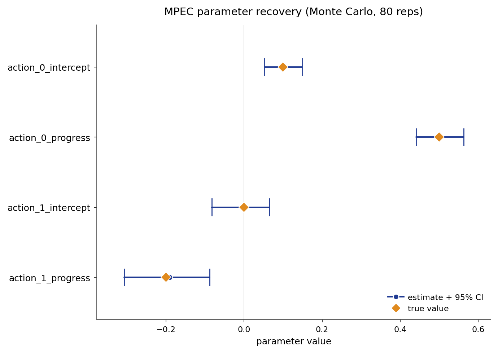

# MPEC

Mathematical programming with equilibrium constraints (MPEC) estimates the same
structural dynamic discrete choice likelihood as NFXP, through a different
numerical route. NFXP eliminates the value function by solving the Bellman fixed
point inside every likelihood evaluation. MPEC keeps the value function as an
explicit optimization variable and enforces the Bellman fixed point as an
equality constraint. The reward parameters and the value vector are estimated
jointly in a single constrained program.

## Source Papers

The constrained formulation follows {ref}`Su and Judd (2012) <su-judd-2012>`.
{ref}`Iskhakov et al. (2016) <iskhakov-2016>` compare the constrained and nested
approaches and identify conditions under which the constrained problem degrades.
The consistency argument follows {ref}`Shapiro and Xu (2005) <shapiro-xu-2005>`.
Finite-sample cautions for a related sequential-search MPEC estimator are reported
in {ref}`Koiso and Otani (2024) <koiso-otani-2024>`.

## Notation

Throughout, $s \in \{1, \dots, S\}$ indexes the discrete state ($S$ the total
state count) and $a$ the discrete action, observed for individual $i$ in period
$t$. The vector $\phi(s, a)$ collects the known reward features and
$\theta \in \mathbb{R}^K$ the reward parameters to be estimated ($K$ the
parameter dimension). The discount factor is $\beta$ and the logit shock scale
is $\sigma$. The transition kernel $P_a(s, s')$ gives the probability of moving
to $s'$ from $s$ under action $a$, stored in $(A, S, S)$ orientation. The value
function is $V$, held as an explicit variable in the constrained program. The
choice-specific value is $Q_\theta(s, a; V)$, which depends on the current value
vector. The conditional choice probability, the policy, is
$\pi_{\theta, V}(a \mid s)$.

## Model

The observed data are state, action, and next-state trajectories
$(s_{it}, a_{it}, s_{i,t+1})$. The flow payoff is linear in the features:

$$
u_\theta(s, a) = \phi(s, a)^\top \theta.
$$

With discount factor $\beta$ and logit shock scale $\sigma$, the soft Bellman
operator maps a value vector to its log-sum-exp:

$$
T_\theta V(s)
= \sigma \log \sum_a \exp\!\left(
    \frac{u_\theta(s, a) + \beta \sum_{s'} P_a(s, s') V(s')}{\sigma}
\right).
$$

The log-sum-exp form follows because integrating over Type-I extreme value shocks
yields $E[\max_a (Q_a + \varepsilon_a)] = \sigma \log \sum_a \exp(Q_a/\sigma)$
(standard result; see Rust 1987, Section 3).

Given a value vector $V$, the choice-specific value is:

$$
Q_\theta(s, a; V) = u_\theta(s, a) + \beta \sum_{s'} P_a(s, s') V(s').
$$

The implied conditional choice probability follows the logit rule:

$$
\pi_{\theta, V}(a \mid s) =
\frac{\exp(Q_\theta(s, a; V) / \sigma)}
     {\sum_b \exp(Q_\theta(s, b; V) / \sigma)}.
$$

The canonical instance is Rust's bus-engine replacement model. A bus operator
decides each period whether to keep a deteriorating engine or pay a flat cost to
replace it. The dynamic program links today's choices to tomorrow's states, so
observed choices carry information about the structural costs.

## Identification

MPEC point-identifies the reward parameters $\theta$ under the following
assumptions, which are the same structural requirements as NFXP plus one
additional condition arising from the constrained formulation.

- **Conditional independence (CI).** The observed state transition is Markov in
  the current state and action and does not depend on the current logit shock.
- **Additive separability (AS).** The per-period payoff is the systematic reward
  plus an additive choice-specific shock, drawn independently across choices as
  Type-I extreme value with fixed scale $\sigma$.
- **Exogenous transitions.** The transition kernel $P_a(s, s')$ is supplied or
  estimated in a first stage, outside the payoff likelihood.
- **Reward normalization.** The reward level and scale need an anchor. An exit or
  absorbing action with payoff fixed to zero pins the level, and the logit scale
  $\sigma$ is held fixed.
- **Action-dependent feature rank.** The reward features must vary across
  actions. The feature rank must equal the number of parameters. State-only
  features copied across actions collapse the action contrasts and leave $\theta$
  unidentified.
- **Constraint qualification.** The Bellman constraint Jacobian must be
  numerically well-conditioned at the solution. A poorly conditioned Jacobian
  makes the equality-constrained program ill-posed even when the structural
  identification conditions hold.
- **State coverage.** Each state must appear in the observed data. Unvisited
  states contribute no likelihood information to the corresponding Bellman
  constraint rows and can leave the constrained program ill-supported in those
  directions. The canonical tabular validation observes every state.

These hold inside a finite discrete state space, a stationary environment with
expected-utility maximization, and a known, fixed discount factor $\beta$. Given
them, $\theta$ is point-identified. Identification weakens under thin action
support, an invalid normalization, a state space large enough that the Bellman
constraint dimension strains the optimizer, or a discount factor approaching one.

## Estimator

MPEC maximizes the conditional log likelihood jointly over the reward parameters
and the value vector, subject to the Bellman equality constraint:

$$
(\hat\theta, \hat V)
= \arg\max_{\theta,\, V}\ \sum_{i,t} \log \pi_{\theta, V}(a_{it} \mid s_{it})
\quad \text{subject to} \quad
V - T_\theta V = 0.
$$

At any feasible point the constraint forces $V = V_\theta$, so MPEC and NFXP
evaluate the same likelihood and target the same maximum likelihood estimate.
When $V = T_\theta V$, the choice-specific values $Q_\theta(s, a; V)$ equal the
Bellman Q-values, so $\pi_{\theta, V}(a \mid s) = \pi_\theta(a \mid s)$; the two
likelihoods are identical. The difference is numerical route, not structural
object.

Standard errors use the same implicit-score identity as NFXP. At the constrained
optimum, the sensitivity of the value function to the reward parameters satisfies:

$$
(I - \beta P_\pi)\, \frac{\partial V}{\partial \theta}
= \sum_a \pi(a \mid s)\, \phi(s, a),
$$

where $P_\pi = \sum_a \operatorname{diag}(\pi_{\theta,V}(\cdot \mid a)) P_a$ is
the policy-weighted transition matrix, with $\operatorname{diag}(\pi_{\theta,V}(\cdot \mid a))$
denoting the $S \times S$ diagonal matrix whose $(s,s)$ entry is
$\pi_{\theta,V}(a \mid s)$. Here $\partial V / \partial \theta$ is an
$S \times K$ matrix; the linear system is solved once per reward parameter
($K$ right-hand sides).

This equation follows from differentiating the Bellman fixed-point constraint
$V = T_\theta V$ totally with respect to $\theta$:

$$
\frac{\partial V}{\partial \theta}
= \frac{\partial (T_\theta V)}{\partial V}\,\frac{\partial V}{\partial \theta}
  + \frac{\partial (T_\theta V)}{\partial \theta}.
$$

The two partial derivatives on the right are obtained from the log-sum-exp
expression for $T_\theta V(s)$:

- **Jacobian $\partial (T_\theta V)/\partial V$.** Differentiating
  $\sigma \log \sum_a \exp(Q_\theta(s,a;V)/\sigma)$ with respect to $V_{s'}$
  gives $\sum_a \pi(a \mid s)\, \beta P_a(s, s')$, so the $S \times S$ Jacobian
  is $\beta P_\pi$.
- **Feature gradient $\partial (T_\theta V)/\partial \theta$.** Differentiating
  with respect to $\theta$ gives $\sum_a \pi(a \mid s)\, \phi(s, a)$, the
  policy-weighted feature average.

Substituting both and rearranging yields $(I - \beta P_\pi)\,\partial V/\partial
\theta = \sum_a \pi(a \mid s)\, \phi(s, a)$.

The per-observation score is obtained by the chain rule through $\log
\pi_{\theta,V}(a_{it} \mid s_{it})$:

$$
\frac{\partial \log \pi(a_{it} \mid s_{it})}{\partial \theta}
= \frac{1}{\sigma}\!\left[
    \phi(s_{it}, a_{it}) - \sum_b \pi(b \mid s_{it})\, \phi(s_{it}, b)
  \right]
+ \frac{\beta}{\sigma} \sum_{s'}\!\left[
    P_{a_{it}}(s_{it}, s') - \sum_b \pi(b \mid s_{it})\, P_b(s_{it}, s')
  \right]
  \left(\frac{\partial V}{\partial \theta}\right)_{s'},
$$

where the second term uses the solved $\partial V/\partial \theta$ from the
linear system above. Stacking scores over observations, the sandwich covariance
is $\bigl(\sum_i g_i g_i^\top\bigr)^{-1}$ where $g_i = \sum_t (\text{score at
observation } it)$ is the per-individual score vector.

Shapiro and Xu (2005) establish that stationary points of the sample constrained
problem converge to stationary points of the population problem (their Prop. 4.2),
and that a sharp local optimum of the population problem is a sharp local optimum
of the sample problem with probability approaching one (their Thm 5.4). Thm 5.4
is the hook into the standard delta-method / sandwich asymptotic normality result
for smooth M-estimators: once the sample optimum tracks a unique, sharp population
optimum, a Taylor expansion of the first-order conditions around the true
parameter value yields $\sqrt{N}(\hat\theta - \theta_0) \xrightarrow{d} N(0, J^{-1} \Sigma J^{-\top})$,
where $J$ is the population Hessian of the log-likelihood and $\Sigma$ is the
outer product of the score, the standard sandwich form for a smooth
M-estimator. Shapiro and Xu supply the stochastic-MPEC analogue of
the regularity conditions (their smoothing assumption and Lipschitz continuity of
the equilibrium operator) that make the expected log-likelihood continuously
differentiable in $\theta$. Together these results justify treating the MPEC
estimate as consistent and asymptotically normal under a well-specified tabular
DDC with the assumptions above.

## Algorithm

```text
Algorithm  MPEC (constrained maximum likelihood, default solver="sqp")
Input   panel {(s_it, a_it, s_{i,t+1})}, features phi, transitions P,
        discount beta, logit scale sigma
Output  theta_hat, V_hat, standard errors, policy pi

1   initialize theta
2   solve  V_0 = T_theta V_0                      # warm start: Bellman fixed point
3   form the joint variable  x = (theta, V)
4   define equality constraint  c(x) = V - T_theta V   # one row per state
5   repeat                                         # SQP outer loop (scipy SLSQP)
6       compute  u(s, a) := phi(s, a)' theta
7       compute  Q(s, a; V) := u(s, a) + beta * sum_{s'} P_a(s,s') V(s')
8       compute  pi(a | s) := softmax(Q(s, :) / sigma)
9       L(theta, V) := sum_{i,t} log pi(a_it | s_it)
10      evaluate  c(x) and its Jacobian via JAX automatic differentiation
11      update  x := (theta, V) via SQP step solving the quadratic subproblem
12  until the KKT stationarity norm and constraint violation fall below tolerance
13  check  |V - T_theta V|_inf                     # inspect final Bellman residual
14  solve  (I - beta P_pi) dV/dtheta = sum_a pi(a|s) phi(s,a)
15  compute per-observation scores and the robust covariance
16  return theta_hat, V_hat, standard errors, pi(theta_hat, V_hat)
```

The default solver is `MPECConfig(solver="sqp")`: scipy SLSQP solves the
equality-constrained problem at each SQP step, with the objective gradient and
the Bellman constraint Jacobian supplied by JAX. The value vector is initialized
at the Bellman fixed point of the starting $\theta$, so the optimizer begins
feasible. No Bellman fixed-point solve is nested inside the likelihood objective.

Two additional variants are available. `solver="sqp_jax"` is an experimental
JAX-native reduced-space SQP: it maintains $V$ on the Bellman manifold by
Newton-Kantorovich restoration steps and optimizes in $\theta$-space only using
BFGS with an implicit-function-theorem gradient; it is slower than the default
and intended for research comparison. `solver="augmented_lagrangian"` converts
the constrained problem into a sequence of unconstrained L-BFGS-B subproblems
with an increasing penalty on constraint violation; it is less reliable at
discount factors near one. The string `"slsqp"` is a deprecated alias for
`"augmented_lagrangian"`, not scipy SLSQP; it emits a deprecation warning and
its convergence indicator checks only Bellman feasibility, not optimality.

## Applicability

| Applicable when | Prefer an alternative when |
| --- | --- |
| States and actions are discrete. | The Bellman constraint is too large for a constrained optimizer. |
| Transitions are known or can be estimated first. | Transition estimation is the main modeling problem. |
| The reward has a compact parametric form. | The reward must be high-dimensional or neural. |
| Bellman constraint diagnostics are central. | Only the fastest repeated comparison run is needed. |
| A constrained-likelihood cross-check on NFXP is needed. | Only a behavioral cloning baseline is required. |

MPEC targets the same structural object as NFXP and CCP through a different
numerical route. CCP is usually faster when first-stage choice probabilities are
well supported. NFXP nests the Bellman solve inside the likelihood and avoids
the constraint-dimension scaling problem; Iskhakov et al. (2016) show the
constrained problem can degrade as the state space grows or the discount factor
approaches one. NNES and TD-CCP become attractive when the state space is too
large for either repeated nested Bellman solves or the constrained program.

## Usage

The public MPEC surface is the lower-level estimator API. Create an estimator,
call `estimate`, and inspect the returned summary:

```python
from econirl.environments.rust_bus import RustBusEnvironment
from econirl.estimation.mpec import MPECEstimator, MPECConfig
from econirl.preferences.linear import LinearUtility
from econirl.simulation import simulate_panel

env = RustBusEnvironment(num_mileage_bins=20, discount_factor=0.99)
panel = simulate_panel(env, n_individuals=100, n_periods=50)
utility = LinearUtility.from_environment(env)

model = MPECEstimator(config=MPECConfig(solver="sqp"))
summary = model.estimate(
    panel=panel,
    utility=utility,
    problem=env.problem_spec,
    transitions=env.transition_matrices,
)

print(summary.parameters)
print(summary.metadata["final_constraint_violation"])
```

Inspect the Bellman residual before treating the result as structural evidence.
A high likelihood with a large residual is not a solution:

```python
# Check the Bellman residual at the solution.
violation = summary.metadata["final_constraint_violation"]
print(f"Bellman residual (inf-norm): {violation:.2e}")

# Read the policy at specific states.
print(summary.policy[[0, 5, 10, 19], :])
```

The [Quick Start](mpec/quick_start.md) page documents the full set of fitted
attributes and lower-level interface options.

## Evidence

Parameter recovery is measured on the `canonical_low_action` synthetic cell,
which has known rewards, transitions, policies, values, Q functions, and Type A,
Type B, and Type C counterfactual oracles. The figure below is a Monte-Carlo
study: the panel is resimulated and refit on a fresh seed each time, and each
parameter is plotted as its recovered mean and 95% interval against the true
value.



Recovery is measured over a Monte-Carlo run of 80 replications.

| Parameter | True | Recovered (mean) | 95% interval |
| --- | ---: | ---: | --- |
| `action_0_intercept` | 0.10 | 0.103 | [0.053, 0.148] |
| `action_0_progress` | 0.50 | 0.495 | [0.441, 0.562] |
| `action_1_intercept` | 0.00 | -0.005 | [-0.083, 0.064] |
| `action_1_progress` | -0.20 | -0.190 | [-0.307, -0.089] |

Across the 80 replications the true value sits inside the 95% interval for every parameter, and the mean estimate is close to the truth.

The behavioral and regret numbers below were produced with `solver="slsqp"` (the
legacy augmented-Lagrangian solver); the Algorithm section's default and
recommended solver is `solver="sqp"`.

Behavioral fit and counterfactual regret on the same cell, against the known
oracle objects:

| Metric | Value |
| --- | ---: |
| Policy total variation | 0.0057 |
| Value RMSE | 0.0194 |
| Type A regret (reward shift) | 0.000213 |
| Type B regret (transition change) | 0.000362 |
| Type C regret (action removed) | 0.000086 |

The regrets are small because the recovered reward is close to the true reward
and re-solving the intervened model reproduces nearly the same policy as the
oracle. For the full cross-estimator comparison on the bus-engine panel, see the
[bus engine simulation study](../simulation_studies/rust_bus.md).

## References

Source papers:

- Su, C.-L. and Judd, K. L. (2012). Constrained Optimization Approaches to
  Estimation of Structural Models. _Econometrica_, 80(5), 2213-2230.
  {ref}`reference entry <su-judd-2012>`.
- Iskhakov, F., Lee, J., Rust, J., Schjerning, B., and Seo, K. (2016). Comment on
  "Constrained Optimization Approaches to Estimation of Structural Models."
  _Econometrica_, 84(1), 365-370. {ref}`reference entry <iskhakov-2016>`.
- Shapiro, A. and Xu, H. (2005). Stochastic Mathematical Programs with
  Equilibrium Constraints, Modeling and Sample Average Approximation.
  _Optimization_, 57(3), 395-418 (published 2008).
  {ref}`reference entry <shapiro-xu-2005>`.
- Koiso, S. and Otani, S. (2024). An MPEC Estimator for the Sequential Search
  Model. arXiv:2409.04378. {ref}`reference entry <koiso-otani-2024>`.

Implementation and reproduction:

- Estimator source: [`econirl.estimation.mpec`](https://github.com/rawatpranjal/EconIRL/blob/main/src/econirl/estimation/mpec.py).
- Validation runner: [`validation/estimators/mpec/run.py`](https://github.com/rawatpranjal/EconIRL/blob/main/validation/estimators/mpec/run.py).
- Results file: [`mpec.json`](https://github.com/rawatpranjal/EconIRL/blob/main/validation/results/mpec.json).

Pages:

- [Quick Start](mpec/quick_start.md)
- [Pre-Estimation Checks](mpec/pre_estimation.md)
- [Simulation Study](mpec/validation.md)
- [Counterfactuals](mpec/counterfactuals.md)
- [Rust Bus Engine Example](mpec/rust_bus.md)

```{toctree}
:hidden:

mpec/quick_start
mpec/pre_estimation
mpec/validation
mpec/counterfactuals
mpec/rust_bus
```
