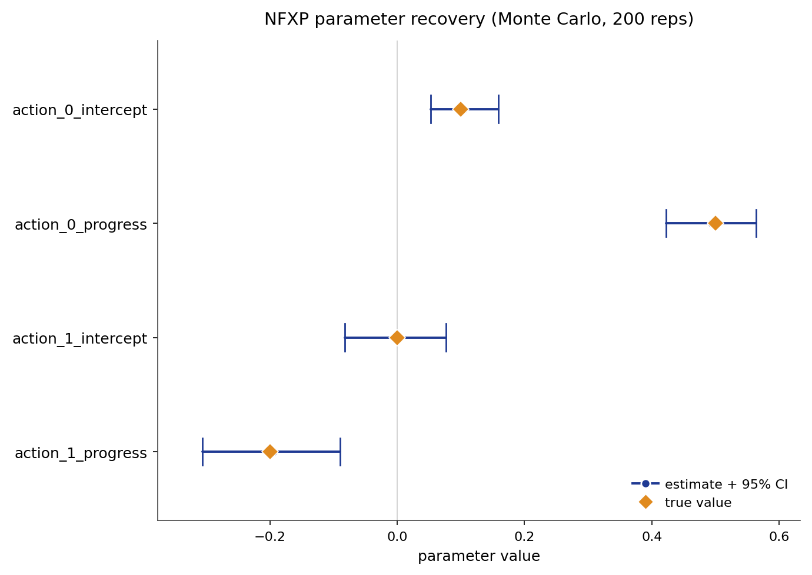

# NFXP

Nested fixed point is the reference estimator for tabular structural dynamic
discrete choice. It recovers primitive reward parameters by maximum likelihood,
nesting the solution of the agent's dynamic program inside each likelihood
evaluation. The inner loop solves the Bellman fixed point for a candidate
reward parameter. The outer loop maximizes the conditional choice log
likelihood over that parameter.

## Source Papers

The estimator follows {ref}`Rust (1987) <rust-1987>`, which introduces the
bus-engine replacement model and the nested fixed-point algorithm.
{ref}`Iskhakov et al. (2016) <iskhakov-2016>` compare the nested fixed point to
constrained-optimization alternatives and motivate the polyalgorithm inner
solver used in the package.

## Notation

Throughout, $s$ indexes the discrete state and $a$ the discrete action, observed
for individual $i$ in period $t$. The index $b$ is a dummy action variable used
in sums over the action set. The vector $\phi(s, a)$ collects the known
reward features and $\theta$ the reward parameters to be estimated. The discount
factor is $\beta$ and the logit shock scale is $\sigma$. The transition kernel
$P_a(s, s')$ gives the probability of moving to $s'$ from $s$ under action $a$,
stored in $(A, S, S)$ orientation, with $S$ states and $A$ actions. The
integrated value function is
$V_\theta(s)$, the choice-specific value is $Q_\theta(s, a)$, and the conditional
choice probability, the policy, is $\pi_\theta(a \mid s)$.

## Model

The observed data are state, action, and next-state trajectories
$(s_{it}, a_{it}, s_{i,t+1})$. The flow payoff is linear in the features:

$$
u_\theta(s, a) = \phi(s, a)^\top \theta.
$$

With discount factor $\beta$ and logit shock scale $\sigma$, the integrated value
function solves the soft Bellman fixed point $V_\theta = T_\theta V_\theta$,
where the Bellman operator $T_\theta$ is defined by:

$$
V_\theta(s)
= \sigma \log \sum_a \exp\!\left(
    \frac{u_\theta(s, a) + \beta \sum_{s'} P_a(s, s') V_\theta(s')}{\sigma}
\right).
$$

The choice-specific value is:

$$
Q_\theta(s, a) = u_\theta(s, a) + \beta \sum_{s'} P_a(s, s') V_\theta(s').
$$

The implied conditional choice probability follows the logit rule:

$$
\pi_\theta(a \mid s) =
\frac{\exp(Q_\theta(s, a) / \sigma)}
     {\sum_b \exp(Q_\theta(s, b) / \sigma)}.
$$

The canonical instance is Rust's bus-engine replacement model. A bus operator
decides each period whether to keep a deteriorating engine or pay a flat cost to
replace it. The dynamic program links today's choices to tomorrow's states, so
observed choices carry information about the structural costs.

## Identification

NFXP point-identifies the reward parameters $\theta$ under the following
assumptions.

- **Conditional independence (CI).** The observed state transition is Markov in
  the current state and action and does not depend on the current logit shock.
- **Additive separability (AS).** The per-period payoff is the systematic reward
  plus an additive choice-specific shock, drawn independently across choices as
  Type-I extreme value with fixed scale $\sigma$.
- **Exogenous transitions.** The transition kernel $P_a(s, s')$ is supplied or
  estimated in a first stage, outside the payoff likelihood.
- **Reward normalization.** The reward level and scale need an anchor. An exit or
  absorbing action with payoff fixed to zero pins the level, and the logit scale
  $\sigma$ is held fixed.
- **Action-dependent feature rank.** The reward features must vary across
  actions. The feature rank must equal the number of parameters. State-only
  features copied across actions collapse the action contrasts and leave $\theta$
  unidentified.

These hold inside a finite discrete state space, a stationary environment with
expected-utility maximization, and a known, fixed discount factor $\beta$. Given
them, $\theta$ is point-identified. Identification weakens under thin action
support, an invalid normalization, or a transition tensor supplied in the wrong
orientation.

## Estimator

NFXP maximizes the conditional log likelihood:

$$
\hat{\theta}
= \arg\max_\theta \sum_{i,t} \log \pi_\theta(a_{it} \mid s_{it}).
$$

Because $V_\theta = T_\theta V_\theta$ is an implicit equation in $\theta$, the
derivative $\partial V/\partial\theta$ is obtained by the implicit function
theorem rather than by differentiating through the iteration.

The score follows from differentiating $\log \pi_\theta(a \mid s)$ directly.
Writing out the softmax log:

$$
\frac{\partial}{\partial\theta} \log \pi_\theta(a \mid s)
= \frac{\partial}{\partial\theta}
  \!\left[
    \frac{Q_\theta(s,a)}{\sigma}
    - \log \sum_b \exp\!\left(\frac{Q_\theta(s,b)}{\sigma}\right)
  \right].
$$

Applying the chain rule and the log-sum-exp derivative $\partial \log\sum_b e^{f_b}/\partial\theta = \sum_b \pi_b \,\partial f_b/\partial\theta$:

$$
= \frac{1}{\sigma}\frac{\partial Q_\theta(s,a)}{\partial\theta}
  - \frac{1}{\sigma}\sum_b \pi_\theta(b \mid s)
    \frac{\partial Q_\theta(s,b)}{\partial\theta}.
$$

The per-observation score at observation $i$ is:

$$
\psi_i(\theta)
=
\frac{1}{\sigma}
\left[
    \frac{\partial Q_\theta(s_i, a_i)}{\partial \theta}
    -
    \sum_b \pi_\theta(b \mid s_i)
    \frac{\partial Q_\theta(s_i, b)}{\partial \theta}
\right].
$$

The MLE first-order condition is $\sum_{i,t} \psi_i(\theta) = 0$, which BHHH
iterates to solve.

The Q-gradient follows from the chain rule on
$Q_\theta(s,a) = u_\theta(s,a) + \beta\sum_{s'} P_a(s,s') V_\theta(s')$:

$$
\frac{\partial Q_\theta(s,a)}{\partial\theta}
= \phi(s,a)
  + \beta \sum_{s'} P_a(s,s')\frac{\partial V_\theta(s')}{\partial\theta}.
$$

The soft Bellman value $V_\theta(s) = \sigma \log \sum_a \exp(Q_\theta(s,a)/\sigma)$
differentiates by the log-sum-exp envelope (soft-max envelope theorem):

$$
\frac{\partial V_\theta(s)}{\partial\theta}
= \sum_a \pi_\theta(a \mid s)
  \frac{\partial Q_\theta(s,a)}{\partial\theta}.
$$

Substituting the Q-gradient into this envelope equation and collecting
$\partial V/\partial\theta$ terms on the left yields the linear system:

$$
(I - \beta P_\pi)\frac{\partial V}{\partial \theta}
= \sum_a \pi_\theta(a \mid s)\,\phi(s, a),
$$

where $P_\pi = \sum_a \operatorname{diag}_s(\pi_\theta(a \mid s))\, P_a \in \mathbb{R}^{S \times S}$
is the policy-weighted transition matrix, with $\operatorname{diag}_s(\pi_\theta(a \mid s))$
denoting the $S \times S$ diagonal matrix whose $(s,s)$ entry is $\pi_\theta(a \mid s)$.

## Algorithm

```text
Algorithm  NFXP (nested fixed-point maximum likelihood)
Input   panel {(s_it, a_it, s_{i,t+1})}, features phi, transitions P,
        discount beta, logit scale sigma
Output  theta_hat, standard errors, policy pi, value V

1   initialize theta
2   repeat                                         # outer loop: BHHH ascent
3       u_theta(s, a) := phi(s, a)' theta
4       solve  V_theta = T_theta V_theta           # inner loop: Bellman fixed point
5       Q_theta(s, a) := u_theta(s, a) + beta * sum_{s'} P_a(s, s') V_theta(s')
6       pi_theta(a | s) := exp(Q_theta(s, a)/sigma) / sum_b exp(Q_theta(s, b)/sigma)
7       L(theta) := sum_{i,t} log pi_theta(a_it | s_it)
8a      H <- sum_i psi_i(theta) psi_i(theta)^T   # BHHH information matrix
8b      theta <- theta + H^{-1} (sum_i psi_i(theta))  # Newton-like ascent step
9   until the gradient norm is below tolerance
10  return theta_hat, standard errors from the information matrix, pi_theta, V_theta
```

The inner solve in step 4 defaults to `inner_solver="polyalgorithm"`: safe
successive approximation while far from the fixed point, then Newton-Kantorovich
steps near the solution, following Iskhakov et al. (2016). Two pure variants are
also available. `sa` (successive approximation) is a contraction iteration that
converges linearly and is robust from any start. `nk` (Newton-Kantorovich)
converges quadratically near the solution but needs a good starting point. The
outer optimizer is BHHH, which builds a positive semi-definite Hessian
approximation from the outer products of the per-observation scores. The
implementation lives in `econirl.estimation.nfxp`.

The standard errors come from maximum-likelihood asymptotics. The `se_method`
argument selects the covariance estimator. `asymptotic` inverts the
observed-information matrix. `robust`, the default, returns the sandwich form, the
inverse information with the outer product of the per-observation scores in the
middle. `clustered` sums scores by individual before forming the sandwich meat, and
`bootstrap` resamples whole trajectories. `full_likelihood_bhhh` is the Rust Table
IX replication option: it forms the BHHH outer product for the joint structural and
transition-probability likelihood and reports the structural covariance block. The
conditional and robust SEs agree under correct specification and separate under
misspecification.

## Applicability

| Applicable when | Prefer an alternative when |
| --- | --- |
| States and actions are discrete. | The state space is too large for repeated Bellman solves. |
| Transitions are known or can be estimated first. | Transition estimation is the main modeling challenge. |
| The reward has a compact parametric form. | The reward must be high-dimensional or neural. |
| A structural reference estimate is required. | Only a fast imitation baseline is required. |
| Counterfactual policy analysis is central. | Only fitted choice probabilities are required. |

NFXP is the reference estimator for tabular structural estimation. CCP and MPEC
target the same structural object with different computational strategies. NNES
and TD-CCP become attractive when exact nested Bellman solves are too expensive.
UFXP attains the same asymptotic efficiency at a fraction of the cost by
eliminating the value-function dependence before the parameter search, at the
price of being an asymptotic equivalent rather than the exact finite-sample MLE.

## Usage

```python
from econirl.datasets import load_rust_bus
from econirl import NFXP

df = load_rust_bus()

model = NFXP(n_states=90, discount=0.9999, utility="linear_cost")
model.fit(df, state="mileage_bin", action="replaced", id="bus_id")

print(model.params_)
print(model.summary())
```

Counterfactual analysis re-solves the fitted dynamic program under a changed
primitive:

```python
cf = model.counterfactual(RC=4.0)      # raise the replacement cost
print(cf.params)
print(cf.policy)                       # new replacement probability by state
```

The fitted policy gives the replacement probability by state, which can be read
at specific states:

```python
print(model.predict_proba([0, 10, 50, 89]))
```

The [Quick Start](nfxp/quick_start.md) page documents the full set of fitted
attributes and the lower-level `NFXPEstimator` interface.

## Evidence

Parameter recovery is measured on the `canonical_low_action` synthetic cell,
which has known rewards, transitions, policies, values, Q functions, and Type A,
Type B, and Type C counterfactual oracles. The figure below is a Monte-Carlo
study over 200 replications: the panel is resimulated and refit on a fresh seed
each time, and each parameter is plotted as its recovered mean and 95% interval
against the true value.



Across the 200 replications the true value sits inside the 95% interval for every
parameter, and the mean estimate is close to the truth.

| Parameter | True | Recovered (mean) | 95% interval |
| --- | ---: | ---: | --- |
| `action_0_intercept` | 0.10 | 0.103 | [0.053, 0.159] |
| `action_0_progress` | 0.50 | 0.495 | [0.422, 0.563] |
| `action_1_intercept` | 0.00 | -0.003 | [-0.083, 0.077] |
| `action_1_progress` | -0.20 | -0.195 | [-0.306, -0.089] |

Behavioral fit and counterfactual regret on the same cell, against the known
oracle objects:

| Metric | Value |
| --- | ---: |
| Policy total variation | 0.0057 |
| Value RMSE | 0.0194 |
| Type A regret (reward shift) | 0.000213 |
| Type B regret (transition change) | 0.000362 |
| Type C regret (action removed) | 0.000086 |

The regrets are small because the recovered reward is close enough to the truth
that re-solving the intervened model reproduces almost the same policy as the
oracle. For the full cross-estimator comparison on the bus-engine panel, see the
[bus engine simulation study](../simulation_studies/rust_bus.md).

## References

Source papers:

- Rust, J. (1987). Optimal Replacement of GMC Bus Engines: An Empirical Model of
  Harold Zurcher. _Econometrica_, 55(5), 999-1033.
  {ref}`reference entry <rust-1987>`.
- Iskhakov, F., Lee, J., Rust, J., Schjerning, B., and Seo, K. (2016). Comment on
  "Constrained Optimization Approaches to Estimation of Structural Models."
  _Econometrica_, 84(1), 365-370. {ref}`reference entry <iskhakov-2016>`.

Implementation and reproduction:

- Estimator source: [`econirl.estimation.nfxp`](https://github.com/rawatpranjal/EconIRL/blob/main/src/econirl/estimation/nfxp.py).
- sklearn wrapper: [`econirl.NFXP`](https://github.com/rawatpranjal/EconIRL/blob/main/src/econirl/estimators/nfxp.py).
- Validation runner: [`validation/estimators/nfxp/run.py`](https://github.com/rawatpranjal/EconIRL/blob/main/validation/estimators/nfxp/run.py).
- Recovery study: [`validation/estimators/nfxp/recovery_mc.py`](https://github.com/rawatpranjal/EconIRL/blob/main/validation/estimators/nfxp/recovery_mc.py).
- Results files: [`nfxp.json`](https://github.com/rawatpranjal/EconIRL/blob/main/validation/results/nfxp.json), [`nfxp_recovery.json`](https://github.com/rawatpranjal/EconIRL/blob/main/validation/results/nfxp_recovery.json).

Pages:

- [Quick Start](nfxp/quick_start.md)
- [Pre-Estimation Checks](nfxp/pre_estimation.md)
- [Simulation Study](nfxp/validation.md)
- [Counterfactuals](nfxp/counterfactuals.md)
- [Rust Bus Engine Example](nfxp/rust_bus.md)

```{toctree}
:hidden:

nfxp/quick_start
nfxp/pre_estimation
nfxp/validation
nfxp/counterfactuals
nfxp/rust_bus
```
