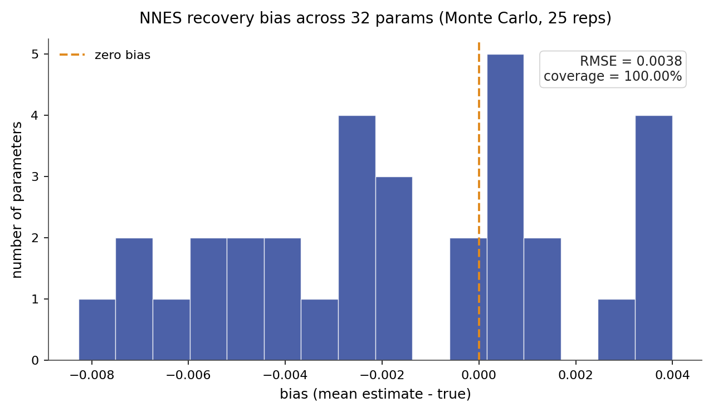

# NNES

NNES (Neural Network Estimation of Structural models) is a structural dynamic
discrete choice estimator that recovers finite-dimensional reward parameters
while representing the continuation value with a trained neural network. The
estimator embeds this approximation inside a nested pseudo-likelihood
policy-iteration loop: at the true conditional choice probabilities,
value-approximation errors are Neyman-orthogonal to the structural score, so
the pseudo-likelihood Hessian is the correct variance estimator despite the
neural nuisance object. The structural estimate supports counterfactual policy
analysis; the neural network approximates the continuation value, not the reward.

## Source Papers

The estimator follows {ref}`Nguyen (2025) <nguyen-2025>`, which introduces
neural value approximation for structural dynamic discrete choice estimation and
establishes the Neyman-orthogonality property of the nested pseudo-likelihood
mapping. {ref}`Hotz and Miller (1993) <hotz-miller-1993>` supply the
conditional-choice-probability inversion underlying the profiled NPL step, and
{ref}`Aguirregabiria and Mira (2002) <aguirregabiria-mira-2002>` develop the
nested pseudo-likelihood policy-iteration framework on which NNES builds.

## Notation

Throughout, $s$ indexes the discrete state and $a$ the discrete action, observed
for individual $i$ in period $t$. The vector $\phi(s, a)$ collects the known
reward features and $\theta$ the finite-dimensional reward parameters to be
estimated. The discount factor is $\beta$ and the logit shock scale is $\sigma$.
The transition kernel $P_a(s, s')$ gives the probability of moving to $s'$ from
$s$ under action $a$, stored in $(A, S, S)$ orientation. The integrated value
function is $V_\theta(s)$, its neural approximation is $V_\psi(s)$ with network
parameters $\psi$, and the choice-specific value under the approximation is
$Q_{\theta,\psi}(s, a)$. The conditional choice probability, the policy, is
$\pi_{\theta,\psi}(a \mid s)$. The NPL policy iterate is $\hat{P}(a \mid s)$.
The dummy action index $b$ ranges over the same action set as $a$ and appears
in softmax denominators.

The profiled integrated value $W_\theta(\hat{P})$ is the solution to the
policy-evaluation equation at fixed CCPs $\hat{P}$; it equals $V_\theta$ when
$\hat{P}$ coincides with the structural policy $\pi_{\theta,\psi}$. The
profiled value components $W_z(\hat{P})$ and $W_e(\hat{P})$ are defined by

$$
W_z(\hat{P}) = (I - \beta F_\pi)^{-1} b_z,
\qquad
W_e(\hat{P}) = (I - \beta F_\pi)^{-1} b_e,
$$

where $F_\pi[s,t] = \sum_a \hat{P}(a \mid s)\,P_a(s,t)$ is the
transition matrix induced by the fixed CCP iterate,
$b_z[s,k] = \sum_a \hat{P}(a \mid s)\,\phi(s,a,k)$ is the
policy-weighted feature vector, and
$b_e[s] = \sigma\,H\!\left(\hat{P}(\cdot \mid s)\right)$ is
$\sigma$ times the Shannon entropy at state $s$:

$$
H(s) = -\sum_a \hat{P}(a \mid s)\,\log \hat{P}(a \mid s).
$$

## Model

The observed data are state, action, and next-state trajectories
$(s_{it}, a_{it}, s_{i,t+1})$. The flow payoff is linear in the features:

$$
u_\theta(s, a) = \phi(s, a)^\top \theta.
$$

The integrated value function satisfies the soft Bellman fixed point:

$$
V_\theta(s)
= \sigma \log \sum_a \exp\!\left(
    \frac{u_\theta(s, a) + \beta \sum_{s'} P_a(s, s') V_\theta(s')}{\sigma}
\right).
$$

NNES replaces the exact value object with a trained ReLU network
$V_\psi(s) \approx V_\theta(s)$, anchored so that $V_\psi(s_0) = 0$ for a
fixed anchor state $s_0$. The choice-specific value under the approximation is:

$$
Q_{\theta,\psi}(s, a) = u_\theta(s, a) + \beta \sum_{s'} P_a(s, s') V_\psi(s').
$$

The implied conditional choice probability follows the logit rule, where $b$
runs over all actions in the denominator:

$$
\pi_{\theta,\psi}(a \mid s) =
\frac{\exp(Q_{\theta,\psi}(s, a) / \sigma)}
     {\sum_b \exp(Q_{\theta,\psi}(s, b) / \sigma)}.
$$

When $V_\psi = V_\theta$, the choice-specific value recovers the
Bellman-consistent $Q$-function and $\pi_{\theta,\psi}$ coincides with
the structural policy.

**Connection to the linear system.** The soft Bellman fixed point implies a
policy-evaluation identity (Aguirregabiria and Mira 2002, logit social-surplus
form): at the structural policy $\hat{P} = \pi_\theta$, the expected integrated
value satisfies

$$
V_\theta(s)
= \sum_a \hat{P}(a \mid s)\,Q_{\theta,\hat{P}}(s, a)
  + \sigma\,H(s),
$$

where $H(s) = -\sum_a \hat{P}(a \mid s)\log\hat{P}(a \mid s)$ is the Shannon
entropy of $\hat{P}(\cdot \mid s)$. Substituting
$Q_{\theta,\hat{P}}(s,a) = u_\theta(s,a) + \beta\sum_{s'} P_a(s,s')\,V_\theta(s')$,
writing $u_\theta = \phi^\top\theta$, and rearranging yields the linear system

$$
(I - \beta F_\pi)\,W_\theta = b_z\,\theta + b_e,
$$

where $b_z[s,k] = \sum_a \hat{P}(a\mid s)\phi(s,a,k)$ and $b_e[s] = \sigma H(s)$.
The linear system defines $W_\theta$ by policy evaluation at the current CCP
$\hat{P}$; it equals the structural value $V_\theta$ only when $\hat{P} = \pi_\theta$,
and approaches it as the NPL iterates converge. Because the right-hand side is
affine in $\theta$, the solution splits as $W_\theta = W_z\theta + W_e$ via a
single matrix solve.

The primary package evidence uses a high-action synthetic benchmark with
81 states (80 regular, 1 absorbing), a 16-dimensional encoded state
representation, 3 actions, and 32 reward parameters. This cell tests whether
the NPL-profiled neural value path recovers a finite-dimensional structural
reward when the state representation is richer than a small tabular reference.

## Identification

NNES point-identifies the reward parameters $\theta$ under the following
assumptions.

- **Conditional independence (CI).** The observed state transition is Markov in
  the current state and action and does not depend on the current logit shock.
  This separates the transition dynamics from the payoff.
- **Additive separability (AS).** The per-period payoff is the systematic reward
  plus an additive choice-specific shock, drawn independently across choices as
  Type-I extreme value with fixed scale $\sigma$. The paper's NPL orthogonality
  result is stated for this logit DDC structure.
- **Exogenous transitions.** The transition kernel $P_a(s, s')$ is supplied or
  estimated in a first stage, outside the payoff likelihood. NNES is model-based;
  without an available transition law, a transition-free estimator is required.
- **Reward normalization.** The reward level and scale need an anchor. An
  absorbing or exit action with payoff fixed to zero pins the level, and the
  logit scale $\sigma$ is held fixed.
- **Action-dependent feature rank.** The reward features must vary across
  actions. The feature rank must equal the number of parameters; state-only
  features copied across actions collapse the action contrasts and leave
  $\theta$ unidentified.
- **NPL Neyman-orthogonality.** At the true conditional choice probabilities,
  first-order errors in the value approximation $V_\psi$ drop out of the NPL
  structural score. Formally,

  $$
  \frac{\partial}{\partial \delta}
  \left[
    \sum_i
    \frac{\partial \log \pi_{\theta,\, V_\psi + \delta}(a_i \mid s_i)}
         {\partial \theta}
  \right]_{\delta=0,\; \hat{P}=\pi_{\rm true}}
  = 0,
  $$

  where $\delta$ represents a first-order perturbation to $V_\psi$
  (Nguyen 2025, Propositions 3-4). This zero-Jacobian / Neyman-orthogonality
  property means the pseudo-likelihood Hessian is the correct semiparametrically
  efficient variance estimator without an explicit debiasing correction.
- **Value-approximation regularity.** The value-network approximation error must
  be small enough to enter the structural score only at second order. This is an
  asymptotic fourth-root-style requirement, not a finite-sample guarantee; a
  poor-fitting value network can contaminate recovery even when the data
  likelihood looks acceptable.

These hold inside a finite discrete state space, a stationary environment with
expected-utility maximization, and a known, fixed discount factor $\beta$.
Identification weakens under thin action support, an invalid normalization,
or a misoriented transition tensor. An unanchored value network can drift in
high-discount problems because the absolute value level is weakly identified
by choice data alone.

## Estimator

For a fixed NPL policy iterate $\hat{P}$, the policy-evaluation equation under
the fixed CCPs is the linear system

$$
(I - \beta F_\pi)\,W_\theta = b_z\,\theta + b_e,
$$

where $F_\pi[s,t] = \sum_a \hat{P}(a \mid s)\,P_a(s,t)$,
$b_z[s,k] = \sum_a \hat{P}(a \mid s)\,\phi(s,a,k)$, and
$b_e[s] = \sigma\,H(\hat{P}(\cdot \mid s))$ are as defined in the Notation
block. Because the flow payoff $u_\theta(s,a) = \phi(s,a)^\top\theta$ is
linear in $\theta$, the right-hand side is affine in $\theta$, so the
solution splits by linearity of the matrix solve:

$$
W_\theta[\hat{P}]
= W_z(\hat{P})\,\theta + W_e(\hat{P}),
\qquad
W_z = (I - \beta F_\pi)^{-1} b_z,
\quad
W_e = (I - \beta F_\pi)^{-1} b_e.
$$

This affine structure is what makes NPL profiling possible: the value target is
computed once per outer iteration by a single matrix solve, with no inner
Bellman loop.

Differentiating $W_\theta[\hat{P}] = W_z\,\theta + W_e$ with respect to
$\theta$ at fixed $\hat{P}$ gives $\partial W / \partial\theta = W_z$ (since
$W_z$ depends only on $\hat{P}$ and the transitions, not on $\theta$).
Substituting into the choice-specific value
$Q_{\theta,\psi}(s,a) = \phi(s,a)^\top\theta + \beta\sum_{s'} P_a(s,s')\,V_\psi(s')$,
and replacing $V_\psi$ with the profiled target $W_\theta[\hat{P}]$, gives:

$$
\frac{\partial Q_{\theta,\hat{P}}(s,a)}{\partial\theta}
= \phi(s,a) + \beta\sum_{s'} P_a(s,s')\,W_z(s')
=: \tilde{z}(s,a).
$$

The profiled choice value is therefore $Q^{\hat{P}}(s,a) = \tilde{z}(s,a)^\top\theta + \tilde{e}(s,a)$,
where $\tilde{z}(s,a) = \phi(s,a) + \beta\,\mathbb{E}[W_z(s') \mid s,a]$ and
$\tilde{e}(s,a) = \beta\,\mathbb{E}[W_e(s') \mid s,a]$.
No Bellman fixed-point differentiation is needed; the implicit-differentiation
analog $(I - \beta F_\pi)\,\partial W/\partial\theta = b_z$ is solved once via
$W_z$.

The value network $V_\psi$ is trained by supervised regression on the profiled
target $W_\theta[\hat{P}]$, and the structural parameters are recovered by
maximizing the profiled pseudo-likelihood over $\tilde{z}$ and $\tilde{e}$:

$$
\hat{\theta}(\hat{P})
= \arg\max_\theta \sum_{i,t}
  \log \operatorname{softmax}\!\left(
    \frac{\tilde{z}(s_{it},\cdot)^\top\theta + \tilde{e}(s_{it},\cdot)}{\sigma}
  \right)\![a_{it}].
$$

The outer optimizer is L-BFGS-B. After the maximization step, conditional choice
probabilities are updated from the implied logit policy and the loop repeats.
The per-observation score from this profiled pseudo-likelihood has the logit form:

$$
\ell_i'(\theta)
=
\frac{1}{\sigma}
\left[
    \tilde{z}(s_i, a_i)
    -
    \sum_a \pi_{\theta,\hat{P}}(a \mid s_i)\,\tilde{z}(s_i, a)
\right],
$$

where the gradient flows through $W_z(\hat{P})$ rather than through the Bellman
fixed point, so no inner-loop differentiation is required. The estimator solves
$\sum_{i,t} \ell_{it}'(\theta) = 0$, equivalently the argmax above.

## Algorithm

```text
Algorithm  NNES-NPL (neural nested pseudo-likelihood, default variant)
Input   panel {(s_it, a_it, s_{i,t+1})}, features phi, transitions P,
        discount beta, logit scale sigma, value network V_psi,
        outer iterations K
Output  theta_hat, policy pi, value approximation V_psi

1   initialize theta
2   initialize hat_P(a | s) from empirical state-action frequencies
3   repeat K times                          # outer NPL loop
4       W_z, W_e := profiled_value_components(hat_P, P, phi, beta, sigma)
5       target_V := W_z * theta + W_e       # value profiled as affine in theta
6       target_V := target_V - target_V[anchor_state]   # anchor normalization
7       train V_psi on target_V by supervised regression
8       Q(s, a) := phi(s, a)' theta + beta * sum_{s'} P_a(s, s') V_psi(s')
9       pi(a | s) := exp(Q(s, a)/sigma) / sum_b exp(Q(s, b)/sigma)
10      theta := argmax_theta sum_{i,t}
              log softmax((z_tilde(s_it,.) theta + e_tilde(s_it,.)) / sigma)[a_it]
              # uses Q^P_hat = z_tilde theta + e_tilde (profiled, not Bellman-fixed)
12      hat_P := pi                         # update policy iterate
13  return theta_hat, standard errors from the profiled Hessian, pi, V_psi
```

The default variant is `bellman="npl"` (the `NNESEstimator` class in
`econirl.estimation.nnes`). This is the path with the Neyman-orthogonality
property; standard errors from the profiled Hessian are semiparametrically
efficient. The alternative `bellman="nfxp"` invokes `NNESNFXPEstimator`, which
trains the value network to satisfy the NFXP soft-Bellman residual rather than
the NPL profiled target. This variant does not carry the orthogonality guarantee:
value-approximation errors enter the structural score directly, so standard errors
from its Hessian are not semiparametrically efficient. The `"nfxp"` variant is
available as a diagnostic but is not the reported inference path.

## Applicability

| Applicable when | Prefer an alternative when |
| --- | --- |
| States and actions are discrete. | The state space is small enough for exact NFXP or tabular CCP. |
| The reward is finite-dimensional and parametric. | The reward itself must be unrestricted or neural. |
| The value object is too large, encoded, or smooth for repeated exact Bellman solves. | Transitions are unavailable; use TD-CCP or a transition-free estimator. |
| Transitions are known or can be estimated first. | Only in-sample choice probabilities are required. |
| Counterfactual policy analysis under changed primitives is required. | Only a fast imitation baseline is required. |
| A flexible value approximation is the modeling objective. | The cleanest exact-likelihood structural reference is required. |

NNES targets the same finite-dimensional structural object as NFXP, CCP, and
MPEC, but replaces the exact tabular Bellman solve with a neural value
approximation. CCP and MPEC use tabular continuation objects; SEES uses a
deterministic basis-function sieve. NNES becomes attractive when encoded states
or high-dimensional state representations make a neural value function the
natural modeling choice. On small tabular problems, exact NFXP or CCP can still
dominate because the neural training overhead exceeds the savings from avoiding
exact dynamic programming.

## Usage

```python
from econirl.datasets import load_rust_bus
from econirl import NNES

df = load_rust_bus()

model = NNES(
    n_states=90,
    n_actions=2,
    discount=0.9999,
    utility="linear_cost",
    bellman="npl",
    hidden_dim=32,
    num_layers=2,
    v_epochs=500,
    n_outer_iterations=3,
)
model.fit(df, state="mileage_bin", action="replaced", id="bus_id")

print(model.params_)
print(model.summary())
```

The fitted policy gives action probabilities by state and can be read at
specific states:

```python
print(model.predict_proba([0, 20, 40, 60, 80]))   # shape (5, n_actions)
```

Counterfactual policy analysis re-solves the structural model under changed
primitives using the simulation harness. The public wrapper does not expose a
`counterfactual()` method; the full `NNESEstimator` API is the route for
counterfactual re-solves in research workflows. The
[Counterfactuals](nnes/counterfactuals.md) subpage documents the three
counterfactual types and the harness-level results.

The [Quick Start](nnes/quick_start.md) page documents the full set of fitted
attributes and the full `NNESEstimator` API.

## Evidence

Parameter recovery is measured on a high-action synthetic benchmark with 81
states, a 16-dimensional encoded state representation, 3 actions, and 32 reward
parameters, with known oracle reward, policy, value, Q, and counterfactual
objects. The figure below is a Monte-Carlo study over 25
replications: the panel is resimulated and refit on a fresh seed each time, and
each parameter is plotted as its recovered mean and 95% interval against the true
value.



The recovery study resimulates and refits across 25 replications. The estimator recovers all 32 value-function weights: the aggregate recovery RMSE is 0.0038, and the true value falls inside the 95% interval for all 32 of 32 weights. The figure shows the per-weight recovery-error distribution.

Behavioral fit and counterfactual regret on the `canonical_high_action` primary
cell, against the known oracle objects from `validation/results/nnes.json`:

| Metric | Value |
| --- | ---: |
| Policy total variation | 0.0238 |
| Value RMSE | 0.1156 |
| Type A regret (reward shift) | 0.004865 |
| Type B regret (transition change) | 0.005559 |
| Type C regret (action removed) | 0.001314 |

All three regret values fall below the 0.05 threshold. The behavioral metrics
are from a single-fit oracle-comparison run, not a Monte-Carlo average; they will be
updated when the recovery study is complete. Current standard errors are not
available in the results file; that entry remains pending the Monte-Carlo run.
For the full cross-estimator comparison on the bus-engine panel, see the
[bus engine simulation study](../simulation_studies/rust_bus.md).

## References

Source papers:

- Nguyen, H. (2025). "Neural Networks for Efficient Estimation of
  High-Dimensional Dynamic Discrete Choice Models." Working paper, Georgetown
  University. {ref}`reference entry <nguyen-2025>`.
- Hotz, V. J., and Miller, R. A. (1993). "Conditional Choice Probabilities and
  the Estimation of Dynamic Models." _Review of Economic Studies_, 60(3),
  497-529. {ref}`reference entry <hotz-miller-1993>`.
- Aguirregabiria, V., and Mira, P. (2002). "Swapping the Nested Fixed Point
  Algorithm: A Class of Estimators for Discrete Markov Decision Models."
  _Econometrica_, 70(4), 1519-1543. {ref}`reference entry <aguirregabiria-mira-2002>`.

Implementation and reproduction:

- Estimator source: [`econirl.estimation.nnes`](https://github.com/rawatpranjal/EconIRL/blob/main/src/econirl/estimation/nnes.py).
- sklearn wrapper: [`econirl.NNES`](https://github.com/rawatpranjal/EconIRL/blob/main/src/econirl/estimators/nnes.py).
- Validation runner: [`validation/estimators/nnes/run.py`](https://github.com/rawatpranjal/EconIRL/blob/main/validation/estimators/nnes/run.py).
- Recovery study: `validation/estimators/nnes/recovery_mc.py` (pending; adapt from `validation/estimators/nfxp/recovery_mc.py`).
- Results file: [`nnes.json`](https://github.com/rawatpranjal/EconIRL/blob/main/validation/results/nnes.json).

Pages:

- [Quick Start](nnes/quick_start.md)
- [Pre-Estimation Checks](nnes/pre_estimation.md)
- [Simulation Study](nnes/validation.md)
- [Counterfactuals](nnes/counterfactuals.md)
- [Rust Bus Engine Example](nnes/rust_bus.md)

```{toctree}
:hidden:

nnes/quick_start
nnes/pre_estimation
nnes/validation
nnes/counterfactuals
nnes/rust_bus
```
