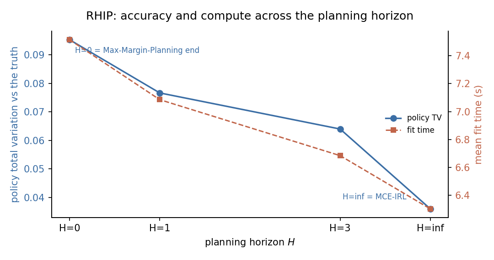

# RHIP

Receding Horizon Inverse Planning is a horizon-parameterised inverse
reinforcement learning estimator. It recovers a linear reward by matching
discounted feature expectations, with a single hyperparameter, the planning
horizon $H$, controlling how far the agent plans with the stochastic
soft-Bellman policy before falling back to a deterministic planner. The horizon
spans a family of classic methods: at $H = \infty$ it is maximum causal entropy
IRL, at $H = 0$ it is the Max-Margin-Planning end, and intermediate values
interpolate.

## Source Papers

The estimator follows {ref}`Barnes et al. (2024) <barnes-2024>`, which
introduces receding horizon inverse planning and shows that the planning horizon
spans maximum causal entropy IRL, a Bayesian-IRL-like middle ground, and
Max-Margin Planning as special cases. The infinite-horizon endpoint coincides
with maximum causal entropy IRL, following {ref}`Ziebart (2010) <ziebart-2010>`.
The package replicates the method, the horizon spectrum, not the planetary-scale
graph machinery of the source application.

## Notation

Throughout, $s$ indexes the discrete state and $a$ the discrete action, observed
for individual $i$ in period $t$. The vector $\phi(s, a)$ collects the
action-dependent reward features and $\theta$ the reward parameters to be
estimated. The discount factor is $\beta$ and the logit shock scale is $\sigma$.
The transition kernel $P_a(s, s')$ gives the probability of moving to $s'$ from
$s$ under action $a$, stored in $(A, S, S)$ orientation. The planning horizon is
$H$. The deterministic continuation value is $V^{\mathrm{det}}(s)$, the
horizon-$H$ soft value is $V_H(s)$, the choice-specific value is $Q_H(s, a)$,
and the receding-horizon policy is $\pi_H(a \mid s)$. The empirical discounted
feature occupancy is $\mu_E$ and the model occupancy under $\pi_H$ is $\mu_H$.

## Model

The observed data are state, action, and next-state trajectories
$(s_{it}, a_{it}, s_{i,t+1})$. The reward is linear in the action-dependent
features:

$$
r_\theta(s, a) = \phi(s, a)^\top \theta.
$$

Beyond the planning horizon the agent uses a cheap deterministic planner. The
continuation value is the hard-max optimum, the $\sigma \to 0$ limit of the soft
operator:

$$
V^{\mathrm{det}}(s) = \max_a \left[
    r_\theta(s, a) + \beta \sum_{s'} P_a(s, s')\, V^{\mathrm{det}}(s')
\right].
$$

Within the horizon, $H$ soft-Bellman backups run on top of $V^{\mathrm{det}}$.
Starting from $V_0 = V^{\mathrm{det}}$, for $k = 1, \dots, H$:

$$
Q_k(s, a) = r_\theta(s, a) + \beta \sum_{s'} P_a(s, s')\, V_{k-1}(s'),
\qquad
V_k(s) = \sigma \log \sum_a \exp\!\left(\frac{Q_k(s, a)}{\sigma}\right).
$$

The receding-horizon policy is the softmax of the final choice-specific values:

$$
\pi_H(a \mid s) =
\frac{\exp(Q_H(s, a) / \sigma)}{\sum_b \exp(Q_H(s, b) / \sigma)}.
$$

At $H = 0$ no soft backups run, so the policy is the softmax over the
deterministic continuation value, the Max-Margin-Planning end. As $H \to \infty$
the soft backups drive $V$ to the soft fixed point, the maximum causal entropy
end. The canonical instance is route choice on a road network: a traveller moves
one edge at a time, and the planning horizon sets how far ahead the route is
planned stochastically.

## Identification

RHIP recovers a reward representation under the maximum causal entropy dynamic
discrete choice assumptions. These are inherited unchanged from MCE-IRL; the
horizon $H$ is a planner hyperparameter, not an identifying assumption.

- **Known transitions.** The transition kernel $P_a(s, s')$ is supplied or
  estimated outside the estimator and does not depend on the reward parameters.
- **Causal behavioral model.** The agent's policy is the soft-optimal causal
  policy. The action distribution at each state is the softmax of the
  choice-specific values from the soft Bellman recursion.
- **Additive linear reward.** The reward is linear in the supplied feature
  matrix: $r_\theta(s, a) = \phi(s, a)^\top \theta$. Structural counterfactuals
  require this parametric form.
- **Reward normalization.** The reward is identified only up to transformations
  that leave behavior unchanged, including additive constants and reward
  shaping. A normalization anchor must be applied consistently when comparing
  estimated and reference rewards.
- **Action-dependent feature rank.** The feature design must vary across
  actions. State-only features broadcast across actions and leave
  action-specific payoff differences unidentified.
- **Sufficient action support.** Each action must have enough observed support
  for the occupancy comparison. Thin support leaves the corresponding reward
  directions weakly pinned.

These hold inside a finite discrete state space with a stationary environment
and a known discount factor $\beta$. Under them, the feature-moment condition
$\mu_E = \mu_H$ determines $\theta$ within the supplied feature basis and
normalization. The horizon $H$ selects which behavioral model the moments are
matched against, namely how far the agent plans stochastically, so a horizon
that fits the demonstrator-noise regime improves recovery. It adds no
identification restriction. At $H = \infty$ the assumption set is exactly that
of maximum causal entropy IRL.

## Estimator

RHIP matches discounted feature expectations. The empirical and model feature
moments are:

$$
\mu_E = \sum_{s,a} D_E(s, a)\,\phi(s, a),
\qquad
\mu_H = \sum_{s,a} D_H(s, a)\,\phi(s, a),
$$

where $D_E$ is the empirical discounted occupancy and $D_H$ is the occupancy
induced by $\pi_H$. The estimator ascends the maximum-entropy feature-matching
gradient:

$$
\nabla_\theta L(\theta) = \mu_E - \mu_H.
$$

This is the same gradient form as MCE-IRL. The horizon changes only the policy
$\pi_H$ that drives the model occupancy $D_H$, not the gradient. The empirical
occupancy, the initial distribution, and the forward state-visitation fixed
point are computed by the shared MCE-IRL occupancy helpers.

## Algorithm

```text
Algorithm  RHIP (receding-horizon feature matching, finite H)
Input   panel {(s_it, a_it, s_{i,t+1})}, features phi, transitions P,
        discount beta, logit scale sigma, horizon H
Output  theta_hat, policy pi_H, value V_H

1   compute empirical feature moments mu_E from the demonstration occupancy
2   compute initial state distribution rho_0 from the data
3   initialize theta
4   repeat                                         # outer loop: Adam ascent
5       r_theta(s, a) := phi(s, a)' theta
6       V_det := hard-max value iteration under r_theta      # deterministic tail
7       V_0 := V_det
8       for k = 1..H:                              # H soft-Bellman backups
9           Q_k(s, a) := r_theta(s, a) + beta * sum_{s'} P_a(s, s') V_{k-1}(s')
10          V_k(s)    := sigma * logsumexp_a Q_k(s, a) / sigma
11      pi_H(a | s)   := exp(Q_H(s, a)/sigma) / sum_b exp(Q_H(s, b)/sigma)
12      D_H           := forward state-visitation fixed point under pi_H, rho_0
13      mu_H          := sum_{s,a} D_H(s, a) phi(s, a)
14      grad          := mu_E - mu_H
15      update theta by Adam along grad
16  until the gradient norm or the occupancy moment is below tolerance
17  return theta_hat, pi_H, V_H
```

The infinite-horizon endpoint takes a separate path. When `horizon=float("inf")`
(or `None`), the estimator delegates to `econirl.estimation.mce_irl`, so
$H = \infty$ reproduces maximum causal entropy IRL exactly with the same config.
At finite $H$ the deterministic tail in step 6 is plain hard-max value
iteration, and $H = 0$ runs no soft backups so the policy is the softmax over
the deterministic continuation value. The implementation lives in
`econirl.estimators.rhip`.

## Applicability

| Applicable when | Prefer an alternative when |
| --- | --- |
| Demonstrations come from a discrete sequential decision problem. | Likelihood-based structural standard errors are required. |
| Transitions are known or can be supplied. | Transition estimation is the main modeling challenge. |
| Reward features are supplied and action-dependent. | Reward features are unknown or require a neural representation. |
| The full stochastic planner is too costly at scale. | A small state space makes the full soft solve cheap. |
| A tunable planning horizon between deterministic and stochastic is wanted. | A single fixed behavioral model is sufficient. |

RHIP sits across the entropy IRL family. At $H = \infty$ it coincides with
MCE-IRL, the reference entropy IRL estimator. At $H = 0$ it occupies the
Max-Margin-Planning end of the spectrum, fully deterministic and cheap.
Intermediate horizons interpolate between the two. The structural estimators
(NFXP, CCP, MPEC) target the same reward through likelihood paths and report
standard errors for $\theta$, which RHIP does not.

## Usage

RHIP fits a pre-built panel with action-dependent features and a transition
tensor in $(A, S, S)$ orientation:

```python
import numpy as np

from econirl import RHIP

model = RHIP(horizon=3, discount=0.95, scale=1.0,
            feature_names=["edge_cost", "amenity", "goal"])
model.fit(panel, features=features, transitions=transitions)

print(model.params_)
print(model.policy_.shape)
```

The horizon is the single knob. `horizon=float("inf")` recovers maximum causal
entropy IRL; `horizon=0` is the deterministic end:

```python
mce = RHIP(horizon=float("inf"))      # the MCE-IRL endpoint
mce.fit(panel, features=features, transitions=transitions)

mmp_end = RHIP(horizon=0)             # the Max-Margin-Planning end
mmp_end.fit(panel, features=features, transitions=transitions)
```

Counterfactual analysis re-solves the dynamic program under changed primitives.
The fitted primitives for this are `model.reward_matrix_`, `model.policy_`, and
`model.value_`. The fitted policy gives action probabilities by state:

```python
print(model.predict_proba([0, 10, 50, 89]))
```

## Evidence

RHIP is an inverse reinforcement learning estimator, so the reward is identified
only up to behavior-preserving transformations. Recovery is measured by
behavioral metrics, not parameter bias. The evidence is the single-regime
horizon spectrum from the high-dimensional route-choice study: a 150-node random
geometric road network with linear reward features
$[\text{edge\_cost}, \text{amenity}, \text{goal}]$ and true parameters
$\theta = [1.0, 0.5, 1.0]$. The horizon sweeps $H \in \{0, 1, 3, \infty\}$.

The figure traces policy total variation across the four horizons. Accuracy
improves smoothly as the horizon grows, and $H = \infty$ matches maximum causal
entropy IRL.



Behavioral recovery and baseline counterfactual regret per horizon, averaged
over the study replications:

| Horizon | Policy TV | Value RMSE | Baseline regret | Note |
| --- | ---: | ---: | ---: | --- |
| $H = 0$ | 0.0952 | 19.53 | 0.0519 | Max-Margin-Planning end |
| $H = 1$ | 0.0766 | 18.34 | 0.0397 | one soft backup |
| $H = 3$ | 0.0640 | 15.10 | 0.0201 | middle of the spectrum |
| $H = \infty$ | 0.0360 | 3.73 | 0.0537 | matches MCE-IRL |

Policy total variation is the distance between the estimated and true choice
probabilities, lower is better. It falls monotonically as the horizon grows. At
$H = \infty$ the estimator delegates to MCE-IRL, so its row matches MCE-IRL by
construction. The figure is accuracy-only. Wall-clock fit time is not shown,
because the $H = \infty$ path reuses the optimized MCE-IRL solver and runs faster
than the finite-horizon path here, which would invert the planning cost the
horizon is meant to trade. For the full cross-estimator comparison, see the
[high-dimensional route-choice simulation study](../simulation_studies/highdim_route_choice.md).

The horizon is an identifiable behavioral parameter, not only a compute knob. A
companion study draws demonstrations from a finite-lookahead planner with a true
lookahead $h$, then fits RHIP across a sweep of horizons. The best-fitting
horizon recovers the demonstrator's lookahead: the lowest-error horizon lands at
$H = h$ and tracks $h$ as it changes, and both the myopic $H = 0$ and the fully
stochastic $H = \infty$ ends are worse. An interior horizon is the better-
specified model when the demonstrator plans neither one step nor infinitely far
ahead. See the
[horizon-recovery simulation study](../simulation_studies/rhip_lookahead.md).

## References

Source papers:

- Barnes, M., Abueg, M., Lange, O. F., Deeds, M., Trader, J., Molitor, D.,
  Wulfmeier, M., and O'Banion, S. (2024). Massively Scalable Inverse
  Reinforcement Learning in Google Maps. _International Conference on Learning
  Representations_. arXiv:2305.11290. {ref}`reference entry <barnes-2024>`.
- Ziebart, B. D. (2010). _Modeling Purposeful Adaptive Behavior with the
  Principle of Maximum Causal Entropy_. PhD thesis, Carnegie Mellon University.
  {ref}`reference entry <ziebart-2010>`.

Implementation and reproduction:

- Estimator source and sklearn wrapper: [`econirl.estimators.rhip`](https://github.com/rawatpranjal/EconIRL/blob/main/src/econirl/estimators/rhip.py).
- Infinite-horizon endpoint delegate: [`econirl.estimation.mce_irl`](https://github.com/rawatpranjal/EconIRL/blob/main/src/econirl/estimation/mce_irl.py).
- Study script: [`scripts/study_highdim_route_choice.py`](https://github.com/rawatpranjal/EconIRL/blob/main/scripts/study_highdim_route_choice.py).
- Endpoint-equivalence test: [`tests/test_rhip.py`](https://github.com/rawatpranjal/EconIRL/blob/main/tests/test_rhip.py).
- Results file: [`study_highdim_route_choice.json`](https://github.com/rawatpranjal/EconIRL/blob/main/validation/results/study_highdim_route_choice.json).

Studies:

- [High-dimensional route choice](../simulation_studies/highdim_route_choice.md)
