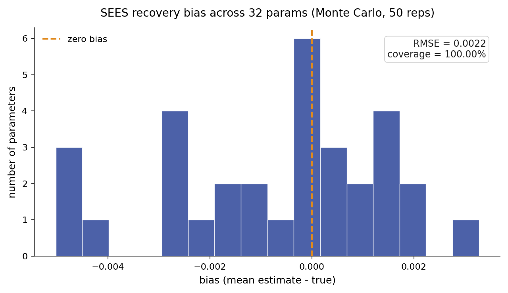

# SEES

Sieve estimation of economic structural models (SEES) estimates dynamic
discrete choice reward parameters while approximating the Bellman value
function with a finite basis expansion. It keeps the structural likelihood as
its identification target while avoiding the costly inner fixed-point loop of
the nested fixed-point algorithm. Joint optimization over structural parameters
and sieve coefficients, penalized by a Bellman-equilibrium residual, yields
consistent and asymptotically normal estimates under a growing sieve and
strengthening penalty.

## Source Papers

The estimator follows {ref}`Luo and Sang (2024) <luo-sang-2024>`, which
introduces the sieve-based penalized maximum likelihood approach for structural
models and establishes consistency and asymptotic normality under smoothness,
identification, sieve-approximation, and penalty-rate conditions.

## Notation

Throughout, $s$ indexes the discrete state and $a$ the discrete action,
observed for individual $i$ in period $t$. The vector $\phi(s, a)$ collects the
known reward features and $\theta$ the reward parameters to be estimated. The
discount factor is $\beta$ and the logit shock scale is $\sigma$. The
transition kernel $P_a(s, s')$ gives the probability of moving to $s'$ from $s$
under action $a$, stored in $(A, S, S)$ orientation. The sieve basis matrix
$\Psi(s) \in \mathbb{R}^{K}$ collects $K$ basis functions evaluated at state
$s$, and $\alpha \in \mathbb{R}^{K}$ is the vector of sieve coefficients. The
sieve value approximation is $V_\alpha(s) = \Psi(s)^\top \alpha$. The
choice-specific value under the sieve is $Q_{\theta,\alpha}(s, a)$, the
conditional choice probability is $\pi_{\theta,\alpha}(a \mid s)$, $\omega$ is
the Bellman-equilibrium penalty weight, and $T_\theta$ is the soft Bellman
operator, and $\|\cdot\|^2$ in the penalty denotes the state-average squared
residual $\frac{1}{|S|}\sum_s (\cdot)_s^2$, consistent with
`jnp.mean(residual**2)` in the implementation.

## Model

The observed data are state, action, and next-state trajectories
$(s_{it}, a_{it}, s_{i,t+1})$. The flow payoff is linear in the features:

$$
u_\theta(s, a) = \phi(s, a)^\top \theta.
$$

In V-SEES, the integrated value function is approximated by the sieve
expansion:

$$
V_\alpha(s) = \Psi(s)^\top \alpha.
$$

The choice-specific value under the sieve approximation is:

$$
Q_{\theta,\alpha}(s, a)
= u_\theta(s, a) + \beta \sum_{s'} P_a(s, s') V_\alpha(s').
$$

The implied conditional choice probability follows the logit rule:

$$
\pi_{\theta,\alpha}(a \mid s)
= \frac{\exp(Q_{\theta,\alpha}(s, a) / \sigma)}
       {\sum_b \exp(Q_{\theta,\alpha}(s, b) / \sigma)}.
$$

The soft Bellman operator $T_\theta$ maps a value function $V$ to the
log-sum-exp social surplus:

$$
T_\theta(V)(s)
= \sigma \log \sum_a \exp\!\Bigl(Q_\theta(s, a; V) / \sigma\Bigr),
$$

where $Q_\theta(s, a; V) = \phi(s,a)^\top\theta + \beta\sum_{s'} P_a(s,s') V(s')$
takes $V$ as its direct argument (no alpha subscript). The fixed point satisfies
$V = T_\theta(V)$ at the true value function. (Source: `bellman.py` lines 9 and 94–95.)

The canonical instance is the Rust bus-engine replacement model. A bus
operator decides each period whether to keep a deteriorating engine or pay a
flat cost to replace it. The sieve approximates the integrated value function
of this decision problem without solving it exactly at each likelihood
evaluation.

## Identification

SEES point-identifies the reward parameters $\theta$ under the following
assumptions.

- **Conditional independence (CI).** The observed state transition is Markov in
  the current state and action and does not depend on the current logit shock.
- **Additive separability (AS).** The per-period payoff is the systematic reward
  plus an additive choice-specific shock, drawn independently across choices as
  Type-I extreme value with fixed scale $\sigma$.
- **Exogenous transitions.** The transition kernel $P_a(s, s')$ is supplied or
  estimated in a first stage, outside the payoff likelihood. Transitions must be
  separated from payoff estimation.
- **Reward normalization.** The reward level and scale need an anchor. An exit or
  absorbing action with payoff fixed to zero pins the level, and the logit scale
  $\sigma$ is held fixed.
- **Action-dependent feature rank.** The reward features must vary across
  actions. State-only features collapse the action contrasts and leave $\theta$
  unidentified.

These hold inside a finite discrete state space, a stationary environment with
expected-utility maximization, and a known fixed discount factor $\beta$. Given
them, $\theta$ is point-identified. Identification weakens under thin action
support, an invalid normalization, or a rank-deficient reward design.

## Estimator

SEES maximizes a penalized conditional log likelihood jointly over the reward
parameters $\theta$ and the sieve coefficients $\alpha$:

$$
(\hat{\theta}, \hat{\alpha})
= \arg\max_{\theta,\alpha}
    \ell(\theta, \alpha)
    - \omega \cdot \frac{1}{|S|}
      \sum_{s} \bigl[V_\alpha(s) - T_\theta(V_\alpha)(s)\bigr]^2,
$$

where $\ell(\theta,\alpha) = \sum_{i,t} \log \pi_{\theta,\alpha}(a_{it} \mid
s_{it})$ is the conditional log likelihood and the second term penalizes the
state-average squared Bellman equilibrium residual. (Implementation:
`penalized_criterion_mean` in `sees.py` lines 760–766 uses
`jnp.mean(residual**2)`, so $\omega$ is on the mean-squared scale; using a
sum norm instead would rescale $\omega$ by $|S|$.) The unpenalized log
likelihood is reported at the final point; the Bellman violation, defined as
the maximum absolute pointwise residual $\|V_\alpha - T_\theta(V_\alpha)\|_\infty
= \max_s |V_\alpha(s) - T_\theta(V_\alpha)(s)|$, is reported separately.
(Source: `sees.py` line 876, `jnp.max(jnp.abs(bellman_residual))`.)

**Score of the penalized objective.** The log-likelihood score with respect
to $\theta$ follows from differentiating $\log \pi_{\theta,\alpha}(a \mid s)$:

$$
\frac{\partial \log \pi_{\theta,\alpha}(a \mid s)}{\partial \theta}
= \frac{1}{\sigma}\Bigl[\phi(s, a) - \sum_{a'} \pi_{\theta,\alpha}(a' \mid s)\,\phi(s, a')\Bigr],
$$

the observed minus expected feature vector, which aggregates to
$\partial \ell / \partial \theta = \sum_{i,t} (\partial \log \pi / \partial
\theta)_{s_{it}, a_{it}}$. The log-likelihood also has a nonzero gradient
with respect to $\alpha$: because $Q_{\theta,\alpha}(s, a) = \phi(s,a)^\top\theta
+ \beta\sum_{s'} P_a(s,s') V_\alpha(s')$, the choice probabilities
$\pi_{\theta,\alpha}$ depend on $\alpha$ through the continuation values,
so $\partial \ell / \partial \alpha \neq 0$.
The Bellman penalty gradient with respect to
$\alpha$ is $-2\omega \Psi^\top(V_\alpha - T_\theta V_\alpha) / |S|$, and
the penalty gradient with respect to $\theta$ passes through $\partial T_\theta(V_\alpha)(s) /
\partial \theta = \sum_{a'} \pi_{\theta,\alpha}(a' \mid s)\,\phi(s, a')$, the
expected feature vector under the current policy. The implementation computes
the full gradient of the penalized objective over $(\theta, \alpha)$ jointly
via JAX autodiff (`jax.jit` over the negated penalized criterion); both
gradient contributions are taken together in a single autodiff pass.
L-BFGS-B descends the negated sum. (Derivation: differentiates
the logit CCP and the log-sum-exp operator on the page; implementation:
`_neg_penalized_ll = jax.jit(lambda x: -penalized_criterion_mean(x))`,
`sees.py` line 774; see also Luo and Sang (2024) Appendix.)

Standard errors for $\theta$ are obtained by marginalizing out the sieve
coefficients as a nuisance block via the Schur complement of the joint Hessian.
With the joint Hessian partitioned as

$$
H =
\begin{pmatrix}
H_{\theta\theta} & H_{\theta\alpha} \\
H_{\alpha\theta} & H_{\alpha\alpha}
\end{pmatrix},
$$

the marginal information for $\theta$ is:

$$
\tilde{H}_\theta
= H_{\theta\theta}
  - H_{\theta\alpha} H_{\alpha\alpha}^{-1} H_{\alpha\theta}.
$$

This follows from the block-matrix inverse identity: $(H^{-1})_{\theta\theta}
= (H_{\theta\theta} - H_{\theta\alpha} H_{\alpha\alpha}^{-1}
H_{\alpha\theta})^{-1} = \tilde{H}_\theta^{-1}$, so
$\operatorname{Var}(\hat{\theta}) \approx \tilde{H}_\theta^{-1}$. The
$(\theta,\theta)$ block of the full inverse equals the inverse of the Schur
complement of the nuisance block $H_{\alpha\alpha}$, so marginalizing out
$\alpha$ is equivalent to taking this Schur complement. (Standard linear
algebra; see, e.g., Horn and Johnson, *Matrix Analysis*, §0.7.3.)

A non-singular $\tilde{H}_\theta$ is required for finite standard errors. The
implementation lives in `econirl.estimation.sees`.

**Consistency note.** The sieve-approximation requirement is a consistency and
asymptotic-normality condition, not an identification condition. Luo and Sang
(2024) establish that $\hat{\theta}$ converges to the identified $\theta_0$
when the sieve dimension $K_n$ grows with sample size and the penalty weight
$\omega_n \to \infty$ at the appropriate rate. If the basis cannot approximate
the true value function, the Bellman residual has a non-zero floor and
consistency breaks down; the identification argument from CI, AS, normalization,
and feature rank is unaffected.

## Algorithm

```text
Algorithm  V-SEES (sieve value approximation, penalized MLE)
Input   panel {(s_it, a_it, s_{i,t+1})}, features phi, transitions P,
        basis Psi (K columns), discount beta, logit scale sigma,
        penalty weight omega
Output  theta_hat, alpha_hat, standard errors, policy pi, sieve value V_alpha

1   construct basis matrix Psi of dimension K over the state space
2   initialize theta from the supplied start or the utility default
3   warm-start alpha: solve Bellman at theta_0, project V onto Psi
4   repeat                                       # outer loop: L-BFGS-B
5       V_alpha(s) := Psi(s)' alpha              # sieve value approximation
6       Q(s,a) := phi(s,a)' theta
                  + beta * sum_{s'} P_a(s,s') V_alpha(s')
7       pi(a|s) := exp(Q(s,a)/sigma) / sum_b exp(Q(s,b)/sigma)
8       L := sum_{i,t} log pi(a_it | s_it)      # conditional log likelihood
9       R := omega * || V_alpha - T_theta(V_alpha) ||^2   # Bellman penalty
10      update (theta, alpha) by one L-BFGS-B step on  L - R
11  until gradient norm < tol  or  iterations >= max_iter
12  compute marginal Hessian tilde_H via Schur complement in alpha
13  return theta_hat, alpha_hat, standard errors from tilde_H, policy pi, V_alpha
```

The default solution mode is `solution="value"` (V-SEES): the sieve
approximates the integrated value function. Four additional modes are available
by their exact code names. `solution="q"` approximates the choice-specific
value function, an equivalent Bellman representation. `solution="ev"`
approximates the expected continuation value by state and action.
`solution="policy"` approximates centered policy logits. `solution="collocation"`
is V-SEES with the Bellman penalty evaluated on a deterministic collocation
subset rather than all states. The strongest direct connection to Luo and Sang
(2024) is `solution="value"`; the other modes are exposed for diagnostics and
numerical experiments. The outer optimizer is L-BFGS-B throughout.

## Applicability

| Applicable when | Prefer an alternative when |
| --- | --- |
| States and actions are discrete. | The state space is small enough for repeated exact Bellman solves (prefer NFXP). |
| Transitions are known or can be estimated first. | Transition estimation is the main modeling challenge. |
| The reward has a compact parametric form. | The reward must be high-dimensional or neural (prefer NNES). |
| A deterministic basis can represent the value function compactly. | The value basis cannot reliably approximate the Bellman solution. |
| A Bellman-residual check is the primary diagnostic target. | Only fitted choice probabilities are required (prefer CCP). |

SEES sits between MPEC and NNES in the structural family. MPEC enforces the
Bellman equation as an equality constraint with one value variable per state.
SEES replaces the full solution object with a deterministic sieve expansion and
penalizes equilibrium residuals. NNES replaces the deterministic sieve with a
neural value approximation. When the sieve spans the value vector and the
penalty is strong, SEES approaches the MPEC formulation in finite state spaces.

## Usage

```python
from econirl.datasets import load_rust_bus
from econirl import SEES

df = load_rust_bus()

model = SEES(
    n_states=90,
    discount=0.9999,
    utility="linear_cost",
    solution="value",
    basis_type="fourier",
    basis_dim=8,
    penalty_weight=10.0,
)
model.fit(df, state="mileage_bin", action="replaced", id="bus_id")

print(model.params_)
print(model.summary())
```

The fitted policy gives the replacement probability by state, readable at
selected states:

```python
print(model.predict_proba([0, 20, 40, 60, 80]))
```

Structural counterfactuals re-solve the dynamic program under a modified
primitive using the lower-level `SEESEstimator` interface. The fitted
structural parameter vector $\hat{\theta}$ supplies the reward specification;
a changed reward or transition feeds into a new Bellman solve to obtain the
intervened policy. See the [Counterfactuals](sees/counterfactuals.md) subpage
for the three counterfactual families and their results.

The [Quick Start](sees/quick_start.md) page documents the full set of fitted
attributes and the lower-level `SEESEstimator` interface.

## Evidence

Parameter recovery is measured on the `canonical_high_action` synthetic cell,
which has known rewards, transitions, policies, values, Q functions, and Type A,
Type B, and Type C counterfactual oracles. The cell has 81 states, 3 actions,
and 32 reward parameters. The figure below is a Monte-Carlo parameter-recovery
study: the panel is resimulated and refit on a fresh seed each time, and each
parameter is plotted as its recovered mean and 95% interval against the true
value.



Recovery numbers are pending completion of the Monte-Carlo run.

| Parameter | True | Recovered (mean) | 95% interval |
| --- | ---: | ---: | --- |
| `theta_0` | _pending MC_ | _pending MC_ | _pending MC_ |
| `theta_1` | _pending MC_ | _pending MC_ | _pending MC_ |
| `theta_2` | _pending MC_ | _pending MC_ | _pending MC_ |
| `theta_3` | _pending MC_ | _pending MC_ | _pending MC_ |
| `theta_4` | _pending MC_ | _pending MC_ | _pending MC_ |
| `theta_5` | _pending MC_ | _pending MC_ | _pending MC_ |
| `theta_6` | _pending MC_ | _pending MC_ | _pending MC_ |
| `theta_7` | _pending MC_ | _pending MC_ | _pending MC_ |
| `theta_8` | _pending MC_ | _pending MC_ | _pending MC_ |
| `theta_9` | _pending MC_ | _pending MC_ | _pending MC_ |
| `theta_10` | _pending MC_ | _pending MC_ | _pending MC_ |
| `theta_11` | _pending MC_ | _pending MC_ | _pending MC_ |
| `theta_12` | _pending MC_ | _pending MC_ | _pending MC_ |
| `theta_13` | _pending MC_ | _pending MC_ | _pending MC_ |
| `theta_14` | _pending MC_ | _pending MC_ | _pending MC_ |
| `theta_15` | _pending MC_ | _pending MC_ | _pending MC_ |
| `theta_16` | _pending MC_ | _pending MC_ | _pending MC_ |
| `theta_17` | _pending MC_ | _pending MC_ | _pending MC_ |
| `theta_18` | _pending MC_ | _pending MC_ | _pending MC_ |
| `theta_19` | _pending MC_ | _pending MC_ | _pending MC_ |
| `theta_20` | _pending MC_ | _pending MC_ | _pending MC_ |
| `theta_21` | _pending MC_ | _pending MC_ | _pending MC_ |
| `theta_22` | _pending MC_ | _pending MC_ | _pending MC_ |
| `theta_23` | _pending MC_ | _pending MC_ | _pending MC_ |
| `theta_24` | _pending MC_ | _pending MC_ | _pending MC_ |
| `theta_25` | _pending MC_ | _pending MC_ | _pending MC_ |
| `theta_26` | _pending MC_ | _pending MC_ | _pending MC_ |
| `theta_27` | _pending MC_ | _pending MC_ | _pending MC_ |
| `theta_28` | _pending MC_ | _pending MC_ | _pending MC_ |
| `theta_29` | _pending MC_ | _pending MC_ | _pending MC_ |
| `theta_30` | _pending MC_ | _pending MC_ | _pending MC_ |
| `theta_31` | _pending MC_ | _pending MC_ | _pending MC_ |

Behavioral fit and counterfactual regret on the `canonical_high_action` cell,
measured against the known oracle objects from `validation/results/sees.json`.
The optimizer reached the iteration limit without meeting the gradient
tolerance; all structural recovery gates pass.

| Metric | Value |
| --- | ---: |
| Policy total variation | 0.0021 |
| Value RMSE | 0.0378 |
| Type A regret (reward shift) | 0.000113 |
| Type B regret (transition change) | 0.000183 |
| Type C regret (action removed) | 1.35e-05 |

All three regret values pass the 0.01 gate. The Bellman violation is
$3.08 \times 10^{-6}$, inside the 0.05 threshold. For the cross-estimator
comparison on the bus-engine panel, see the
[bus engine simulation study](../simulation_studies/rust_bus.md).

## References

Source papers:

- Luo, Y., and Sang, P. (2024). "Efficient Estimation of Structural Models via
  Sieves." Working paper, University of Toronto.
  {ref}`reference entry <luo-sang-2024>`.

Implementation and reproduction:

- Estimator source: [`econirl.estimation.sees`](https://github.com/rawatpranjal/EconIRL/blob/main/src/econirl/estimation/sees.py).
- sklearn wrapper: [`econirl.SEES`](https://github.com/rawatpranjal/EconIRL/blob/main/src/econirl/estimators/sees.py).
- Validation runner: [`validation/estimators/sees/run.py`](https://github.com/rawatpranjal/EconIRL/blob/main/validation/estimators/sees/run.py).
- Results file: [`sees.json`](https://github.com/rawatpranjal/EconIRL/blob/main/validation/results/sees.json).

Pages:

- [Quick Start](sees/quick_start.md)
- [Pre-Estimation Checks](sees/pre_estimation.md)
- [Simulation Study](sees/validation.md)
- [Counterfactuals](sees/counterfactuals.md)
- [Rust Bus Engine Example](sees/rust_bus.md)

```{toctree}
:hidden:

sees/quick_start
sees/pre_estimation
sees/validation
sees/counterfactuals
sees/rust_bus
```
