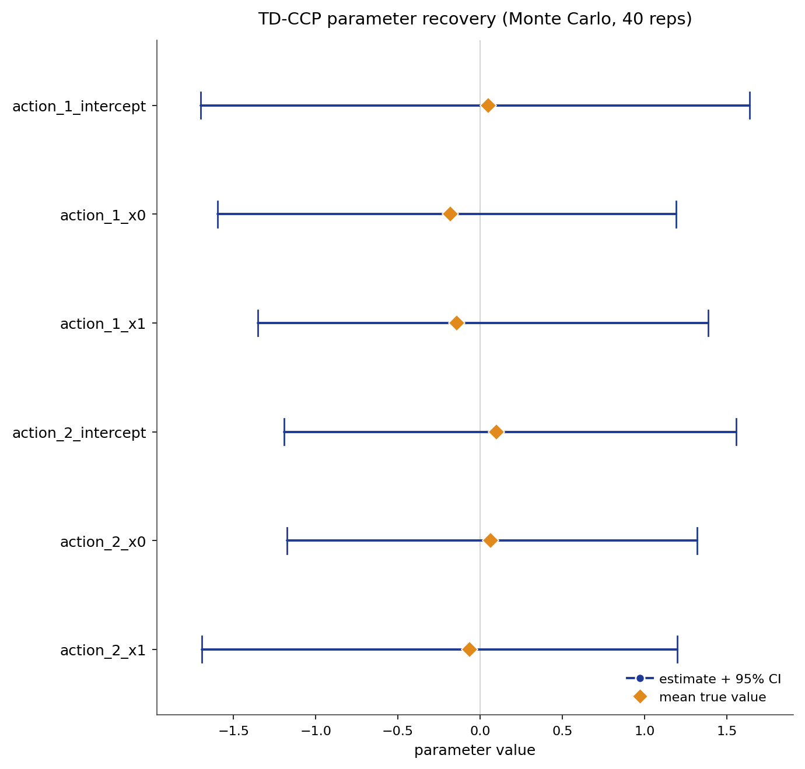

# TD-CCP

TD-CCP estimates finite-dimensional structural reward parameters in dynamic
discrete choice models using conditional choice probabilities and
temporal-difference recursions. The parameter-estimation stage recovers the
linear reward weight vector $\theta$ without constructing a model for the
transition density. Observed current and successor state-action pairs identify
two recursive continuation objects, which enter a CCP pseudo-log-likelihood in
place of the transition integral. Cross-fitted, locally robust standard errors
correct for first-stage estimation error in those objects and deliver valid
inference at parametric rates.

## Source Papers

The estimator follows {ref}`Adusumilli and Eckardt (2025)
<adusumilli-eckardt-2025>`, which introduces the temporal-difference CCP
construction, the semigradient closed-form solve for the continuation
accumulators, the locally robust correction recursion, and a cross-fitting
procedure for valid inference. The CCP foundation is
{ref}`Hotz and Miller (1993) <hotz-miller-1993>`, which first expresses the
dynamic programming problem in terms of conditional choice probabilities and
inverts the CCP mapping to recover structural parameters.

## Notation

Throughout, $x$ indexes the discrete state and $a$ the discrete action,
following the notation of Adusumilli and Eckardt (2025). Observations are
recorded for individual $i$ in period $t$ as current and successor tuples
$(a_t, x_t, a_{t+1}, x_{t+1})$. The vector $z(a, x)$ collects the known
reward features and $\theta$ the finite-dimensional reward parameter vector.
The discount factor is $\beta$ and the logit shock scale is $\sigma$. The
transition kernel $P_a(x, x')$ gives the probability of moving to $x'$ from
$x$ under action $a$, stored in $(A, S, S)$ orientation; the
parameter-estimation stage does not model this kernel. The first-stage
conditional choice probability is $P(a \mid x)$. The reward-feature
accumulator is $h(a, x)$ and the choice-shock accumulator is $g(a, x)$; both
are identified from observed successor pairs without a density model. The
basis function $\phi(a, x)$ is a user-chosen finite-dimensional feature vector
over (action, state) pairs that spans the approximation space for $h$ and $g$;
the default is action-interacted polynomial functions of the state index;
the estimated accumulator evaluates as $\hat{h}(a, x) = \phi(a, x)^\top
\hat{\omega}$. The integrated value function is $V_\theta(x)$ and the
choice-specific value is $\tilde{Q}_\theta(a, x) = h(a, x)^\top \theta +
g(a, x)$.

## Model

The data are current and successor state-action tuples
$(a_t, x_t, a_{t+1}, x_{t+1})$ from a stationary infinite-horizon discrete
choice model. The flow payoff is linear in known reward features:

$$
u_\theta(a, x) = z(a, x)^\top \theta.
$$

The reward-feature accumulator $h$ satisfies the Bellman-style recursion:

$$
h(a, x) = z(a, x) + \beta\,\mathbb{E}\bigl[h(a', x') \mid a, x\bigr].
$$

The choice-shock accumulator $g$ satisfies:

$$
g(a, x) = \beta\,\mathbb{E}\bigl[e(a', x') + g(a', x') \mid a, x\bigr],
\qquad e(a, x) = \gamma_{\mathrm{E}} - \log P(a \mid x),
$$

where $\gamma_{\mathrm{E}}$ is the Euler-Mascheroni constant and $e(a, x)$ is
the CCP-inverted shock accumulator. Under the logit model, the expected shock
conditional on choosing $a$ is $\mathbb{E}[\varepsilon_a \mid a \text{ chosen}]
= \gamma_{\mathrm{E}} - \log \pi(a \mid x)$ (Hotz and Miller 1993),
so $e(a, x) = \gamma_{\mathrm{E}} - \log P(a \mid x)$ recovers the conditional
shock from the observed CCP. Neither recursion requires modeling the transition
density; both are identified from observed successor pairs.

Substituting the Bellman equation recursively, the choice-specific value
$Q(a, x)$ decomposes linearly into a reward-accumulator term $h(a, x)^\top
\theta$ and a choice-shock term $g(a, x)$ that absorbs all future logit shocks
(the Q-decomposition of Adusumilli and Eckardt 2025). This decomposition holds because
the linear reward structure lets the two accumulators be estimated separately.
The implied choice-specific value is:

$$
\tilde{Q}_\theta(a, x) = h(a, x)^\top \theta + g(a, x),
$$

and the conditional choice probability follows the logit rule with scale
$\sigma$:

$$
\pi_\theta(a \mid x)
= \frac{\exp\{\tilde{Q}_\theta(a, x) / \sigma\}}
       {\sum_b \exp\{\tilde{Q}_\theta(b, x) / \sigma\}}.
$$

The implementation uses the full $\sigma$ via `problem.scale_parameter` at
every evaluation point; the default is $\sigma = 1$.

The canonical evaluation instance is the encoded-state design: 81 states,
3 actions, and 6 reward parameters. Reward features are polynomial functions
of two encoded state coordinates; action 0 serves as the reward-normalized
baseline.

## Identification

TD-CCP point-identifies the reward parameters $\theta$ under the following
assumptions.

- **Conditional Independence (CI).** The observed state transition is Markov
  in the current state and action and does not depend on the current logit
  shock.
- **Additive Separability (AS).** The per-period payoff is the systematic
  reward plus an additive choice-specific shock, drawn independently across
  choices as Type-I extreme value with fixed scale $\sigma$.
- **Finite Linear Reward.** The flow utility is a known finite-dimensional
  linear function $z(a, x)^\top \theta$ of the reward features. The reward
  target is the finite parameter vector $\theta$; the estimator does not
  recover an unrestricted functional form.
- **Reward Normalization.** A baseline action with reward features fixed to
  zero anchors the reward level and pins the logit scale.
- **Action-Dependent Feature Rank.** The reward features must vary across
  actions; the action-contrast rank must equal the number of parameters.
  State-only features copied identically across actions difference out of the
  choice probabilities and leave $\theta$ on a ridge.

These hold in a finite discrete state space, a stationary environment, and
with a known fixed discount factor $\beta$. Given these conditions, $\theta$
is point-identified. Identification weakens under thin action support (which
destabilizes first-stage CCPs), an invalid reward normalization, or a
near-singular basis for the continuation accumulators.

## Estimator

The preliminary estimator maximizes the CCP pseudo-log-likelihood:

$$
\tilde{\theta}
= \arg\max_\theta \sum_{i,t} \log \pi_\theta(a_{it} \mid x_{it}),
$$

where $\pi_\theta$ uses the semigradient estimates $\hat{h}$ and $\hat{g}$ in
place of the transition integral. The basis function $\phi(a, x)$ is a
user-chosen finite-dimensional feature vector over (action, state) pairs that
spans the approximation space for $h$ and $g$; the default is action-interacted
polynomial functions of the state index. The semigradient solve for $h$ takes
the closed form:

$$
\hat{\omega}
= \Bigl[\mathbb{E}_n\bigl\{\phi(a,x)
    \bigl(\phi(a,x) - \beta\phi(a',x')\bigr)^\top\bigr\}\Bigr]^{-1}
  \mathbb{E}_n\bigl\{\phi(a,x)\,z(a,x)\bigr\},
$$

with $\hat{h}(a, x) = \phi(a, x)^\top \hat{\omega}$. The analogous equation
for $g$ substitutes the next-period shock $\beta\, e(a', x')$ as the regression
target:

$$
\hat{\omega}_g
= \Bigl[\mathbb{E}_n\bigl\{\phi(a,x)
    \bigl(\phi(a,x) - \beta\phi(a',x')\bigr)^\top\bigr\}\Bigr]^{-1}
  \mathbb{E}_n\bigl\{\phi(a,x)\cdot \beta\, e(a', x')\bigr\},
\quad e(a, x) = \gamma_{\mathrm{E}} - \log P(a \mid x).
$$

The matrix $A = \mathbb{E}_n\{\phi(\phi - \beta\phi')^\top\}$ is shared between
the $h$ and $g$ solves, so both require only one matrix inversion.

The score of the pseudo-log-likelihood with respect to $\theta$ is:

$$
\frac{\partial}{\partial \theta} \log \pi_\theta(a \mid x)
= \frac{h(a, x) - \sum_b \pi_\theta(b \mid x)\, h(b, x)}{\sigma}.
$$

Setting $\mathbb{E}_n[\text{score}] = 0$ and treating $\hat{h}$ and $\hat{g}$
as fixed gives the partial MLE first-order condition that defines
$\tilde{\theta}$.

### Locally Robust Inference

The plug-in score ignores estimation error in $\hat{h}$ and $\hat{g}$.
The locally robust correction debiases the moment by adding a term indexed by
$\lambda(a, x)$. The corrected moment for observation $i$ is:

$$
\zeta_i = m_i + \lambda(a_i, x_i) \cdot \delta_i,
$$

where $m_i = \partial_\theta \log \pi_\theta(a_i \mid x_i)$ is the plug-in
score and $\delta_i$ collects the TD residuals of $h$ and $g$ at observation
$i$ (Adusumilli and Eckardt 2025). The correction function $\lambda$
solves the backward fixed-point:

$$
\lambda(a', x') = -m(a', x';\,\theta,\hat{h},\hat{g})
                  + \beta\,\lambda(a, x),
$$

reversing the time direction relative to the forward recursion for $h$ and $g$
(source: `_compute_backward_value`). **Sign convention note.** This page
writes the correction moment as $\zeta_i = m_i + \lambda \cdot \delta_i$ and the
backward recursion with $-m$. Adusumilli and Eckardt (2025) may use the opposite
sign on $m$ together with a compensating sign on $\zeta$; the two conventions are
algebraically equivalent and produce the same corrected estimator. The robust estimator
$\hat{\theta}$ solves $\mathbb{E}_n[\zeta_i] = 0$. The asymptotic variance is
given by the sandwich formula:

$$
\hat{V} = \bigl(G^\top \hat{\Omega}^{-1} G\bigr)^{-1},
\quad G = \mathbb{E}_n\!\left[\frac{\partial \zeta_i}{\partial \theta^\top}\right],
\quad \hat{\Omega} = \mathbb{E}_n[\zeta_i \zeta_i^\top].
$$

Under the conditions of Adusumilli and Eckardt (2025), $\sqrt{n}(\hat{\theta} -
\theta_0) \to \mathcal{N}(0, V)$. With cross-fitting (the cross-fitting procedure
of Adusumilli and Eckardt 2025), $\lambda$ is computed on one fold using objects
learned on the complementary fold, giving valid inference at parametric rates
with standard errors clustered by individual. The deep asymptotic proof is
stated and cited; it is not re-derived here.

## Algorithm

```text
Algorithm  TD-CCP (semigradient, locally robust cross-fitting)
Input   panel {(a_it, x_it, a_{i,t+1}, x_{i,t+1})}, reward features z,
        basis phi, discount beta, fold count K
Output  theta_hat, standard errors, policy pi, value V

1   estimate first-stage CCPs P(a | x) from observed choices          # logit or frequency
2   partition individuals into K folds
3   for k = 1, ..., K:
4       using data from folds != k, solve for h_k by semigradient TD:
            omega_k = [E_n{phi(a,x)(phi(a,x) - beta phi(a',x'))'}]^{-1}
                       E_n{phi(a,x) z(a,x)}
5       using data from folds != k, solve for g_k analogously
            with target beta (gamma_E - log P(a' | x'))
6       on fold k data, solve the preliminary CCP pseudo-likelihood for tilde_theta_k
7       on fold k data, compute the correction recursion lambda_k           # backward fixed-point; see Locally Robust Inference
8       on fold k data, solve the locally robust moment equation for theta_k # zeta_i = 0; see Locally Robust Inference
9   theta_hat := average_k(theta_k)
10  standard errors from the fold covariances, clustered by individual
11  return theta_hat, standard errors, policy pi_theta, value V_theta
```

The parameter-estimation stage does not model the transition kernel; the
accumulators $\hat{h}$ and $\hat{g}$ are identified entirely from observed
successor pairs $(a_t, x_t, a_{t+1}, x_{t+1})$.

The default estimator uses `method="semigradient"`, `cross_fitting=True`, and
`robust_se=True`, implementing the locally robust cross-fitting procedure of
Adusumilli and Eckardt (2025). The semigradient steps (4 and 5) reduce to single
matrix solves, making recursive-term estimation fast. The alternative
`method="neural"` replaces the semigradient closed-form solves with neural
approximate value iteration, which trains neural networks for $h$ and $g$
iteratively; it
is more flexible for high-dimensional state spaces and does not use
cross-fitting or locally robust standard errors in the current implementation.
The implementation lives in `econirl.estimation.td_ccp`.

## Applicability

| Applicable when | Prefer an alternative when |
| --- | --- |
| Choices are discrete and agents are forward-looking. | The state space is small and tabular Bellman solves are feasible (NFXP). |
| The panel records current and next state-action pairs. | The panel does not record successor states or actions. |
| Transition-density modeling is the main bottleneck. | Transitions are known or easily estimated (CCP or NFXP). |
| The reward is a finite linear function of known features. | The reward target is an unrestricted neural map (IRL family). |
| Locally robust standard errors are required for inference. | Observed action support is very sparse at key states. |

TD-CCP occupies the niche between exact tabular methods and IRL. NFXP and
MPEC nest the Bellman solve inside the likelihood and require the full
transition tensor; CCP inverts the CCP mapping and needs the transition object
for the future-value terms. TD-CCP sidesteps the transition-density modeling
step entirely for reward-parameter estimation, at the cost of requiring
observed successor state-action pairs in the panel. NNES and UFXP are
attractive when Bellman solves are feasible but the main goal is computation
speed. Counterfactual evaluation under an intervened transition process still
requires a transition environment; TD-CCP's advantage is confined to the
parameter-estimation stage.

## Usage

```python
from econirl.datasets import load_rust_bus
from econirl import TDCCP

df = load_rust_bus()

model = TDCCP(
    n_states=90,
    n_actions=2,
    discount=0.9999,
    utility="linear_cost",
    method="semigradient",
)
model.fit(df, state="mileage_bin", action="replaced", id="bus_id")

print(model.params_)
print(model.summary())
```

The fitted policy gives the action probability at each state:

```python
states = [0, 10, 50, 89]
print(model.predict_proba(states))
```

Counterfactual evaluation re-solves the dynamic program under a changed reward
or transition primitive. The public wrapper exposes the fitted parameters,
policy, and confidence intervals; re-solution under an intervened environment
uses `econirl.estimation.td_ccp.TDCCPEstimator` with a supplied transition
tensor. See the [Counterfactuals](tdccp/counterfactuals.md) subpage for the
counterfactual taxonomy and reported regret values.

The [Quick Start](tdccp/quick_start.md) page documents the full set of fitted
attributes and the lower-level `TDCCPEstimator` interface.

## Evidence

Parameter recovery is measured on the `shapeshifter_encoded_state_locally_robust`
synthetic cell, which has known rewards, transitions, policies, values, Q
functions, and Type A, Type B, and Type C counterfactual oracles. The figure
below is a Monte-Carlo study: the panel is resimulated on a fresh seed each
replication, and each parameter is plotted as its recovered mean and 95%
interval against the true value.



Parameter recovery on the `shapeshifter_encoded_state_locally_robust` cell
across 40 replications. Each replication resimulates the panel on a fresh seed
and refits the estimator.

| Parameter | True | Recovered (mean) | 95% interval |
| --- | ---: | ---: | --- |
| `action_1_intercept` | 0.048 | 0.039 | [-1.700, 1.638] |
| `action_1_x0` | -0.182 | -0.170 | [-1.598, 1.194] |
| `action_1_x1` | -0.144 | -0.137 | [-1.352, 1.388] |
| `action_2_intercept` | 0.100 | 0.096 | [-1.194, 1.558] |
| `action_2_x0` | 0.065 | 0.076 | [-1.174, 1.320] |
| `action_2_x1` | -0.063 | -0.068 | [-1.693, 1.198] |

The mean estimate recovers each parameter, but the deliberately hard shapeshifter case has high per-replication variance, so the 95% intervals are wide. The width reflects finite-sample difficulty, not bias.

Behavioral fit and counterfactual regret on the same cell, against the known
oracle objects:

| Metric | Value |
| --- | ---: |
| Policy total variation | 0.004658 |
| Value RMSE | 0.020109 |
| Type A regret (reward shift) | 0.001883 |
| Type B regret (transition change) | 0.001864 |
| Type C regret (action removed) | 0.003200 |

The regrets are small because the recovered reward is close enough to the truth
that re-solving under the intervened primitive reproduces almost the same
policy as the oracle. For the full cross-estimator comparison on a bus-engine
panel, see the [bus engine simulation study](../simulation_studies/rust_bus.md).

## References

Source papers:

- Adusumilli, K., and Eckardt, D. (2025). "Temporal-Difference Estimation of
  Dynamic Discrete Choice Models." Working paper.
  {ref}`reference entry <adusumilli-eckardt-2025>`.
- Hotz, V. J., and Miller, R. A. (1993). "Conditional Choice Probabilities and
  the Estimation of Dynamic Models." _Review of Economic Studies_, 60(3),
  497-529. {ref}`reference entry <hotz-miller-1993>`.

Implementation and reproduction:

- Estimator source: [`econirl.estimation.td_ccp`](https://github.com/rawatpranjal/EconIRL/blob/main/src/econirl/estimation/td_ccp.py).
- sklearn wrapper: [`econirl.TDCCP`](https://github.com/rawatpranjal/EconIRL/blob/main/src/econirl/estimators/tdccp.py).
- Validation runner: [`validation/estimators/tdccp/run.py`](https://github.com/rawatpranjal/EconIRL/blob/main/validation/estimators/tdccp/run.py).
- Results file: [`tdccp.json`](https://github.com/rawatpranjal/EconIRL/blob/main/validation/results/tdccp.json).

Pages:

- [Quick Start](tdccp/quick_start.md)
- [Pre-Estimation Checks](tdccp/pre_estimation.md)
- [Simulation Study](tdccp/validation.md)
- [Counterfactuals](tdccp/counterfactuals.md)
- [Rust Bus Engine Example](tdccp/rust_bus.md)

```{toctree}
:hidden:

tdccp/quick_start
tdccp/pre_estimation
tdccp/validation
tdccp/counterfactuals
tdccp/rust_bus
```
