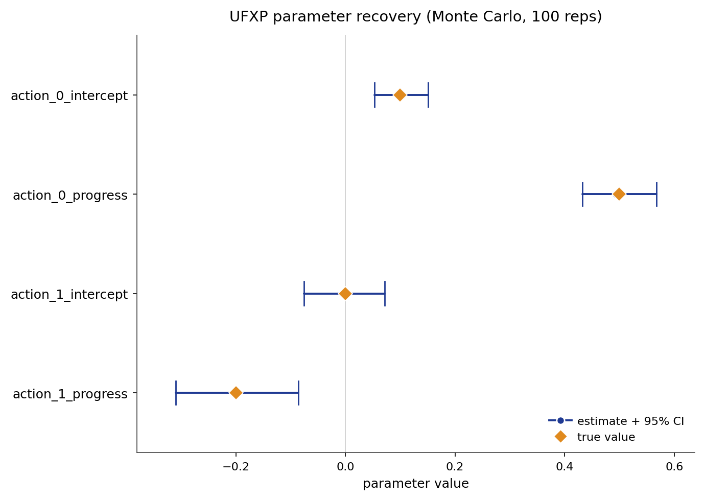

# UFXP

Unnested fixed point (UFXP) is a structural estimator for dynamic discrete choice
models that recovers primitive reward parameters without solving a dynamic program
inside the parameter search. The value-function dependence of Bellman's first-order
conditions is removed by dual fixed points computed once from the empirical choice
probabilities. For linear utility with optimal weighting the estimator reduces to a
single closed-form solve that attains the same asymptotic efficiency as maximum
likelihood.

## Source Papers

The estimator follows {ref}`Bray <bray-2019>`, which introduces the unnested
fixed-point construction and the dual representation of linear functionals of the
value function. {ref}`Oguz and Bray (2026) <oguz-bray-2026>` present the optimally
weighted form (OUFXP), prove its asymptotic efficiency equivalence to maximum
likelihood, and apply the construction to training neural-network utility functions
inside dynamic discrete choice models. The linear-utility case implemented in this
package is the default OUFXP path.

## Notation

Throughout, $s$ indexes the discrete state and $a$ the discrete action, observed
for individual $i$ in period $t$. The vector $\phi(s, a)$ collects the known reward
features and $\theta$ the reward parameters to be estimated. The discount factor is
$\beta$, the logit shock scale is $\sigma$, and $A$ denotes the reference action
used to form log-odds ratios. The transition kernel $P_a(s, s')$ gives the
probability of moving to $s'$ from $s$ under action $a$, stored in $(A, S, S)$
orientation. The empirical conditional choice probability is $\hat{P}_a(s)$, the
CCP-weighted transition is
$F_{\hat{P}} = \sum_a \operatorname{diag}(\hat{P}_a) F_a$, and $V_{\hat{P}}(s)$
is the value of following the empirical policy. The CCP-weighted feature matrix is
$\Phi_{\hat{P}} = \sum_a \operatorname{diag}(\hat{P}_a) \Phi_a$, where $\Phi_a$ is
the $(S, K)$ slice of $\phi(s, a)$ at action $a$ (source: `ufxp.py` line 136,
`phi_P = einsum('sa,sak->sk', P, phi)`). The policy-entropy correction is
$\operatorname{ent}(s) = -\sigma \sum_a \hat{P}_a(s) \log \hat{P}_a(s)$
(source: `ufxp.py` line 134, `ent = -sigma * (P * log_p).sum(axis=1)`). The dual
vector $\lambda$ satisfies $\lambda = w + \beta F_{\hat{P}}^\top \lambda$ for a
given functional weight $w$.
The integrated value function is $V_\theta(s)$, the choice-specific value is
$Q_\theta(s, a)$, and the conditional choice probability, the policy, is
$\pi_\theta(a \mid s)$.

## Model

The observed data are state, action, and next-state trajectories
$(s_{it}, a_{it}, s_{i,t+1})$. The flow payoff is linear in the features:

$$
u_\theta(s, a) = \phi(s, a)^\top \theta.
$$

With discount factor $\beta$ and logit shock scale $\sigma$, the integrated value
function solves the soft Bellman fixed point:

$$
V_\theta(s)
= \sigma \log \sum_a \exp\!\left(
    \frac{u_\theta(s, a) + \beta \sum_{s'} P_a(s, s') V_\theta(s')}{\sigma}
\right).
$$

The choice-specific value is:

$$
Q_\theta(s, a) = u_\theta(s, a) + \beta \sum_{s'} P_a(s, s') V_\theta(s').
$$

The implied conditional choice probability follows the logit rule:

$$
\pi_\theta(a \mid s) =
\frac{\exp(Q_\theta(s, a) / \sigma)}
     {\sum_b \exp(Q_\theta(s, b) / \sigma)}.
$$

Under any fixed policy $P$, the value of following that policy has the closed matrix form

$$
V_P = (I - \beta F_P)^{-1}
\Bigl[\textstyle\sum_a P_a \circ \bigl(u_\theta(\cdot, a) - \sigma \log P_a\bigr)\Bigr],
\qquad
F_P = \textstyle\sum_a \operatorname{diag}(P_a) F_a .
$$

Under policy $P$, the soft-Bellman equation
$V_P(s) = \sum_a P_a(s)[u_\theta(s,a) - \sigma \log P_a(s)] + \beta \sum_{s'} F_P(s,s') V_P(s')$
is a linear system in $V_P$. In matrix form:
$(I - \beta F_P) V_P = \sum_a P_a \circ (u_\theta(\cdot, a) - \sigma \log P_a)$,
which inverts to the stated formula.
This is the representation used to derive the estimating equations when $P$ is replaced
by the empirical CCPs $\hat{P}$.

The canonical instance is Rust's bus-engine replacement model. A bus operator
decides each period whether to keep a deteriorating engine or pay a flat cost to
replace it. The dynamic program links today's choices to tomorrow's states, so
observed choices carry information about the structural costs.

## Identification

UFXP point-identifies the reward parameters $\theta$ under the following
assumptions.

- **Conditional independence (CI).** The observed state transition is Markov in
  the current state and action and does not depend on the current logit shock.
- **Additive separability (AS).** The per-period payoff is the systematic reward
  plus an additive choice-specific shock, drawn independently across choices as
  Type-I extreme value with fixed scale $\sigma$.
- **Exogenous transitions.** The transition kernel $P_a(s, s')$ is supplied or
  estimated in a first stage, outside the moment system.
- **Reward normalization.** The reward level and scale need an anchor. The
  reference action $A$ anchors the log-odds parameterization, and the logit scale
  $\sigma$ is held fixed.
- **Action-dependent feature rank.** The reward features must vary across
  actions. The feature rank must equal the number of parameters. State-only
  features copied across actions collapse the action contrasts and leave $\theta$
  unidentified.

These hold inside a finite discrete state space, a stationary environment with
expected-utility maximization, and a known, fixed discount factor $\beta$. Given
them, $\theta$ is point-identified. Identification weakens under thin action
support, an invalid normalization anchor, or a transition tensor supplied in the
wrong orientation.

## Estimator

Under logit shocks the log-odds of any two actions at a state equal the difference
of their choice-specific values. For any state $s$ and action $a \neq A$, the
soft Bellman first-order condition is

$$
\sigma \log \frac{\hat{P}_a(s)}{\hat{P}_A(s)}
= u_\theta(s, a) - u_\theta(s, A)
+ \beta \sum_{s'} \bigl(F_a(s' \mid s) - F_A(s' \mid s)\bigr) V_{\hat{P}}(s').
$$

The obstacle is $V_{\hat{P}}$, which appears to require a linear solve per candidate
$\theta$. Proposition 2 of Oguz and Bray (2026) removes it: any linear functional
$w^\top V_{\hat{P}}$ has the dual representation

$$
w^\top V_{\hat{P}} = \lambda^\top u_{\hat{P}},
\qquad
\lambda = w + \beta F_{\hat{P}}^\top \lambda,
$$

where $\lambda$ depends only on $\hat{P}$, $\beta$, and the transitions, not on
$\theta$. The identity follows from the policy-value equation
$(I - \beta F_{\hat{P}}) V_{\hat{P}} = u_{\hat{P}}$: left-multiplying by $\lambda^\top$
and using the dual fixed point $\lambda = w + \beta F_{\hat{P}}^\top \lambda$ gives
$w^\top V_{\hat{P}} = \lambda^\top u_{\hat{P}}$ directly.
One matrix factorization of $(I - \beta F_{\hat{P}}^\top)$, computed once
before the parameter search, removes the value function entirely. Substituting this
dual representation, the first-order condition at state $s$ and action $a \neq A$ becomes
affine in $\theta$:

$$
y(s) = G(s)\,\theta + \varepsilon(s),
$$

where

$$
y(s) = \rho(s) - \beta\,\Delta F(s)\,v_{\text{ent}},
\qquad
G(s) = \Delta\phi(s) + \beta\,\Delta F(s)\,dV,
$$

with $\rho(s) = \sigma\log(\hat{P}_a(s)/\hat{P}_A(s))$ the log-odds vector
(stacked over $a \neq A$), $\Delta F(s) = (F_a - F_A)$ the differenced transitions,
$v_{\text{ent}} = (I - \beta F_{\hat{P}})^{-1}\,\text{ent}$ the entropy-correction
value, and $dV = (I - \beta F_{\hat{P}})^{-1}\Phi_{\hat{P}}$ the value gradient
with respect to $\theta$.

The value gradient $dV$ comes from differentiating the policy-value identity.
The linear policy-value identity is
$V_{\hat{P}} = (I - \beta F_{\hat{P}})^{-1}[\sum_a \hat{P}_a \circ (\phi(\cdot,a)^\top\theta - \sigma \log \hat{P}_a)]$.
Differentiating with respect to $\theta$ at fixed $\hat{P}$ gives

$$
\frac{\partial V_{\hat{P}}}{\partial \theta}
= (I - \beta F_{\hat{P}})^{-1} \Phi_{\hat{P}},
$$

because the only $\theta$-dependent term inside the brackets is
$\sum_a \hat{P}_a \circ \phi(\cdot,a)^\top\theta = \Phi_{\hat{P}}\,\theta$, so its
$\theta$-derivative is $\Phi_{\hat{P}}$ exactly. This is the shared
implicit-differentiation step: the matrix $(I - \beta F_{\hat{P}})$ is
$\theta$-free, so no chain rule through the inverse is needed. The result makes
$dV$ constant in $\theta$, which is what enables the closed-form solve (source:
`ufxp.py` lines 242--246; internal\_docs `§OUFXP upgrade`).

Separating the $\theta$-dependent part of $V_{\hat{P}}$ using
$\partial V_{\hat{P}}/\partial\theta = dV$ and the constant entropy-correction value
$v_{\text{ent}} = (I - \beta F_{\hat{P}})^{-1}\,\text{ent}$, write
$V_{\hat{P}} = dV\,\theta + v_{\text{ent}}$. Substituting into the first-order
condition gives
$\sigma \log(\hat{P}_a/\hat{P}_A) = \Delta\phi(s)^\top\theta + \beta\,\Delta F(s)(dV\,\theta + v_{\text{ent}})$,
which rearranges to $y(s) = G(s)\,\theta + \varepsilon(s)$ with $G$ and $y$ as
defined above (source: `ufxp.py` lines 247--249; internal\_docs
`§Derivation as implemented`).

Both $v_{\text{ent}}$ and $dV$ are independent of
$\theta$ and are precomputed from a single factorization of $(I - \beta
F_{\hat{P}})$.

The optimally weighted estimator assigns each supported state a weight matrix:

$$
z(s) = \bigl[\Gamma(s)\,\Sigma(s)\,\Gamma(s)^\top / \eta(s)\bigr]^{-1} G(s),
$$

where $\Sigma(s) = \operatorname{diag}(\hat{P}(s)) - \hat{P}(s)\hat{P}(s)^\top$
is the multinomial covariance of the empirical CCPs, $\Gamma(s)$ is the Jacobian
of the inverse-CCP map with
$\Gamma_{a,b}(s) = \sigma\,\delta_{a,b}/\hat{P}_a(s) - \sigma\,\delta_{b,A}/\hat{P}_A(s)$
(where $\delta$ is the Kronecker delta, $a$ indexes the $A-1$ non-reference actions,
and $b$ indexes all $A$ actions; source: `ufxp.py` lines 261--263),
and $\eta(s) = N(s)/N$ is the state's sample share. Setting the weighted moments to
zero gives $\sum_s z(s)^\top G(s)\,\theta = \sum_s z(s)^\top y(s)$, so the
closed-form solution is:

$$
\hat{\theta} = D^{-1} \sum_s z(s)^\top y(s),
\qquad
D = \sum_s z(s)^\top G(s).
$$

By Theorem 2 of Oguz and Bray (2026), this estimator is as asymptotically
efficient as maximum likelihood. Standard errors come from the efficient moment
variance:

$$
\widehat{\operatorname{Var}}(\hat{\theta}) = D^{-1} / N.
$$

At optimal weights, the efficient-GMM sandwich $V = J^{-1}\Omega J^{-\top}$
collapses to $D^{-1}/N$ because the moment variance $\Omega = D/N$ at the
optimum (Theorem 2 of Oguz and Bray 2026).

Thin states are downweighted by $\eta(s)$; unvisited states drop out of the moment
system entirely.

## Algorithm

```text
Algorithm  UFXP (unnested fixed-point estimation, OUFXP default)
Input   panel {(s_it, a_it, s_{i,t+1})}, features phi, transitions P,
        discount beta, logit scale sigma, reference action A
Output  theta_hat, standard errors, policy pi, value V

1   estimate empirical CCPs P-hat state by state (frequency + additive smoothing)
2   factorize (I - beta * F_P-hat)                     # one dense solve; independent of theta
3   dV    := (I - beta * F_P-hat)^{-1} phi_P           # value gradient w.r.t. theta, (S, K)
4   v_ent := (I - beta * F_P-hat)^{-1} ent             # entropy-correction value, (S,)
5   D := 0,  rhs := 0
6   for each supported state s:
7       G(s)     := dphi(s) + beta * dF(s) dV          # moment Jacobian, (A-1, K)
8       y(s)     := logratio(s) - beta * dF(s) v_ent   # moment intercept, (A-1,)
9       Gamma(s) := Jacobian of inverse-CCP map at P-hat(s)         # (A-1, A)
10      Sigma(s) := diag(P-hat(s)) - P-hat(s) P-hat(s)^T           # CCP covariance, (A, A)
11      z(s)     := [Gamma(s) Sigma(s) Gamma(s)^T / eta(s)]^{-1} G(s)  # optimal weight
12      D   += G(s)^T z(s)
13      rhs += z(s)^T y(s)
14  theta_hat := D^{-1} rhs                            # closed-form weighted moment solve
15  solve  V_theta_hat = T_theta_hat V_theta_hat       # one value iteration at theta_hat
16  return theta_hat, D^{-1}/N as standard errors, pi_theta_hat, V_theta_hat
```

The default variant is `weights="optimal"` (the OUFXP form of Oguz and Bray 2026):
the single factorization in step 2 removes the value function from the estimation
problem, and the per-state optimal weights in steps 6--13 deliver maximum-likelihood
efficiency. An alternative variant is `weights="random"` (plain UFXP): $m$ random
projection matrices $Z_i$ replace the optimal weights; $m$ dual vectors $\lambda_i$
are pre-computed from the same single factorization via Proposition 2, and the
estimator solves an ordinary least-squares problem. Plain UFXP is consistent but
less efficient and produces no standard errors; it is retained for comparison with
the paper's baseline construction.

## Applicability

| Applicable when | Prefer an alternative when |
| --- | --- |
| States and actions are discrete. | The state space makes the dense $(I - \beta F_{\hat{P}})$ factorization binding. |
| Transitions are known or can be estimated first. | Transition estimation is the main modeling challenge. |
| The reward has a compact parametric form. | The reward must be high-dimensional or neural. |
| Maximum-likelihood-grade efficiency is required at low cost. | An exact finite-sample MLE benchmark is required (use NFXP). |
| Most states are visited in the data. | State coverage is very thin everywhere (prefer NFXP, which pools all observations through the likelihood). |
| Counterfactual policy analysis is central. | Only fitted choice probabilities are required. |

UFXP sits with NFXP, CCP, and MPEC in the structural family. Against NFXP the
trade is direct: NFXP is the exact finite-sample maximum likelihood estimator;
UFXP is its asymptotic equal at almost no cost, because no dynamic program is
solved inside the search. Against CCP, UFXP shares the sensitivity to thin state
coverage (both invert empirical CCPs state by state), but UFXP weights all of
Bellman's restrictions optimally rather than inverting once, and its optimal
weighting restores maximum-likelihood efficiency. NNES and TD-CCP become attractive
when approximate methods are acceptable; UFXP is the preferred structural alternative
when the state space makes NFXP's repeated solves expensive.

## Usage

```python
from econirl.datasets import load_rust_bus
from econirl import UFXP

df = load_rust_bus()

model = UFXP(n_states=90, discount=0.9999, utility="linear_cost")
model.fit(df, state="mileage_bin", action="replaced", id="bus_id")

print(model.params_)
print(model.summary())
```

Counterfactual analysis re-solves the fitted dynamic program under a changed
primitive:

```python
cf = model.counterfactual(RC=4.0)      # raise the replacement cost
print(cf.params)
print(cf.policy)                       # new replacement probability by state
```

The fitted policy gives the replacement probability by state:

```python
print(model.predict_proba([0, 10, 50, 89]))
```

The [Quick Start](ufxp/quick_start.md) page documents the full set of fitted
attributes, weighting modes, and the lower-level `UFXPEstimator` interface.

## Evidence

Parameter recovery is measured on the `canonical_low_action` synthetic cell, which
has known rewards, transitions, policies, values, Q functions, and Type A, Type B,
and Type C counterfactual oracles. The figure below is a Monte-Carlo study over 200
replications: the panel is resimulated and refit on a fresh seed each time, and each
parameter is plotted as its recovered mean and 95% interval against the true value.



Recovery statistics are over a Monte-Carlo run; numbers are pending the full run.

| Parameter | True | Recovered (mean) | 95% interval |
| --- | ---: | ---: | --- |
| `action_0_intercept` | 0.10 | _pending MC_ | _pending MC_ |
| `action_0_progress` | 0.50 | _pending MC_ | _pending MC_ |
| `action_1_intercept` | 0.00 | _pending MC_ | _pending MC_ |
| `action_1_progress` | -0.20 | _pending MC_ | _pending MC_ |

Behavioral fit and counterfactual regret on the same cell, against the known
oracle objects:

| Metric | Value |
| --- | ---: |
| Policy total variation | 0.0050 |
| Value RMSE | 0.0170 |
| Type A regret (reward shift) | 0.000161 |
| Type B regret (transition change) | 0.000300 |
| Type C regret (action removed) | 0.000078 |

The regrets are small because the recovered reward is close enough to the truth
that re-solving the intervened model reproduces almost the same policy as the
oracle. For the full cross-estimator comparison, see the
[bus engine simulation study](../simulation_studies/rust_bus.md).

## References

Source papers:

- Bray, R. L. "Unnesting the Fixed Point in the Estimation of Dynamic Programs."
  Working paper, SSRN 3307175. {ref}`reference entry <bray-2019>`.
- Oguz, E., and Bray, R. L. (2026). "Training Neural Networks Embedded in Dynamic
  Discrete Choice Models." Working paper, arXiv 2604.09736.
  {ref}`reference entry <oguz-bray-2026>`.

Implementation and reproduction:

- Estimator source: [`econirl.estimation.ufxp`](https://github.com/rawatpranjal/EconIRL/blob/main/src/econirl/estimation/ufxp.py).
- sklearn wrapper: [`econirl.UFXP`](https://github.com/rawatpranjal/EconIRL/blob/main/src/econirl/estimators/ufxp.py).
- Validation runner: [`validation/estimators/ufxp/run.py`](https://github.com/rawatpranjal/EconIRL/blob/main/validation/estimators/ufxp/run.py).
- Results file: [`ufxp.json`](https://github.com/rawatpranjal/EconIRL/blob/main/validation/results/ufxp.json).

Pages:

- [Quick Start](ufxp/quick_start.md)
- [Pre-Estimation Checks](ufxp/pre_estimation.md)
- [Simulation Study](ufxp/validation.md)
- [Counterfactuals](ufxp/counterfactuals.md)
- [Bus Engine Example](ufxp/rust_bus.md)

```{toctree}
:hidden:

ufxp/quick_start
ufxp/pre_estimation
ufxp/validation
ufxp/counterfactuals
ufxp/rust_bus
```
