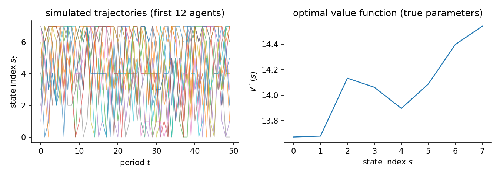

# Abstract MDP 1: sanity check

The simplest abstract problem: a small but non-trivial random MDP with an action-dependent linear reward, easy enough that a correct estimator must recover it. It is the sanity check that the whole roster works before harder regimes. Every estimator on the uniform estimate interface is run; the table reports the exact recovered parameters, recovery error, policy distance from the true policy, and counterfactual regret.

Environment: `random_mdp(num_states=8, num_actions=2, num_features=2, branching=3, discount_factor=0.9, seed=0)`. 300 x 50 observations, 3 replications. True theta `[-0.1437, 0.7872]`. Generated 2026-06-12 with econirl 0.0.4.

## The data-generating process

One Garnet-style MDP is drawn from the seed and held fixed. Each state-action pair reaches a uniform random subset of $b$ states with Dirichlet weights, mixed with a small self-loop mass $\ell$:

$$
P(s' \mid s, a) \;=\; (1-\ell)\, D_{s,a}(s') \;+\; \ell\, \mathbf{1}\{s'=s\},
\qquad D_{s,a} \sim \mathrm{Dirichlet}(\mathbf{1}_b),\quad b = 3,\ \ell = 0.05 .
$$

The reward is linear in features of the normalized state index $x_s = s/(S-1)$. Action $0$ is a zeroed outside option (the identification anchor); for action $1$,

$$
u_\theta(s,a) = \theta^\top \varphi(s,a),
\qquad \varphi(s,1) = \bigl(1,\ x_s + 1\bigr),
\qquad \theta \sim \mathcal{N}(0,\ 0.25\, I_2).
$$

The agent discounts at $\beta = 0.9$ and faces i.i.d. logit taste shocks (scale $\sigma = 1$), so behavior solves the soft Bellman equation

$$
V(s) = \log \sum_{a} \exp\Bigl(u_\theta(s,a) + \beta\, \mathbb{E}\bigl[V(s') \mid s,a\bigr]\Bigr),
\qquad \pi^*(a \mid s) \propto \exp\Bigl(u_\theta(s,a) + \beta\, \mathbb{E}\bigl[V(s') \mid s,a\bigr]\Bigr),
$$

and the data are $N$ independent agents simulated for $T$ periods from $\pi^*$ and the transition law. The figure shows what that produces: state paths mix across the whole space, and the optimal value function varies smoothly in the state index.



## Results

| Estimator | Family | Ran | Recovered params | Param RMSE | Policy TV | Regret base | Regret A | Regret B | Regret C | Time (s) |
|---|---|---|---|---|---|---|---|---|---|---|
| NFXP | structural | 3/3 | [-0.154, 0.797] | 0.0251 | 0.0025 | 0.0002 | 0.0002 | 0.0002 | 0.0000 | 4.4 |
| CCP | structural | 3/3 | [-0.154, 0.797] | 0.0250 | 0.0025 | 0.0002 | 0.0002 | 0.0002 | 0.0000 | 2.2 |
| MPEC | structural | 3/3 | [-0.154, 0.797] | 0.0252 | 0.0026 | 0.0002 | 0.0002 | 0.0002 | 0.0000 | 5.4 |
| NNES | structural | 3/3 | [-0.154, 0.797] | 0.0251 | 0.0025 | 0.0002 | 0.0002 | 0.0002 | 0.0000 | 12.6 |
| SEES | structural | 3/3 | [-0.154, 0.797] | 0.0254 | 0.0025 | 0.0002 | 0.0002 | 0.0002 | 0.0000 | 0.8 |
| TD-CCP | structural | 3/3 | [-0.155, 0.794] | 0.0215 | 0.0021 | 0.0002 | 0.0002 | 0.0002 | 0.0000 | 3.5 |
| UFXP | structural | 3/3 | [-0.155, 0.796] | 0.0248 | 0.0025 | 0.0002 | 0.0002 | 0.0002 | 0.0000 | 0.1 |
| MCE-IRL | behavioral | 3/3 | [-0.154, 0.797] | - | 0.0025 | 0.0002 | 0.0002 | 0.0002 | 0.0000 | 5.8 |
| MaxEnt-IRL | behavioral | 3/3 | [-0.348, 0.923] | - | 0.0101 | 0.0056 | 0.0062 | 0.0016 | 0.0000 | 14.4 |
| IQ-Learn | behavioral | 3/3 | [-0.219, 0.773] | - | 0.0370 | 0.0091 | 0.0101 | 0.0096 | 0.0000 | 1.4 |
| GLADIUS | behavioral | 3/3 | [-0.380, 0.915] | - | 0.0165 | 0.0062 | 0.0066 | 0.0044 | 0.0000 | 17.1 |
| AIRL | behavioral | 3/3 | [0.147, 0.522] | - | 0.0324 | 0.0513 | 0.0554 | 0.0297 | 0.0000 | 98.4 |
| f-IRL | behavioral | 3/3 | not in theta gauge (16 values) | - | 0.0091 | 0.0034 | 0.0462 | 0.0736 | 61.4508 | 23.0 |
| BC | behavioral | 3/3 | not in theta gauge (16 values) | - | 0.0088 | 0.0026 | 0.0423 | 0.0676 | 61.4560 | 0.2 |

Param RMSE is the structural family only (recovered theta vs true, same gauge). Policy TV is total-variation distance from the true-parameter policy. Regret is welfare loss (lower is better): `base` is the observed world; `A` payoff shift, `B` transition change, `C` action penalty. Transfer uses the recovered reward in the linear feature gauge (theta . features): estimators that recovered such a reward re-solve it under each intervention and adapt. Estimators that return a tabular object outside that gauge (here f-IRL and behavioral cloning) are scored with their fixed policy and cannot adapt, which shows up as large Type C regret. For behavioral cloning that frozen reading is exactly correct (it recovers no reward); for a tabular-reward method it is a conservative lower bound on what the method could transfer.

## Code used

The exact construction for each estimator (configs are modest quick-run defaults, not tuned):

### NFXP

Reference structural estimator; recovers cleanly.

```python
def _run_nfxp(env, panel):
    from econirl.estimation import NFXPEstimator

    est = NFXPEstimator(inner_solver="hybrid", inner_tol=1e-10,
                        inner_max_iter=100000, compute_hessian=True, verbose=False)
    return est.estimate(panel, _linear_utility(env), env.problem_spec, env.transition_matrices)
```

### CCP

Hotz-Miller conditional choice probabilities; recovers cleanly.

```python
def _run_ccp(env, panel):
    from econirl.estimation import CCPEstimator

    est = CCPEstimator(num_policy_iterations=1, compute_hessian=True, verbose=False)
    return est.estimate(panel, _linear_utility(env), env.problem_spec, env.transition_matrices)
```

### MPEC

Constrained MLE; recovers cleanly.

```python
def _run_mpec(env, panel):
    from econirl.estimation.mpec import MPECConfig, MPECEstimator

    est = MPECEstimator(config=MPECConfig(solver="slsqp", max_iter=200, constraint_tol=1e-6),
                        compute_hessian=True, verbose=False)
    return est.estimate(panel, _linear_utility(env), env.problem_spec, env.transition_matrices)
```

### NNES

Neural value network plus structural MLE; recovers cleanly.

```python
def _run_nnes(env, panel):
    from econirl.estimation.nnes import NNESEstimator

    est = NNESEstimator(hidden_dim=64, v_epochs=800, n_outer_iterations=5,
                        compute_se=False, verbose=False)
    return est.estimate(panel, _linear_utility(env), env.problem_spec, env.transition_matrices)
```

### SEES

Fixed: bspline basis with basis_dim >= num_states. A fourier basis of dim 4 underfit the 8-state value function (param RMSE 0.89 -> 0.025).

```python
def _run_sees(env, panel):
    from econirl.estimation.sees import SEESEstimator

    # Basis must span the value function: bspline basis_dim >= num_states. A
    # fourier basis_dim=4 underfit the 8-state value (workflow diagnosis).
    est = SEESEstimator(basis_type="bspline", basis_dim=8, warm_start_value=True,
                        penalty_weight=10.0, compute_se=False, verbose=False)
    return est.estimate(panel, _linear_utility(env), env.problem_spec, env.transition_matrices)
```

### TD-CCP

Neural CCP with approximate value iteration; recovers cleanly.

```python
def _run_tdccp(env, panel):
    from econirl.estimation import TDCCPConfig, TDCCPEstimator

    est = TDCCPEstimator(config=TDCCPConfig(hidden_dim=64, avi_iterations=15,
                                            epochs_per_avi=15, compute_se=False, verbose=False))
    return est.estimate(panel, _linear_utility(env), env.problem_spec, env.transition_matrices)
```

### UFXP

Unnested fixed point (Bray; Oguz and Bray 2026) with the paper's optimal weighting (OUFXP): closed form for linear utility, as asymptotically efficient as maximum likelihood, standard errors from the efficient moment variance.

```python
def _run_ufxp(env, panel):
    from econirl.estimation import UFXPEstimator

    # Bray's unnested fixed point with the paper's optimal weighting (OUFXP):
    # closed form for linear utility, MLE-efficient, with standard errors from
    # the efficient moment variance.
    est = UFXPEstimator(weights="optimal", verbose=False)
    return est.estimate(panel, _linear_utility(env), env.problem_spec, env.transition_matrices)
```

### MCE-IRL

Causal maximum-entropy IRL; recovers behavior cleanly.

```python
def _run_mce_irl(env, panel):
    from econirl.estimation import MCEIRLConfig, MCEIRLEstimator

    est = MCEIRLEstimator(config=MCEIRLConfig(learning_rate=0.05, outer_max_iter=100,
                                              inner_max_iter=2000, compute_se=False, verbose=False))
    return est.estimate(panel, _action_reward(env), env.problem_spec, env.transition_matrices)
```

### MaxEnt-IRL

Fixed: feed action-dependent features. A state-only reward is broadcast equally across actions and cannot represent the action contrast (policy TV 0.23 -> 0.01).

```python
def _run_maxent_irl(env, panel):
    from econirl.contrib.maxent_irl import MaxEntIRLEstimator

    # Feed the action-dependent features: a state-only reward is broadcast
    # equally across actions and cannot represent the action contrast that
    # drives choice here (workflow diagnosis). Adaptive per-parameter steps
    # (Adam) handle mixed feature scales.
    est = MaxEntIRLEstimator(inner_tol=1e-8, inner_max_iter=5000, outer_max_iter=500,
                             learning_rate=0.05, compute_hessian=False, verbose=False)
    return est.estimate(panel, _action_reward(env), env.problem_spec, env.transition_matrices)
```

### IQ-Learn

Fixed: q_type='linear'. A tabular Q-table does not propagate to unvisited states (policy TV 0.29 -> 0.04).

```python
def _run_iq_learn(env, panel):
    from econirl.estimation.iq_learn import IQLearnConfig, IQLearnEstimator

    # q_type="linear" uses the feature structure; a tabular Q does not propagate
    # to unvisited states (workflow diagnosis).
    est = IQLearnEstimator(config=IQLearnConfig(q_type="linear", divergence="chi2",
                                                alpha=3.0, max_iter=2000, verbose=False))
    return est.estimate(panel, _action_reward(env), env.problem_spec, env.transition_matrices)
```

### GLADIUS

Neural Q and expected-value networks; tracks behavior.

```python
def _run_gladius(env, panel):
    from econirl.estimation import GLADIUSConfig, GLADIUSEstimator

    est = GLADIUSEstimator(config=GLADIUSConfig(max_epochs=300, q_hidden_dim=128,
                                                v_hidden_dim=128, q_lr=1e-4, v_lr=1e-4,
                                                patience=60, compute_se=False, verbose=False))
    return est.estimate(panel, _linear_utility(env), env.problem_spec, env.transition_matrices)
```

### AIRL

Fixed: reward_arg='state_action'. The default 'state' marginalized the reward across actions (policy TV 0.24 -> 0.02); recovered parameters stay gauge/shaping-unidentified by design, so TV is the right scorecard.

```python
def _run_airl(env, panel):
    from econirl.estimation import AIRLConfig, AIRLEstimator

    # reward_arg="state_action": the default "state" marginalizes the reward
    # across actions and cannot represent the action contrast (workflow
    # diagnosis). AIRL accepts a reward spec, not a utility. Policy TV is fixed;
    # the recovered parameters stay gauge/shaping-unidentified by design.
    est = AIRLEstimator(config=AIRLConfig(reward_type="linear", reward_arg="state_action",
                                          reward_lr=0.01, discriminator_steps=10,
                                          max_rounds=300, compute_se=False, verbose=False))
    return est.estimate(panel, _action_reward(env), env.problem_spec, env.transition_matrices)
```

### f-IRL

f-divergence IRL; tracks behavior.

```python
def _run_firl(env, panel):
    from econirl.estimation.f_irl import FIRLEstimator

    # fkl (bounded gradient) with the estimator's default reward clip; the
    # chi2 ratio gradient is unbounded on near-deterministic experts.
    est = FIRLEstimator(f_divergence="fkl", lr=0.2, max_iter=400, reward_clip=10.0,
                        verbose=False)
    return est.estimate(panel, _linear_utility(env), env.problem_spec, env.transition_matrices)
```

### BC

Behavioral cloning; matches observed choices but recovers no reward, so it cannot transfer to a counterfactual world.

```python
def _run_bc(env, panel):
    from econirl.estimation.behavioral_cloning import BehavioralCloningEstimator

    est = BehavioralCloningEstimator(smoothing=1.0, verbose=False)
    return est.estimate(panel, _linear_utility(env), env.problem_spec, env.transition_matrices)
```

## Reproduce

```bash
python scripts/quick_all_estimators.py --replications 3   # run + write JSON
python scripts/quick_all_estimators.py --page          # regenerate this page
python scripts/quick_all_estimators.py --verify        # re-derive the table from JSON
```

Raw facts: `validation/results/quick_all_estimators.json`. Counterfactual regret follows the package Type A (payoff shift), Type B (transition change), Type C (action penalty) taxonomy; regret = initial_distribution . (oracle_value - estimated_value), lower is better. Estimators with a recovered reward re-solve it under each intervention (transfer); estimators without one keep their fixed policy (cannot adapt).

Excluded from this run: MCE-IRL-NN (uses the sklearn .fit interface, not the uniform .estimate path); GAIL (known slow (~9 min/fit); not a quick run); DeepMaxEnt-IRL (known slow (~7 min/fit); not a quick run); Bayesian-IRL (known slow (~16 min/fit); not a quick run).