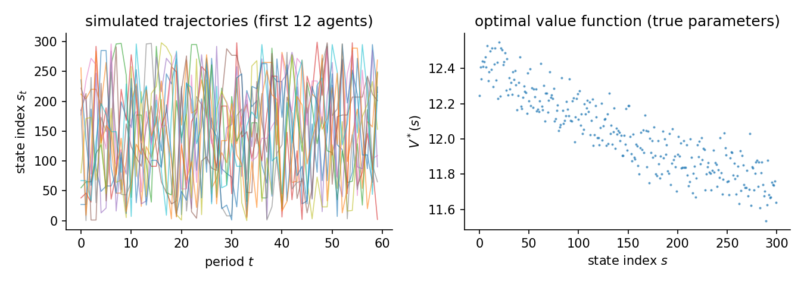

# Abstract MDP 2

The sanity-check page showed every estimator recovering an easy problem. This page hardens the problem along three separate axes and watches the structural family specifically. What happens to runtime as the state space grows? What happens to inference as the discount factor approaches one? What happens to the parameters when the reward features are collinear? Each axis gets its own cell, run on the same engine and reported from the same raw records as every other page.

## The data-generating process

The first two cells draw one Garnet-style MDP from the seed and hold it fixed. Each state-action pair reaches a uniform random subset of $b$ states with Dirichlet weights, mixed with a small self-loop mass $\ell$:

$$
P(s' \mid s, a) \;=\; (1-\ell)\, D_{s,a}(s') \;+\; \ell\, \mathbf{1}\{s'=s\},
\qquad D_{s,a} \sim \mathrm{Dirichlet}(\mathbf{1}_b),\quad b = 5,\ \ell = 0.05 .
$$

The reward is linear in polynomial features of the normalized state index $x_s = s/(S-1)$. Action $0$ is a zeroed outside option, the identification anchor. For $a \geq 1$,

$$
u_\theta(s,a) = \theta^\top \varphi(s,a),
\qquad \varphi(s,a) = \bigl(1,\ x_s,\ x_s^{2} + a\bigr),
\qquad \theta \sim \mathcal{N}(0,\ 0.25\, I_3).
$$

The agent discounts at $\beta$ and faces i.i.d. logit taste shocks (scale $\sigma = 1$), so behavior solves the soft Bellman equation

$$
V(s) = \log \sum_{a} \exp\Bigl(u_\theta(s,a) + \beta\, \mathbb{E}\bigl[V(s') \mid s,a\bigr]\Bigr),
\qquad \pi^*(a \mid s) \propto \exp\Bigl(u_\theta(s,a) + \beta\, \mathbb{E}\bigl[V(s') \mid s,a\bigr]\Bigr),
$$

and the data are $N$ independent agents simulated for $T$ periods from $\pi^*$ and $P$. The third cell swaps in a small handcrafted MDP whose features are deliberately collinear. Its construction is described in that cell.

## 300 states, discount 0.95

A 300-state Garnet MDP with stochastic sparse transitions (branching 5) and a 3-feature linear reward: `random_mdp(num_states=300, num_actions=2, num_features=3, branching=5, discount_factor=0.95, seed=505)`. 500 x 60 observations, 3 replications, seed 505. True theta `[0.3863, -1.5993, 0.1317]`. Design rank 3/3, condition number 3.88e+01, action-contrast rank 3/3 (the rank that identification from choices actually uses). Generated 2026-06-12 with econirl 0.0.4.

The first cell is about cost at scale. All estimators face the same 300-state problem, and the runtime column is the result. The two NFXP rows are the same estimator with two inner solvers, Rust's original successive approximation against the Newton-Kantorovich polyalgorithm. The refinement's value is measured on this page rather than asserted.



### Results

| Estimator | Family | Ran | Conv | Recovered params | Param RMSE | Policy TV | Regret base | Regret A | Regret B | Regret C | Time (s) |
|---|---|---|---|---|---|---|---|---|---|---|---|
| NFXP-SA | structural | 3/3 | 3/3 | [0.431, -1.614, 0.107] | 0.0452 | 0.0035 | 0.0008 | 0.0008 | 0.0008 | 0.0000 | 4.4 |
| NFXP-NK | structural | 3/3 | 3/3 | [0.431, -1.614, 0.107] | 0.0452 | 0.0035 | 0.0008 | 0.0008 | 0.0008 | 0.0000 | 3.5 |
| CCP | structural | 3/3 | 3/3 | [0.429, -1.617, 0.111] | 0.0432 | 0.0037 | 0.0008 | 0.0008 | 0.0008 | 0.0000 | 2.7 |
| MPEC | structural | 3/3 | 3/3 | [0.431, -1.614, 0.107] | 0.0452 | 0.0035 | 0.0008 | 0.0008 | 0.0008 | 0.0000 | 1.1 |
| NNES | structural | 3/3 | 3/3 | [0.431, -1.614, 0.107] | 0.0452 | 0.0035 | 0.0008 | 0.0008 | 0.0008 | 0.0000 | 17.0 |
| SEES | structural | 3/3 | 0/3 | [0.543, -1.431, -0.046] | 0.1692 | 0.0040 | 0.0009 | 0.0008 | 0.0009 | 0.0000 | 2.8 |
| TD-CCP | structural | 3/3 | 3/3 | [0.342, -1.787, 0.246] | 0.1416 | 0.0057 | 0.0024 | 0.0024 | 0.0023 | 0.0000 | 2.9 |
| UFXP | structural | 3/3 | 3/3 | [0.422, -1.601, 0.111] | 0.0440 | 0.0031 | 0.0006 | 0.0006 | 0.0006 | 0.0000 | 0.1 |
| MCE-IRL | behavioral | 3/3 | 0/3 | [0.431, -1.614, 0.107] | - | 0.0035 | 0.0008 | 0.0008 | 0.0008 | 0.0000 | 5.9 |

Param RMSE covers the structural family only, which shares the parameterization of the true model. Policy TV is the distance between estimated and true choice probabilities, lower is better. Conv is the estimator's own convergence indicator. A cautious estimator can report False while the recovered policy is accurate. Regret base is welfare lost in the observed environment. Types A, B, and C are welfare lost after a change. Type A shifts a payoff, Type B changes the transitions, Type C penalizes an action. Estimators with a recovered reward re-solve it and adapt. Those without one keep their old policy.

The two NFXP rows land within a second of each other, so the textbook solver gap does not bite at 300 states. The high-dimension page is where it starts to. The approximation-based members (SEES, TD-CCP) give up some parameter precision relative to the exact family while staying close on behavior.

## Same MDP, discount 0.99

The identical 300-state MDP with the discount factor moved from 0.95 to 0.99, where continuation values dominate flow payoffs and the inner fixed point becomes a slow contraction. Structural family only, 10 replications, standard errors requested from every estimator. 500 x 60 observations, 10 replications, seed 505. True theta `[0.3863, -1.5993, 0.1317]`. Design rank 3/3, condition number 3.88e+01, action-contrast rank 3/3 (the rank that identification from choices actually uses). Generated 2026-06-12 with econirl 0.0.4.

The second cell moves the discount factor to 0.99 and asks whether the reported uncertainty is usable. The parameter table shows bias, the spread across replications, RMSE, coverage of the nominal 95% intervals, and how often each estimator produced finite standard errors. NFXP-SA runs 2 of 10 replications as a runtime spot-check. Its inference is the same MLE as NFXP-NK, which runs all 10.

### Results

| Estimator | Family | Ran | Conv | Recovered params | Param RMSE | Policy TV | Regret base | Regret A | Regret B | Regret C | Time (s) |
|---|---|---|---|---|---|---|---|---|---|---|---|
| NFXP-SA | structural | 2/2 | 2/2 | [0.403, -1.594, 0.121] | 0.0329 | 0.0027 | -0.0004 | -0.0004 | -0.0005 | 0.0000 | 4.2 |
| NFXP-NK | structural | 10/10 | 10/10 | [0.434, -1.555, 0.080] | 0.0840 | 0.0040 | 0.0025 | 0.0024 | 0.0024 | 0.0000 | 4.3 |
| CCP | structural | 10/10 | 10/10 | [0.433, -1.555, 0.081] | 0.0840 | 0.0042 | 0.0025 | 0.0025 | 0.0024 | 0.0000 | 3.3 |
| MPEC | structural | 10/10 | 10/10 | [0.434, -1.555, 0.080] | 0.0840 | 0.0040 | 0.0025 | 0.0024 | 0.0024 | 0.0000 | 0.6 |
| NNES | structural | 10/10 | 10/10 | [0.434, -1.555, 0.080] | 0.0840 | 0.0040 | 0.0025 | 0.0024 | 0.0024 | 0.0000 | 16.9 |
| SEES | structural | 10/10 | 0/10 | [0.830, -1.161, -0.304] | 0.4474 | 0.0209 | 0.1145 | 0.1125 | 0.1145 | 0.0000 | 2.1 |
| TD-CCP | structural | 10/10 | 10/10 | [0.397, -1.671, 0.159] | 0.1189 | 0.0052 | 0.0065 | 0.0065 | 0.0061 | 0.0000 | 2.7 |
| UFXP | structural | 10/10 | 10/10 | [0.426, -1.541, 0.083] | 0.0857 | 0.0040 | 0.0028 | 0.0027 | 0.0026 | 0.0000 | 0.1 |

Param RMSE covers the structural family only, which shares the parameterization of the true model. Policy TV is the distance between estimated and true choice probabilities, lower is better. Conv is the estimator's own convergence indicator. A cautious estimator can report False while the recovered policy is accurate. Regret base is welfare lost in the observed environment. Types A, B, and C are welfare lost after a change. Type A shifts a payoff, Type B changes the transitions, Type C penalizes an action. Estimators with a recovered reward re-solve it and adapt. Those without one keep their old policy.

### Parameter recovery

| Estimator | Parameter | True | Mean est | Bias | Emp. SE | RMSE | 95% coverage | SE avail |
|---|---|---|---|---|---|---|---|---|
| NFXP-SA | theta_0 | 0.386 | 0.403 | +0.016 | 0.004 | 0.017 | 1.00 +/- 0.00 | 100% (2 reps) |
| NFXP-SA | theta_1 | -1.599 | -1.594 | +0.005 | 0.073 | 0.052 | 1.00 +/- 0.00 | 100% (2 reps) |
| NFXP-SA | theta_2 | 0.132 | 0.121 | -0.011 | 0.019 | 0.017 | 1.00 +/- 0.00 | 100% (2 reps) |
| NFXP-NK | theta_0 | 0.386 | 0.434 | +0.048 | 0.109 | 0.114 | 0.90 +/- 0.09 | 100% (10 reps) |
| NFXP-NK | theta_1 | -1.599 | -1.555 | +0.045 | 0.128 | 0.130 | 0.90 +/- 0.09 | 100% (10 reps) |
| NFXP-NK | theta_2 | 0.132 | 0.080 | -0.052 | 0.129 | 0.133 | 0.90 +/- 0.09 | 100% (10 reps) |
| CCP | theta_0 | 0.386 | 0.433 | +0.047 | 0.110 | 0.114 | - | 10% (10 reps) |
| CCP | theta_1 | -1.599 | -1.555 | +0.044 | 0.132 | 0.133 | - | 10% (10 reps) |
| CCP | theta_2 | 0.132 | 0.081 | -0.051 | 0.132 | 0.135 | - | 10% (10 reps) |
| MPEC | theta_0 | 0.386 | 0.434 | +0.048 | 0.109 | 0.114 | 0.90 +/- 0.09 | 100% (10 reps) |
| MPEC | theta_1 | -1.599 | -1.555 | +0.045 | 0.128 | 0.130 | 0.90 +/- 0.09 | 100% (10 reps) |
| MPEC | theta_2 | 0.132 | 0.080 | -0.052 | 0.129 | 0.133 | 0.90 +/- 0.09 | 100% (10 reps) |
| NNES | theta_0 | 0.386 | 0.434 | +0.048 | 0.109 | 0.114 | 0.90 +/- 0.09 | 100% (10 reps) |
| NNES | theta_1 | -1.599 | -1.555 | +0.045 | 0.129 | 0.130 | 0.90 +/- 0.09 | 100% (10 reps) |
| NNES | theta_2 | 0.132 | 0.080 | -0.052 | 0.130 | 0.133 | 0.90 +/- 0.09 | 100% (10 reps) |
| SEES | theta_0 | 0.386 | 0.830 | +0.443 | 0.200 | 0.482 | 0.20 +/- 0.13 | 100% (10 reps) |
| SEES | theta_1 | -1.599 | -1.161 | +0.439 | 0.325 | 0.536 | 0.40 +/- 0.15 | 100% (10 reps) |
| SEES | theta_2 | 0.132 | -0.304 | -0.436 | 0.280 | 0.510 | 0.40 +/- 0.15 | 100% (10 reps) |
| TD-CCP | theta_0 | 0.386 | 0.397 | +0.011 | 0.122 | 0.116 | 1.00 +/- 0.00 | 100% (10 reps) |
| TD-CCP | theta_1 | -1.599 | -1.671 | -0.072 | 0.146 | 0.156 | 1.00 +/- 0.00 | 100% (10 reps) |
| TD-CCP | theta_2 | 0.132 | 0.159 | +0.027 | 0.149 | 0.144 | 1.00 +/- 0.00 | 100% (10 reps) |
| UFXP | theta_0 | 0.386 | 0.426 | +0.039 | 0.111 | 0.112 | 0.90 +/- 0.09 | 100% (10 reps) |
| UFXP | theta_1 | -1.599 | -1.541 | +0.059 | 0.134 | 0.140 | 0.90 +/- 0.09 | 100% (10 reps) |
| UFXP | theta_2 | 0.132 | 0.083 | -0.049 | 0.133 | 0.135 | 0.90 +/- 0.09 | 100% (10 reps) |

Coverage is the share of replications whose 95% interval contains the truth, shown with its Monte Carlo standard error. It is computed only where every replication produced a finite standard error. SE avail is the share of replications with finite standard errors.

The SE avail column is the headline. One estimator routinely fails to deliver usable standard errors here while recovering good point estimates. Without that column, the blank coverage entries would read as a formatting gap rather than an inference failure.

## Collinear features (24 states)

A small MDP whose third reward feature is exactly twice the second (design rank 2 of 3). The likelihood identifies only the combination theta_1 + 2 theta_2, so no estimator can recover the individual coordinates. 500 x 80 observations, 20 replications, seed 606. True theta `[-0.5, 1.0, 0.3]`. Design rank 2/3, condition number 3.07e+16, action-contrast rank 2/3 (the rank that identification from choices actually uses). Generated 2026-06-12 with econirl 0.0.4.

The last cell breaks identification on purpose. The third feature is exactly twice the second, so only the combination theta_1 + 2 theta_2 is identified, and the design diagnostics above flag it. The parameter columns are omitted. Every estimator still matches behavior, which is what partial identification looks like in practice.

### Results

| Estimator | Family | Ran | Conv | Policy TV | Regret base | Regret A | Regret B | Regret C | Time (s) |
|---|---|---|---|---|---|---|---|---|---|
| NFXP-NK | structural | 20/20 | 20/20 | 0.0032 | 0.0007 | 0.0007 | 0.0008 | 0.0000 | 3.9 |
| CCP | structural | 20/20 | 20/20 | 0.0032 | 0.0007 | 0.0007 | 0.0008 | 0.0000 | 2.0 |
| MPEC | structural | 20/20 | 20/20 | 0.0032 | 0.0007 | 0.0007 | 0.0008 | 0.0000 | 0.5 |
| UFXP | structural | 20/20 | 0/20 | 0.0032 | 0.0007 | 0.0007 | 0.0008 | 0.0000 | 0.1 |

Policy TV is the distance between estimated and true choice probabilities, lower is better. Conv is the estimator's own convergence indicator. A cautious estimator can report False while the recovered policy is accurate. Regret base is welfare lost in the observed environment. Types A, B, and C are welfare lost after a change. Type A shifts a payoff, Type B changes the transitions, Type C penalizes an action. Estimators with a recovered reward re-solve it and adapt. Those without one keep their old policy.

## Notes per estimator

**NFXP-SA.** Rust's original successive-approximation inner loop. Same maximum-likelihood answer as NFXP-NK, different runtime.

**CCP.** Its standard errors come from the outer Hessian and can fail to be finite even when the point estimate is fine. The SE avail column makes that visible.

**UFXP.** Unnested fixed point (Bray; Oguz and Bray 2026) with optimal weighting. As efficient as maximum likelihood, with standard errors, so it enters the coverage table on equal terms.

**MCE-IRL.** Behavioral reference. Its convergence indicator is a conservative gradient-norm check, so read it next to Policy TV.

## Reproduce

```bash
python scripts/sim_abstract_mdp_2.py                 # run + write JSON
python scripts/sim_abstract_mdp_2.py --page          # regenerate this page
python scripts/sim_abstract_mdp_2.py --verify        # re-derive the table from JSON
```

Raw facts: `validation/results/sim_abstract_mdp_2.json`.

Not shown on this page: MaxEnt-IRL, IQ-Learn, AIRL, f-IRL, GLADIUS, Deep-MCE-IRL, BC (this page's question is structural. Parameter recovery, inference quality, and identification as the problem hardens. The IRL family is compared on the bus engine and gridworld pages. MCE-IRL stays here as the behavioral reference); GAIL, GCL, DeepMaxEnt-IRL, Bayesian-IRL (research code or too slow; not benchmarked in this study).