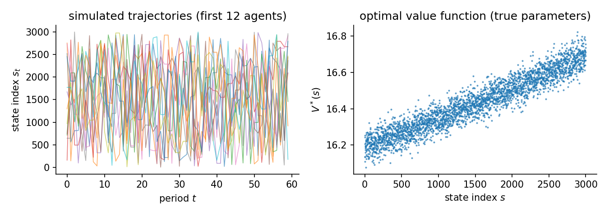

# Abstract MDP 3: High Dimensional Case

This page asks what survives when the state space reaches a few thousand states. Every tabular structural solver consumes a dense transition tensor whose memory and per-iteration cost grow with the square of the state count. An optimizer like MPEC additionally carries one variable per state. Rather than assert where that breaks, the feasibility probes below run every candidate except behavioral cloning, which is trivially cheap, once per scale under a hard time budget and report what happened. The measured answer is more interesting than the folklore. At 3000 states the entire classical family still completes, so the main table benchmarks it alongside the approximation-based estimators. The probes at the larger scale show where the costs actually separate.

## The data-generating process

Same Garnet generator as the previous abstract pages, scaled up. One MDP is drawn from the seed and held fixed: each state-action pair reaches a uniform random subset of $b$ states with Dirichlet weights, plus a small self-loop mass $\ell$:

$$
P(s' \mid s, a) \;=\; (1-\ell)\, D_{s,a}(s') \;+\; \ell\, \mathbf{1}\{s'=s\},
\qquad D_{s,a} \sim \mathrm{Dirichlet}(\mathbf{1}_b),\quad b = 8,\ \ell = 0.05 .
$$

The reward is linear in polynomial features of the normalized state index $x_s = s/(S-1)$, with action $0$ a zeroed outside option and, for $a \geq 1$,

$$
u_\theta(s,a) = \theta^\top \varphi(s,a),
\qquad \varphi(s,a) = \bigl(1,\ x_s,\ x_s^{2} + a\bigr),
\qquad \theta \sim \mathcal{N}(0,\ 0.25\, I_3).
$$

Behavior solves the soft Bellman equation with logit shocks (scale $\sigma = 1$):

$$
V(s) = \log \sum_{a} \exp\Bigl(u_\theta(s,a) + \beta\, \mathbb{E}\bigl[V(s') \mid s,a\bigr]\Bigr),
\qquad \pi^*(a \mid s) \propto \exp\Bigl(u_\theta(s,a) + \beta\, \mathbb{E}\bigl[V(s') \mid s,a\bigr]\Bigr).
$$

Three reward parameters generate behavior over three thousand states. The structure, not the state count, carries the information. That is what the feature-based estimators exploit.

A 3000-state Garnet MDP with stochastic sparse transitions (branching 8) and a 3-feature linear reward: `random_mdp(num_states=3000, num_actions=2, num_features=3, branching=8, discount_factor=0.95, seed=707)`. The panel (500 individuals x 60 periods) covers at most 30000 state visits, so most states are rarely or never observed. Estimators reach them only through the reward features, not through memorized choices. 500 x 60 observations, 3 replications, seed 707. True theta `[-0.1532, 0.9127, -0.0559]`. Design rank 3/3, condition number 3.90e+01, action-contrast rank 3/3 (the rank that identification from choices actually uses). Generated 2026-06-12 with econirl 0.0.4.



## Results

| Estimator | Family | Ran | Conv | Recovered params | Param RMSE | Policy TV | Regret base | Regret A | Regret B | Regret C | Time (s) |
|---|---|---|---|---|---|---|---|---|---|---|---|
| NFXP-SA | structural | 3/3 | 3/3 | [-0.096, 0.991, -0.126] | 0.1269 | 0.0031 | 0.0007 | 0.0007 | 0.0007 | 0.0000 | 46.9 |
| NFXP-NK | structural | 3/3 | 3/3 | [-0.096, 0.991, -0.126] | 0.1269 | 0.0031 | 0.0007 | 0.0007 | 0.0007 | 0.0000 | 27.9 |
| CCP | structural | 3/3 | 3/3 | [-0.108, 0.967, -0.113] | 0.1298 | 0.0136 | 0.0008 | 0.0008 | 0.0008 | 0.0000 | 1.8 |
| MPEC | structural | 3/3 | 3/3 | [-0.096, 0.991, -0.126] | 0.1269 | 0.0031 | 0.0007 | 0.0007 | 0.0007 | 0.0000 | 103.1 |
| UFXP | structural | 3/3 | 3/3 | [-0.075, 0.875, -0.123] | 0.1455 | 0.0088 | 0.0053 | 0.0054 | 0.0055 | 0.0000 | 1.1 |
| TD-CCP | structural | 3/3 | 3/3 | [-0.028, 1.117, -0.207] | 0.1694 | 0.0075 | 0.0036 | 0.0037 | 0.0036 | 0.0000 | 3.7 |
| NNES | structural | 3/3 | 3/3 | [-0.097, 0.990, -0.125] | 0.1260 | 0.0031 | 0.0007 | 0.0007 | 0.0007 | 0.0000 | 19.8 |
| GLADIUS | behavioral | 3/3 | 3/3 | [0.040, 1.079, -0.244] | - | 0.0221 | 0.0112 | 0.0114 | 0.0112 | 0.0000 | 15.6 |
| Deep-MCE-IRL | behavioral | 3/3 | 3/3 | [0.070, -0.038, 0.045] | - | 0.0516 | 0.2016 | 0.2014 | 0.2058 | 0.0000 | 59.8 |
| BC | behavioral | 3/3 | 3/3 | different parameterization (6000 values) | - | 0.1069 | 0.7059 | 0.7172 | 0.7922 | 93.5663 | 0.1 |

Param RMSE covers the structural family only, which shares the parameterization of the true model. Policy TV is the distance between estimated and true choice probabilities, lower is better. Conv is the estimator's own convergence indicator. A cautious estimator can report False while the recovered policy is accurate. Regret base is welfare lost in the observed environment. Types A, B, and C are welfare lost after a change. Type A shifts a payoff, Type B changes the transitions, Type C penalizes an action. Estimators with a recovered reward re-solve it and adapt. Those without one keep their old policy.

Behavioral cloning is the control group. It is nearly free and matches the data where the data exists, but it carries no reward. It can say nothing at unvisited states or under the counterfactual interventions. The gap between its regret and the reward-recovering estimators' regret is the value of estimating structure at this scale.

## Feasibility probes

Single fits per estimator and scale (same generator and panel configuration as the main cell, state count varying), one subprocess per fit, run before the main benchmark to decide the roster empirically.

| Estimator | States | Outcome | Time (s) | Detail |
|---|---|---|---|---|
| CCP | 3000 | completed | 3.1 |  |
| Deep-MCE-IRL | 3000 | completed | 59.8 |  |
| GLADIUS | 3000 | completed | 13.7 |  |
| MPEC | 3000 | completed | 100.1 |  |
| NFXP-NK | 3000 | completed | 30.8 |  |
| NFXP-SA | 3000 | completed | 45.6 |  |
| NNES | 3000 | completed | 20.3 |  |
| TD-CCP | 3000 | completed | 5.1 |  |
| UFXP | 3000 | completed | 1.5 |  |
| CCP | 8000 | completed | 11.5 |  |
| Deep-MCE-IRL | 8000 | completed | 511.9 |  |
| GLADIUS | 8000 | completed | 22.1 |  |
| MPEC | 8000 | completed | 480.1 |  |
| NFXP-NK | 8000 | completed | 263.9 |  |
| NFXP-SA | 8000 | completed | 321.4 |  |
| NNES | 8000 | completed | 45.3 |  |
| TD-CCP | 8000 | completed | 7.9 |  |
| UFXP | 8000 | completed | 8.1 |  |

Each probe is a single fit in its own subprocess with a hard 900-second budget; `timeout` means the fit was killed at the budget, with no number invented for it.

## Notes per estimator

**MPEC.** Constrained MLE with one optimizer variable per state plus the parameters, 3003 variables here. The SQP solver handles that joint problem and matches the nested-solver MLE at roughly 100 seconds per fit.

**UFXP.** Unnested fixed point (Bray; Oguz and Bray 2026) with optimal weighting, built for exactly this regime. One factorization before the parameter search, no fixed point inside any optimizer, and the fastest accurate structural fit on the page.

## Reproduce

```bash
python scripts/sim_abstract_mdp_3.py                 # run + write JSON
python scripts/sim_abstract_mdp_3.py --page          # regenerate this page
python scripts/sim_abstract_mdp_3.py --verify        # re-derive the table from JSON
```

Raw facts: `validation/results/sim_abstract_mdp_3.json`.

Not shown on this page: SEES (a spline value basis with basis_dim near the state count is its own scaling wall at thousands of states. Its showing is on the harder abstract MDP page); MCE-IRL, MaxEnt-IRL, AIRL, IQ-Learn, f-IRL and the other IRL methods (their exact inner solvers face the same dense-tensor cost the probes document for the classical family. The IRL comparison lives on the bus engine and gridworld pages).