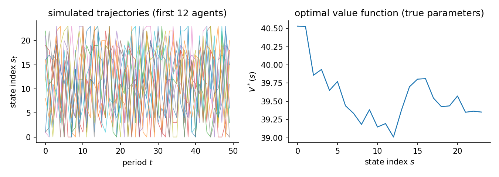

# Abstract MDP 4

The reward has an interaction effect. The true utility multiplies two features. The estimators receive the two features but never their product, so a linear utility is misspecified by construction. It is a fair omission, the kind an applied model makes every day. The question is what it costs. The table reports the distance from the true choices and the counterfactual regret.

Environment: a 24-state, 3-action MDP with sparse random transitions. 300 x 50 observations, 3 replications. Generated 2026-06-12 with econirl 0.0.6.

## The data-generating process

Each state-action pair reaches a random subset of $b$ states with Dirichlet weights:

$$
P(s' \mid s, a) = D_{s,a}(s'), \qquad D_{s,a} \sim \mathrm{Dirichlet}(\mathbf{1}_b), \quad b = 4.
$$

Two features vary smoothly in the normalized state index $x_s = s/(S-1)$. Action $0$ is a zeroed outside option, the identification anchor. For the other actions the features are

$$
\varphi(s,1) = \bigl(x_s,\ \sin \pi x_s\bigr), \qquad \varphi(s,2) = \bigl(1-x_s,\ \cos \pi x_s\bigr).
$$

The true reward adds the product of the two features, the interaction the estimators do not model:

$$
u(s,a) = \theta_0\, \varphi_0(s,a) + \theta_1\, \varphi_1(s,a) + \gamma\, \varphi_0(s,a)\, \varphi_1(s,a), \qquad \theta = (1.0, -0.8),\ \gamma = 2.5.
$$

A linear utility fits $\theta_0 \varphi_0 + \theta_1 \varphi_1$ and has no term for the product. The neural-reward methods learn a reward or value network over the same two features and can form it. The agent discounts at $\beta = 0.95$ and faces logit taste shocks, so behavior solves the soft Bellman equation. The figure shows the simulated paths and the optimal value function.



## Results

| Estimator | Reward | Ran | Conv | Policy TV | Regret base | Regret A | Regret B | Regret C | Time (s) |
|---|---|---|---|---|---|---|---|---|---|
| NFXP | linear | 3/3 | 3/3 | 0.1049 | 0.9687 | 0.9670 | 0.9012 | 0.6432 | 2.7 |
| CCP | linear | 3/3 | 3/3 | 0.1046 | 0.9658 | 0.9630 | 0.9025 | 0.6299 | 1.9 |
| MPEC | linear | 3/3 | 3/3 | 0.1049 | 0.9687 | 0.9670 | 0.9012 | 0.6432 | 0.4 |
| NNES | linear | 3/3 | 3/3 | 0.1049 | 0.9687 | 0.9670 | 0.9012 | 0.6432 | 11.4 |
| SEES | linear | 3/3 | 1/3 | 0.1042 | 0.9698 | 0.9678 | 0.8981 | 0.6391 | 1.0 |
| TD-CCP | linear | 3/3 | 3/3 | 0.1094 | 1.0078 | 1.0051 | 0.8672 | 0.6143 | 3.6 |
| UFXP | linear | 3/3 | 3/3 | 0.1085 | 0.9961 | 0.9945 | 0.8760 | 0.6289 | 0.3 |
| MCE-IRL | linear | 3/3 | 0/3 | 0.1049 | 0.9687 | 0.9670 | 0.9012 | 0.6432 | 7.2 |
| MaxEnt-IRL | linear | 3/3 | 3/3 | 0.1046 | 0.9672 | 0.9656 | 0.9064 | 0.6480 | 7.5 |
| IQ-Learn | linear | 3/3 | 3/3 | 0.1281 | 1.1260 | 1.1290 | 0.8963 | 0.6671 | 1.5 |
| f-IRL | linear | 3/3 | 3/3 | 0.0195 | 0.0291 | 0.0649 | 0.3983 | 71.1407 | 23.0 |
| BC | none | 3/3 | 3/3 | 0.0182 | 0.0246 | 0.0579 | 0.3862 | 70.8517 | 0.1 |
| GLADIUS | neural | 3/3 | 3/3 | 0.0379 | 1.1613 | 1.1506 | 0.8980 | 0.5868 | 12.7 |
| AIRL | neural | 3/3 | 0/3 | 0.0218 | 0.0351 | 0.0735 | 0.4341 | 71.3552 | 110.4 |
| Deep MCE-IRL | neural | 3/3 | 3/3 | 0.0217 | 0.0391 | 0.0717 | 0.4152 | 70.9284 | 25.4 |

The interaction costs two ways. The structural estimators land together: NFXP, CCP, MPEC, NNES, SEES, TD-CCP, and UFXP all sit near a policy distance of 0.10, the residual a linear utility leaves, and their re-solved reward loses close to one unit of welfare. The maximum-entropy IRL methods sit there too. The neural-reward methods learn the product: Deep MCE-IRL and AIRL match the choices to about 0.02 and keep the baseline welfare, though without a transferable reward they hold a fixed policy. GLADIUS matches the choices but projects its reward back onto the linear features, so its counterfactual regret is as large as the linear family's. BC and f-IRL match the choices without estimating a reward.

Reward marks whether the method fits a linear utility, learns a reward or value network, or clones the choices with no reward. Policy TV is the distance between estimated and true choice probabilities, lower is better. The value level is omitted: the reward is identified only up to transformations that leave behavior unchanged, so a value error across families would not compare like with like. Regret base is welfare lost in the observed environment. Types A, B, and C are welfare lost after a change: Type A shifts a payoff, Type B changes the transitions, Type C penalizes an action. Estimators with a recovered reward re-solve it and adapt. Those without one keep their fixed policy.

## Notes per estimator

**f-IRL.** Matches the state-visitation marginals. It tracks the choices, but the recovered reward does not hold up under a re-solve, so its counterfactual stays on the fixed policy.

**BC.** Clones the observed choice frequencies. It matches behavior with no reward, so it has nothing to carry to a counterfactual.

**GLADIUS.** Learns the behavior through a value network, then projects the reward back onto the linear features. The projection cannot hold the interaction, so its counterfactual regret is as large as the linear family's.

## Reproduce

```bash
python scripts/sim_abstract_mdp_4.py --replications 3
python scripts/sim_abstract_mdp_4.py --page
python scripts/sim_abstract_mdp_4.py --verify
```

Raw facts: `validation/results/sim_abstract_mdp_4.json`.

Excluded from this run: GAIL (known slow (~9 min/fit); not run here); DeepMaxEnt-IRL (known slow (~7 min/fit); not run here); Bayesian-IRL (known slow (~16 min/fit); not run here).