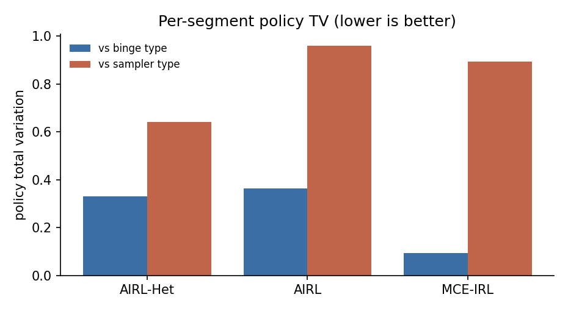

# Content consumption with latent viewer types

A viewer opens a feed and chooses what to watch each period, until they leave. Two kinds of viewer share the same feed. A binge type keeps watching the same category. A sampler type tires of a category fast and switches, then leaves sooner. The two types are not labelled in the data. An estimator sees only the choices.

A homogeneous method fits one reward to the whole crowd. With one reward it cannot serve two types, so it settles on one and leaves the other behind. This study asks whether AIRL-Het can pull the two types apart: recover a reward and a policy for each type, and sort each viewer into the right type.

## The data-generating process

Each viewer sits in a session. The state is a per-category satiation profile: how tired the viewer is of each content category right now. Watching a category raises its satiation. The other categories recover. The actions are watch category A, B, or C, or leave. Leaving ends the session and moves to an absorbing session-ended state.

The reward for watching is linear in four features: enjoyment of the category, a satiation cost on the category just watched, a flat time cost, and a variety bonus for keeping fresh categories on the menu. Leaving carries zero reward. The session-ended state carries zero reward. These two zeros are the anchors AIRL-Het uses to pin down the reward exactly.

The two types differ only in their reward weights on the four features (enjoyment, satiation_cost, time_cost, variety_bonus):

| Type | enjoyment | satiation_cost | time_cost | variety_bonus |
|---|---|---|---|---|
| binge | 4.00 | 0.05 | 0.10 | 0.20 |
| sampler | 0.50 | 3.00 | 3.00 | 0.30 |

The binge type weights enjoyment high and satiation cost low, so it keeps watching one category. The sampler type weights satiation cost and variety high, so it switches categories and leaves sooner. The panel draws 250 viewers from a 50/50 mixture and simulates each one for 40 periods from its own type's optimal policy. The latent type is recorded as ground truth. The state space is 65 states with 4 actions.

## Results

Per-segment policy total variation measures how far a recovered policy is from a true type's policy. Lower is better; zero means the policies agree. AIRL-Het has one policy per type, each scored against its matched type. The homogeneous baselines have one policy, scored against both types.

| Method | TV vs binge | TV vs sampler | Assignment accuracy |
|---|---|---|---|
| AIRL-Het | 0.331 | 0.640 | 0.996 |
| AIRL | 0.364 | 0.960 | n/a |
| MCE-IRL | 0.094 | 0.892 | n/a |

AIRL-Het recovers both types. Its per-segment policy TV is 0.331 for the binge type and 0.640 for the sampler type. It sorts 99.6 percent of viewers into the right type, well above the 50 percent a coin flip would give.

A homogeneous fit cannot do this. One policy has to serve everyone, so it settles on whichever type is easier to fit and leaves the other behind. Its worst-served type ends up far further from the truth than AIRL-Het's worst-served type. The single averaged reward is the reward of no real viewer.



## Reproduce

```bash
python scripts/study_content_consumption.py
```

Numbers are written to `validation/results/study_content_consumption.json`. The figure is written to `docs/_static/simulation_studies/content_consumption_results.png`.
