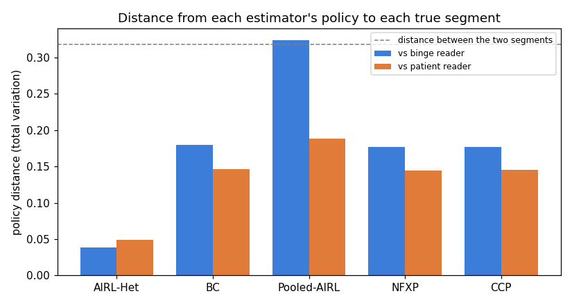

# Serialized content with hidden reader segments

A reader on a serialized-content platform moves through a book one chapter at a time. Each chapter the reader chooses to pay and read now, wait for a free unlock and then read, or exit the book. There are two hidden reader types with different tastes. One type reads on quality and cliffhangers and pays to keep going. The other type is price sensitive and waits for the free unlock. We never observe a reader's type. The study asks which estimators can recover the two types from choices alone.

## The data-generating process

The state combines four things: the chapter (out of 5), how long the reader has waited, whether the current chapter is priced or free, and a content-quality level. That gives 60 episode states plus one absorbing exit state, for 61 states in total. There are three actions: pay (0), wait (1), and exit (2).

Paying or waiting advances the content. Exit moves the reader to the absorbing state and ends the book. The exit action is the reward anchor: its reward is fixed at zero, and the value at the absorbing state is normalized to zero in estimation. These two anchors pin down the reward so that the recovered reward matches the true one rather than an arbitrary shifted version.

The reward is linear in 20 content features. Two latent segments have their own reward weights and near-even population shares of 0.48 and 0.52. Each reader keeps the same type across 4 books. Behaviour solves the soft Bellman equation with discount 0.92 and logit scale 0.85. The panel simulates 800 readers across 3200 books (12368 chapter decisions). The two segments do choose differently: the distance between their policies is 0.318 in total variation.

## What AIRL-Het recovers

AIRL-Het fits two segment-specific rewards with an EM loop that also infers each reader's type. Label switching is resolved before scoring: estimated segments are matched to true segments by reward distance, and assignment accuracy is computed after that match.

| Metric | Value |
|---|---|
| Segment assignment accuracy (after matching) | 0.895 |
| Segment prior L1 error | 0.0435 |
| Recovered priors | 0.50, 0.50 |
| Reward distance, binge reader (normalized RMSE) | 0.244 |
| Reward distance, patient reader (normalized RMSE) | 0.265 |
| Policy distance, binge reader (TV) | 0.038 |
| Policy distance, patient reader (TV) | 0.049 |
| Pooled policy distance vs average behaviour (TV) | 0.028 |
| Runtime (s) | 23.0 |

AIRL-Het recovers both segments. The policy distance is small for each one, the priors are close, and most readers are assigned to the right type.

### Pay / wait / exit choices

Rows are the choice the reader made. Columns are the choice the recovered model predicts for that reader's assigned type. Overall agreement is 0.581. The choices are random draws from a soft policy, so no model can match every one. As a reference, the true model's own choices agree with the sampled actions 0.569 of the time. The recovered model matches that reference.

| observed \ predicted | pay | wait | exit |
|---|---|---|---|
| pay | 4146 | 1200 | 301 |
| wait | 1572 | 2100 | 522 |
| exit | 791 | 801 | 935 |

## What the pooled and homogeneous estimators miss

These estimators assume a single reader type. Each one returns a single policy. The table reports how far that one policy sits from the average behaviour, and from each of the two true segments. A small pooled distance with large per-segment distances means the estimator matches the crowd but represents neither type.

| Estimator | Family | Recovers segments | Pooled TV | TV vs binge reader | TV vs patient reader | Time (s) |
|---|---|---|---|---|---|---|
| AIRL-Het | heterogeneous | yes (2) | 0.028 | 0.038 | 0.049 | 23.0 |
| BC | behavioral | no | 0.054 | 0.179 | 0.147 | 0.0 |
| Pooled-AIRL | behavioral | no | 0.181 | 0.324 | 0.189 | 2.1 |
| NFXP | structural | no | 0.040 | 0.177 | 0.145 | 3.2 |
| CCP | structural | no | 0.041 | 0.177 | 0.145 | 2.0 |

The structural and behavior-cloning baselines fit the average behaviour closely. Pooled-AIRL is a rougher single fit. None of them get close to each individual segment, because none model the two types. AIRL-Het stays close to both segments at once.

## What it shows

When choices come from a mix of hidden types, a single-type model fits the crowd and misses the parts. AIRL-Het separates the types, recovers a reward for each, and assigns readers to types from their choices. That is what makes segment-specific counterfactuals possible.

All numbers come from a results file written by the run script: `validation/results/study_content_consumption.json`. Reproduce with `PYTHONPATH=src:. python scripts/study_content_consumption.py`.
