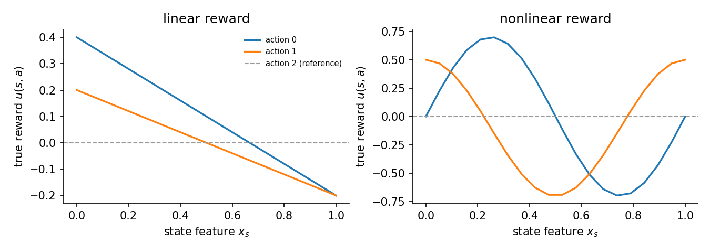
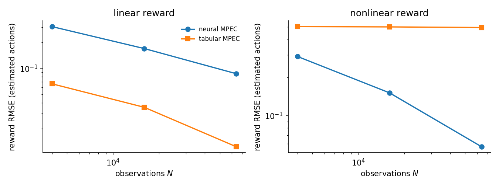

# Direct optimization approaches

Most structural estimators of dynamic discrete choice nest a Bellman fixed-point
solve inside every optimization step: NFXP and Deep MCE-IRL re-solve for the value
function each time the reward parameters change. Direct optimization avoids the
inner loop. It lifts the value function into the optimizer as a free variable and
solves a single problem, imposing the Bellman equation as a constraint rather than
re-deriving it. Three estimators are compared here, all on the same anchored data.
Tabular MPEC carries a linear reward and a value vector and imposes the soft
Bellman equation as a hard equality. Neural MPEC replaces both with networks, so
the equality relaxes to a soft penalty over a state grid. GLADIUS drops the known
transitions entirely and learns an expected-value network in their place.

## The three estimators

The setting is a finite MDP with states $s$, actions $a$, discount $\beta=0.95$,
and logit scale $\sigma=1$. The choice-specific value is

$$
Q(s,a) = u(s,a) + \beta \sum_{s'} P_a(s,s')\,V(s'),
$$

the logit policy is $\pi(a\mid s) = \mathrm{softmax}_a\!\big(Q(s,\cdot)/\sigma\big)$,
and the soft Bellman operator is

$$
TV(s) = \sigma \log \sum_a \exp\!\big(Q(s,a)/\sigma\big).
$$

At a solution $V = TV$. The three methods differ in how the reward is
parameterized, whether $P_a(s,s')$ is known, and how the Bellman condition enters
the optimization.

**Tabular MPEC** (Su and Judd, 2012) uses a linear reward
$u_\theta(s,a) = \phi(s,a)^\top \theta$ and known transitions. It treats the value
vector $V$ as a free variable alongside $\theta$ and imposes the soft Bellman
equation as a hard equality constraint, solved by SLSQP:

$$
\max_{\theta,\,V} \ \sum_{it} \log \pi_{\theta,V}(a_{it}\mid s_{it})
\quad \text{s.t.} \quad V - TV = 0.
$$

Because $V$ is a finite vector, the constraint can be enforced exactly at every
state.

**Neural MPEC** replaces the linear reward with a network $u_\theta(s,a)$ and the
value vector with a network $V_\phi(s)$, keeping the transitions known. Once $V$
is a network it cannot satisfy a hard equality at every state, so the Bellman
condition becomes a soft penalty evaluated at a set of collocation points (here
the full state grid). The loss is

$$
-\frac{1}{N}\sum_{it} \log \pi(a_{it}\mid s_{it})
\;+\; \frac{\rho}{2} \sum_{s} w(s)\,\big(V_\phi(s) - TV(s)\big)^2 .
$$

Because $P_a(s,s')$ is known, the expectation $\sum_{s'} P_a(s,s')\,V_\phi(s')$ is
a matrix-vector product computed exactly, with no double-sampling of transitions.
The reward is anchored so that the reference action carries zero utility,
$u_\theta(s,2) \equiv 0$. The co-training step is short:

```python
def loss_fn(m, rho_):
    u_all = m.reward.all_actions(onehot)
    V_all = m.value.all_states(onehot)
    EV = jnp.einsum("ast,t->as", T, V_all)
    Q = u_all + BETA * EV.T
    logp = jax.nn.log_softmax(Q / SIGMA, axis=1)
    nll = -logp[obs_s, obs_a].mean()
    resid = V_all - SIGMA * jax.scipy.special.logsumexp(Q / SIGMA, axis=1)
    return nll + 0.5 * rho_ * jnp.sum(w * resid**2), None
```

The `einsum` is the exact expected continuation value; `resid` is the per-state
Bellman residual that the penalty drives toward zero.

**GLADIUS** is model-free. It carries a neural $Q$ network and a neural
expected-value (EV) network and trains them single-loop with a soft Bellman
consistency penalty applied to observed transitions. It never uses $P_a(s,s')$:
the EV network stands in for $\sum_{s'} P_a(s,s')\,V(s')$ and is learned from data.
It is run here at the repository-standard network size (128 wide, 3 layers, 500
epochs) with the same action-2 anchor the MPEC methods receive, so it is a fair
model-free baseline. Because it does not use the transitions, its recovered reward
sits in a different identification gauge than the known-$P$ methods.

## Setup

The environment is a 3-action ergodic MDP with 20 states, $\beta=0.95$,
$\sigma=1$. Each state has a scalar feature $x_s \in [0,1]$. Action 2 is a
zero-reward reference action: its feature is identically zero, $\phi(s,2) \equiv 0$,
so its true reward is 0. This is a location normalization in the
Magnac-Thesmar sense; it point-identifies the reward level. All three estimators
pin $u(s,2) = 0$, the two MPEC methods through the feature map and the anchor, and
GLADIUS through its anchor argument.

Reward RMSE is reported over the estimated actions $\{0,1\}$ only. The reference
column is a free zero in both truth and estimate, so including it would mechanically
lower the error and flatter the numbers; it is excluded. Value RMSE is computed
against the soft-Bellman oracle value of the true reward and is comparable across
all three methods.

Two reward regimes are studied.

- **Linear reward.** The true reward is affine in the feature,
  $u(s,a) = \phi(s,a)^\top \theta$. The tabular MPEC is fed the same affine feature
  map, so it is correctly specified.
- **Nonlinear reward.** The true reward is a wave in the feature,
  $u(s,0) = 0.7 \sin 2\pi x$ and $u(s,1) = 0.6 \cos 2\pi x - 0.1$. The tabular MPEC
  is fed a reduced $(1, x)$ map per action and is therefore misspecified: an affine
  function cannot fit a wave.



## Results

Each cell is fit on 16,000 observations from a simulated panel. Reward RMSE is
over the estimated actions $\{0,1\}$; value RMSE is against the soft-Bellman
oracle. The Bellman residual is reported for neural MPEC, where the equation holds
only as a penalty; tabular MPEC enforces it exactly to solver tolerance, and
GLADIUS enforces a model-free consistency condition that is not comparable.

**Linear reward.**

| Estimator | Reward RMSE | Value RMSE | Max Bellman residual |
|---|---|---|---|
| neural MPEC | 0.165 | 0.341 | 0.0076 |
| tabular MPEC | 0.021 | 0.210 | exact (hard constraint) |
| GLADIUS | 0.185 | 2.608 | model-free |

**Nonlinear reward.**

| Estimator | Reward RMSE | Value RMSE | Max Bellman residual |
|---|---|---|---|
| neural MPEC | 0.175 | 0.390 | 0.0012 |
| tabular MPEC | 0.492 | 1.822 | exact (hard constraint) |
| GLADIUS | 0.480 | 4.506 | model-free |

The neural MPEC residual is on the order of $10^{-3}$ in both cells, so the soft
penalty does hold the learned value close to its own Bellman image: the network is
near equilibrium, not merely fitting choices.

The reward error is best read against sample size. The data-scaling sweep below
fits neural and tabular MPEC at $N = 4{,}000$, $16{,}000$, and $64{,}000$
observations and records reward RMSE.



| Regime | Method | N = 4k | N = 16k | N = 64k |
|---|---|---|---|---|
| linear | neural MPEC | 0.304 | 0.170 | 0.087 |
| linear | tabular MPEC | 0.066 | 0.035 | 0.012 |
| nonlinear | neural MPEC | 0.292 | 0.151 | 0.057 |
| nonlinear | tabular MPEC | 0.502 | 0.500 | 0.494 |

(The scaling sweep draws a fresh panel, so the linear neural value at 16k, 0.170,
is a separate draw from the 0.165 in the table above.)

In the linear regime both curves fall at roughly the root-$N$ rate, the signature
of a consistent estimator. The tabular MPEC sits below the neural one throughout:
four pooled parameters are estimated more precisely than a flexible per-state
reward, so when the affine specification is correct, the parametric method is more
efficient.

In the nonlinear regime the neural curve keeps falling toward zero while the
tabular curve is flat at about 0.50. That plateau is a bias floor, not noise: the
affine map cannot represent the wave, and more data cannot remove an
approximation error. The flexible neural reward recovers the wave and its error
keeps shrinking.

## How the three compare

The comparison turns on three axes: the reward form (linear versus neural),
whether the transitions are used (known $P$ versus model-free), and how the
Bellman condition is imposed (hard constraint versus soft penalty).

Under a correct linear specification the parametric tabular MPEC is the most
efficient method, with the lowest reward RMSE (0.021 versus 0.165) and the lowest
value RMSE (0.210 versus 0.341). Pooling the reward into four parameters beats
estimating a flexible per-state reward when the four parameters are the right ones.
Neural MPEC is still consistent, its reward RMSE falling at root-$N$, but it pays a
variance price for flexibility it does not need here.

Under misspecification the ranking flips. The tabular MPEC reward error plateaus at
a bias floor near 0.50 that no amount of data removes, while neural MPEC keeps the
reward error falling as it fits the wave. This is the case for which neural
flexibility exists: when the analyst does not know the functional form, a method
that can represent it avoids a fixed approximation error.

Both known-$P$ methods recover the value function far better than the model-free
GLADIUS, with value RMSE around 0.2 to 0.4 against roughly 2.6 to 4.5. That gap is
the honest cost of not using the known transitions: GLADIUS must learn the
expected-continuation operator from data instead of computing it. Its reward sits
in a different, model-free gauge because it never uses $P_a(s,s')$, so its reward
RMSE is shown as a model-free reference, not a like-for-like structural comparison
with the two known-$P$ methods.

## Estimators

The three runner functions, lightly trimmed.

```python
def run_neural_mpec(env, obs_states, obs_actions, *, width=32, depth=2, rho=1.0,
                    epochs=4000, lr=5e-3, seed=0) -> dict:
    """Co-train (u_theta, V_phi) with NLL + exact (known-P) Bellman-residual penalty."""
    S, A = env.num_states, env.num_actions
    onehot = jnp.eye(S, dtype=jnp.float64)
    T = jnp.asarray(env.transition_matrices, dtype=jnp.float64)
    obs_s = jnp.asarray(np.asarray(obs_states), dtype=jnp.int32)
    obs_a = jnp.asarray(np.asarray(obs_actions), dtype=jnp.int32)
    w = jnp.ones(S, dtype=jnp.float64) / S  # uniform collocation over the full grid

    key = jax.random.PRNGKey(seed)
    k_r, k_v = jax.random.split(key)
    model = NeuralMPEC(reward=RewardNet(S, A, width, depth, key=k_r),
                       value=ValueNet(S, width, depth, key=k_v))

    def loss_fn(m, rho_):
        u_all = m.reward.all_actions(onehot)
        V_all = m.value.all_states(onehot)
        EV = jnp.einsum("ast,t->as", T, V_all)
        Q = u_all + BETA * EV.T
        logp = jax.nn.log_softmax(Q / SIGMA, axis=1)
        nll = -logp[obs_s, obs_a].mean()
        resid = V_all - SIGMA * jax.scipy.special.logsumexp(Q / SIGMA, axis=1)
        return nll + 0.5 * rho_ * jnp.sum(w * resid**2), None
    # ... adam loop over `epochs`, then return reward/value RMSE and max residual
```

```python
def run_tabular_mpec(env, panel, est_features, est_names) -> dict:
    from econirl.estimation.mpec import MPECConfig, MPECEstimator

    util = LinearUtility(feature_matrix=jnp.asarray(est_features), parameter_names=est_names)
    est = MPECEstimator(config=MPECConfig(solver="slsqp", outer_max_iter=200,
                                          constraint_tol=1e-6),
                        compute_hessian=False, verbose=False)
    res = est.estimate(panel, util, env.problem_spec, env.transition_matrices)
    est_R = np.einsum("sak,k->sa", np.asarray(est_features), np.asarray(res.parameters))
    true_R = np.asarray(env.true_reward_matrix)
    A = env.num_actions
    return {
        "reward_rmse": rmse(est_R[:, :A - 1], true_R[:, :A - 1]),
        "value_rmse": rmse(res.value_function, oracle_value(env)),
        "converged": bool(res.converged),
    }
```

```python
def run_gladius(env, panel) -> dict:
    from econirl.estimation.gladius import GLADIUSConfig, GLADIUSEstimator

    S, A = env.num_states, env.num_actions
    util = LinearUtility(feature_matrix=env.feature_matrix,
                         parameter_names=env.parameter_names)
    est = GLADIUSEstimator(config=GLADIUSConfig(
        q_hidden_dim=128, v_hidden_dim=128, q_num_layers=3, v_num_layers=3,
        max_epochs=500, batch_size=512,
        anchor_action=REF_ACTION, anchor_rewards=tuple(0.0 for _ in range(S)),
        anchor_bellman_mode="anchor_moment", compute_se=False, verbose=False,
    ))
    res = est.estimate(panel, util, env.problem_spec, env.transition_matrices)
    reward_table = np.asarray(res.metadata["reward_table"], dtype=np.float64)
    true_R = np.asarray(env.true_reward_matrix)
    return {
        "reward_rmse": rmse(reward_table[:, :A - 1], true_R[:, :A - 1]),
        "value_rmse": rmse(res.value_function, oracle_value(env)),
        "converged": bool(res.converged),
        "note": "model-free; reward in a different gauge (no known P)",
    }
```

## Reproduce

```bash
python scripts/sim_direct_optimization.py
```

Numbers are written to `validation/results/sim_direct_optimization.json`; the two
figures are written under `docs/_static/simulation_studies/`
(`direct_optimization_rewards.png` and `direct_optimization_scaling.png`).
