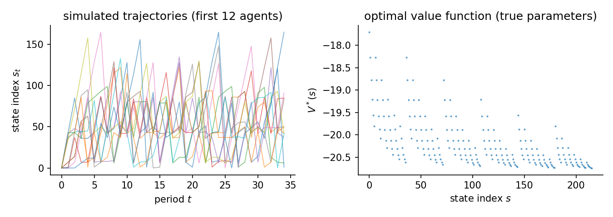
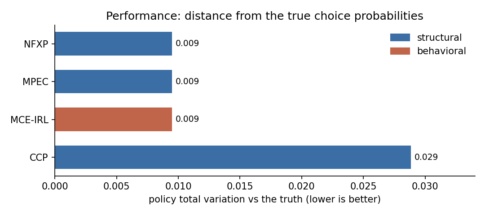
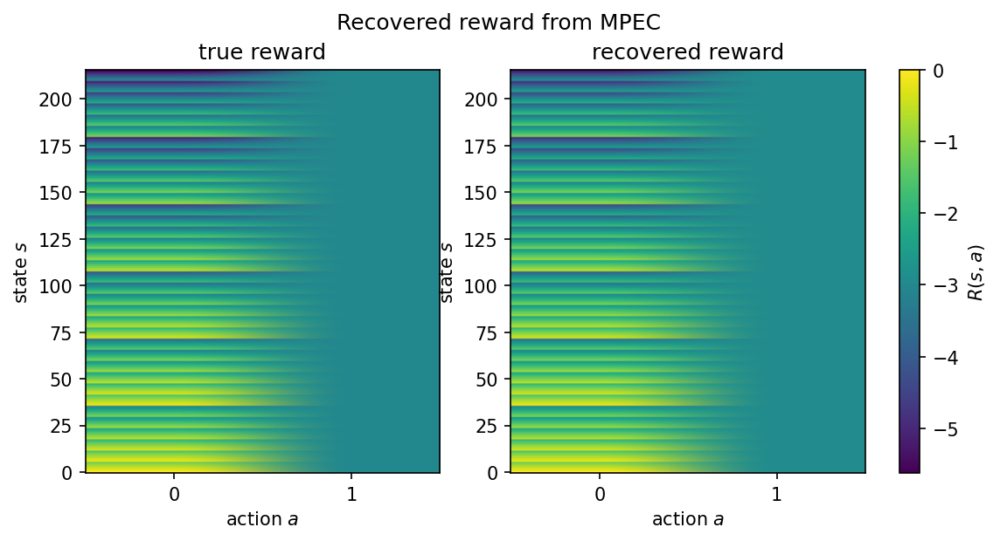
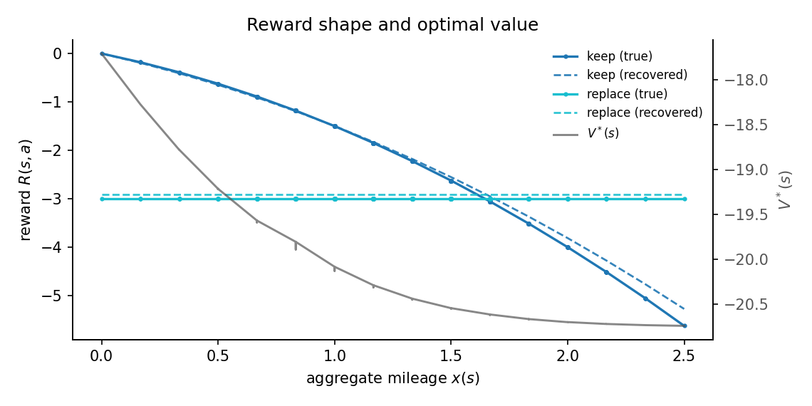

# Fleet maintenance (multi-component bus engine replacement)

A fleet operator maintains a bus with $K$ independent engine components. Each period, the operator chooses to keep all components running or replace them all at once. Replacing is costly upfront but avoids the growing operating cost that accumulates as mileage rises. The problem is a multi-component extension of Rust (1987).

## The data-generating process

Each of the $K$ engine components ages through $M$ mileage bins $m_k \in \{0, \ldots, M-1\}$. The joint state is encoded via mixed-radix as a single flat index $s \in \{0, \ldots, M^K - 1\}$. This study uses $K = 3$ components and $M = 6$ bins, giving $M^K = 216$ states and 2 actions.

Each component mileage advances stochastically each period by 0, 1, or 2 bins with probabilities $(0.3919,\;0.5953,\;0.0128)$, capped at the last bin. The components evolve independently, so the joint transition matrix is a Kronecker product of the per-component matrices. Replacing resets all components to bin 0 and applies one mileage draw.

The reward is linear in three features. Let $x(s) = \sum_k m_k / M$ be the aggregate normalized mileage:

$$
u_\theta(s, a) = \begin{cases}
-\theta_{\mathrm{op}}\,x(s) - \theta_{\mathrm{q}}\,x(s)^2 & a = \text{keep} \\
-\theta_{\mathrm{rc}} & a = \text{replace}
\end{cases}
$$

where $\theta_{\mathrm{rc}}$ is the replacement cost, $\theta_{\mathrm{op}}$ is the linear operating cost, and $\theta_{\mathrm{q}}$ is the quadratic wear cost. The true parameters are $\theta = [\theta_{\mathrm{rc}},\;\theta_{\mathrm{op}},\;\theta_{\mathrm{q}}] = [3.0,\;1.0,\;0.5]$.

Agents discount future payoffs at $\beta = 0.95$ and face i.i.d. logit taste shocks (scale $\sigma = 1$). Their behaviour solves the soft Bellman equation. The action-contrast feature vector is $[-1,\;x(s),\;x(s)^2]$ for each state $s$. Because $x(s)$ takes many distinct values across the 216 states, the contrast feature matrix has rank 3 and all three parameters are identified from observed choices. The operator replaces when aggregate mileage exceeds a threshold (approximately $x(s) > 1.65$ at the true parameters). The panel simulates $N$ agents for $T$ periods from the true optimal policy.

The study uses 200 fleets, 35 periods, and 2 replications. The true parameters
are $[3.0,\;1.0,\;0.5]$ for replacement cost, linear operating cost, and
quadratic wear cost. The action-contrast feature matrix has full rank, so all
three parameters are identified from choices.



## Estimators and data

| Estimator | Family | Uses transitions $P(s'\mid s,a)$ | Transferable reward | Standard errors |
|---|---|---|---|---|
| NFXP | structural | yes | yes | yes |
| CCP | structural | yes | yes | yes |
| MCE-IRL | behavioral | yes | yes | no |
| GLADIUS | behavioral | no | no | no |

Uses transitions is whether the estimator reads the transition kernel; model-free learners do not. Transferable reward is whether it recovers a reward that re-solves under a counterfactual. Standard errors is whether it returns inference. The last two are read from the run.

## Results

| Estimator | Family | Ran | Conv | Recovered params | Param RMSE | Policy TV | Regret base | Regret A | Regret B | Regret C | Time (s) |
|---|---|---|---|---|---|---|---|---|---|---|---|
| NFXP | structural | 2/2 | 2/2 | [2.917, 1.090, 0.408] | 0.1737 | 0.0095 | 0.0061 | 0.0061 | 0.0281 | 0.0908 | 2.5 |
| CCP | structural | 2/2 | 2/2 | [2.980, 1.296, 0.205] | 0.2494 | 0.0288 | 0.0191 | 0.0194 | 0.1673 | 0.7239 | 2.4 |
| MCE-IRL | behavioral | 2/2 | 0/2 | [2.917, 1.090, 0.408] | - | 0.0095 | 0.0061 | 0.0061 | 0.0281 | 0.0908 | 7.0 |
| GLADIUS | behavioral | 2/2 | 2/2 | - | - | - | - | - | - | - | 6.7 |

Param RMSE covers the structural family only, which shares the parameterization of the true model. Policy TV is the distance between estimated and true choice probabilities, lower is better. Conv is the estimator's own convergence indicator. A cautious estimator can report False while the recovered policy is accurate. Regret base is welfare lost in the observed environment. Types A, B, and C are welfare lost after a change. Type A shifts a payoff, Type B changes the transitions, Type C penalizes an action. Estimators with a recovered reward re-solve it and adapt. Those without one keep their old policy.



## Parameter recovery

| Estimator | Parameter | True | Mean est | Bias | Emp. SE | RMSE | 95% coverage | SE avail |
|---|---|---|---|---|---|---|---|---|
| NFXP | replacement_cost | 3.000 | 2.917 | -0.083 | 0.099 | 0.109 | 1.00 +/- 0.00 | 100% (2 reps) |
| NFXP | operating_cost | 1.000 | 1.090 | +0.090 | 0.312 | 0.238 | 1.00 +/- 0.00 | 100% (2 reps) |
| NFXP | quadratic_cost | 0.500 | 0.408 | -0.092 | 0.210 | 0.174 | 1.00 +/- 0.00 | 100% (2 reps) |
| CCP | replacement_cost | 3.000 | 2.980 | -0.020 | 0.094 | 0.070 | 1.00 +/- 0.00 | 100% (2 reps) |
| CCP | operating_cost | 1.000 | 1.296 | +0.296 | 0.289 | 0.360 | 0.00 +/- 0.00 | 100% (2 reps) |
| CCP | quadratic_cost | 0.500 | 0.205 | -0.295 | 0.199 | 0.327 | 0.00 +/- 0.00 | 100% (2 reps) |

Coverage is the share of replications whose 95% interval contains the truth, shown with its Monte Carlo standard error. It is computed only where every replication produced a finite standard error. SE avail is the share of replications with finite standard errors.

The structural family (NFXP, CCP, MPEC) recovers all three parameters on the same scale as the truth, so Param RMSE applies to them alone. MCE-IRL here uses the same linear features and recovers the same values, but its weights stay out of the recovery table because an IRL reward is only partially identified in general. GLADIUS learns a neural policy object with no directly comparable reward weights in this study. Policy TV and regret are the right scorecards for the behavioral family.

## Reward and structure

The true and recovered rewards sit side by side as state-by-action heatmaps on one color scale. The 216 states are the factored mileage combinations. The replace action is flat. The keep action darkens as aggregate mileage rises.



The raw state index is not ordered, because the state is a factored combination of three component mileages. Plotting reward against aggregate mileage $x(s) = \sum_k m_k / M$ recovers the structural shape: the keep cost falls with mileage, the replace cost is flat, and the recovered reward (dashed) tracks the truth.



## Notes per estimator

**NFXP.** Full-solution MLE with a nested Bellman fixed-point inner loop. Quadratic convergence near the optimum. All three parameters are identified from the action-dependent replacement indicator: the keep action has features [0, -x, -x^2] and the replace action has feature [-1, 0, 0], so the action-contrast varies across states and all three coordinates are recoverable.

**CCP.** CCP uses a first-step nonparametric policy estimate to avoid the inner Bellman loop. One policy-iteration step corrects the bias from the nonparametric first stage. Fast on the 216-state factored space because it avoids repeated value-iteration inner solves.

**MCE-IRL.** Its convergence indicator mirrors the inner optimizer's success status. The optimizer can stop short while the recovered policy is already accurate, so it can read False on an accurate fit.

**GLADIUS.** Neural Q and continuation learner. Uses the feature matrix and
the observed panel; it does not use transition matrices in this study. The
216-state factored space is the point of the scalability comparison. At this
state count, a few high-mileage states may go unvisited in the training panel,
so the recovered policy can cover fewer than 216 states and Policy TV is not
computed for that row.

## Reproduce

```bash
python scripts/study_fleet_maintenance.py                 # run + write JSON
python scripts/study_fleet_maintenance.py --page          # regenerate this page
python scripts/study_fleet_maintenance.py --verify        # re-derive the table from JSON
```

Results file: `validation/results/study_fleet_maintenance.json`.

Not shown on this page: MPEC (an Other-tier constrained-optimization form of the same MLE; NFXP and CCP carry the structural recovery here); IQ-Learn, f-IRL (not separately identified from choices on this problem; reward is only partially identified from behavior); NNES, SEES, TD-CCP, UFXP (correct structural estimators but slower on a 216-state factored space; NFXP and CCP already cover the structural family); MaxEnt-IRL, MaxMargin-IRL, AIRL, Neural MCE-IRL (trajectory-entropy and adversarial objectives are not the choice model that generated the data; neural AIRL adds compute without new information here).
