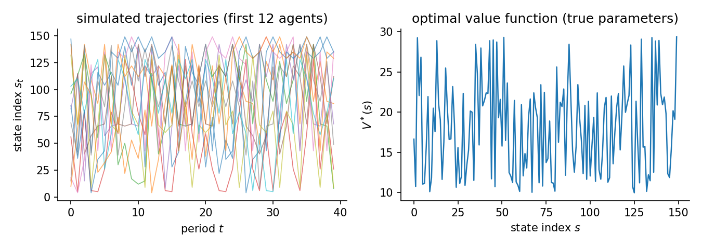
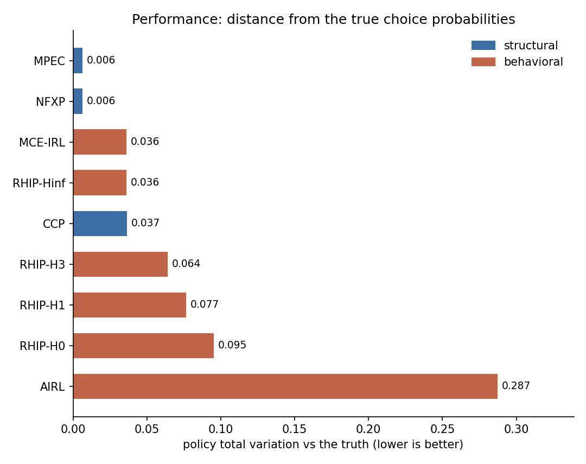
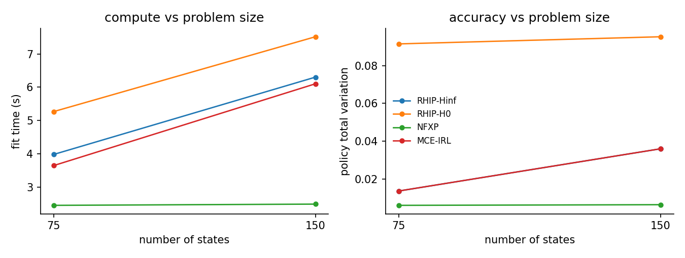
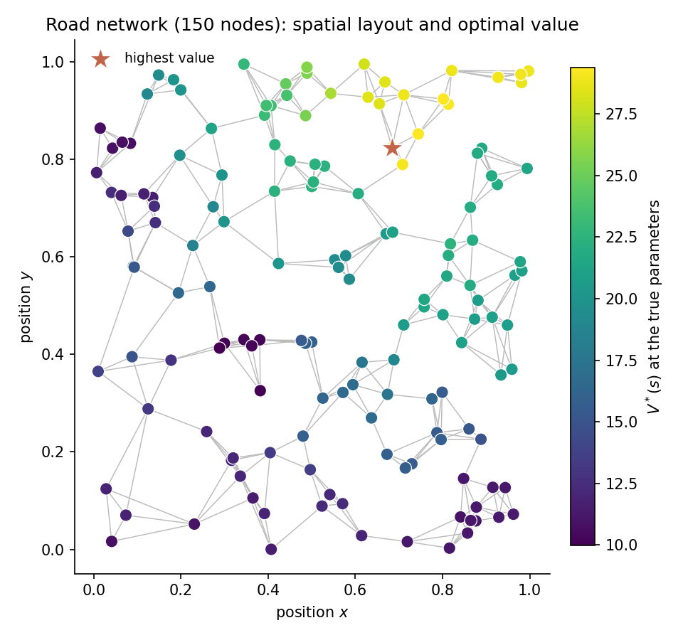

# High-dimensional route choice on a synthetic road network

A traveller moves through a road network one step at a time. Each period, the agent chooses among the nearest neighbours of the current node. The utility depends on the edge: how long it is, how attractive the destination is, and how close the destination sits to a fixed goal node. This is the same route-choice problem as the small study, run on a much larger graph.

## Why this study

Real route choice spans hundreds to millions of road segments. At that scale, the fully stochastic planner that Max Causal Entropy IRL solves becomes expensive. A shorter planning horizon trades a little accuracy for a lot of compute. RHIP (Receding Horizon Inverse Planning) makes the horizon a single knob $H$. Within $H$ steps the agent plans with the expensive stochastic policy; beyond $H$ it falls back to a cheap deterministic planner. The horizon recovers three classic methods as special cases:

$$
H = 0 \;\to\; \text{Max-Margin Planning}, \quad H = 1 \;\to\; \text{Bayesian-IRL middle ground}, \quad H = \infty \;\to\; \text{Max Causal Entropy IRL}.
$$

The 25-node study cannot show the one thing the horizon is for: behaviour at scale. This study runs the spectrum on a 150-node graph.

## The data-generating process

Nodes are scattered uniformly at random in the unit square. Edges connect pairs within a fixed Euclidean radius. A spanning tree is overlaid to keep the graph connected. The agent at node $s$ picks among $A$ nearest neighbours sorted by distance. Actions beyond the node degree self-loop.

The reward for traversing edge $(s, a) \to s'$ is linear in three features:

$$
u_\theta(s, a) = \theta_{\mathrm{cost}}\,(-d_{ss'}) + \theta_{\mathrm{am}}\,\mathrm{am}(s') + \theta_{\mathrm{goal}}\,(-\ell_{s'})
$$

where $d_{ss'}$ is the Euclidean edge length, $\mathrm{am}(s')$ is a node-level amenity draw, and $\ell_{s'}$ is the shortest-path distance from $s'$ to a fixed destination node. The true parameters are $\theta = [1.0,\;0.5,\;1.0]$.

Agents discount future payoffs at $\beta$ and face i.i.d. logit taste shocks (scale $\sigma = 1$). Their behaviour solves the soft Bellman equation. All three parameters are identified from observed route choices because the features vary across edges, not just states. The panel scales with the graph (400 agents at 150 nodes) so state coverage stays adequate. The figure shows simulated paths and the optimal value function (lower at nodes far from the goal).

Synthetic route choice on a random geometric road network. ``road_network(num_nodes=150, num_actions=4, discount_factor=0.95, seed=0)``. 400 x 40 observations, 2 replications, seed 42. True theta `[1.0, 0.5, 1.0]`. Design rank 3/3, condition number 2.46e+01, action-contrast rank 3/3 (the rank that identification from choices actually uses). Generated 2026-06-23 with econirl 0.0.7.



## Estimators and data

| Estimator | Family | Uses transitions $P(s'\mid s,a)$ | Transferable reward | Standard errors |
|---|---|---|---|---|
| RHIP-H0 | behavioral | yes | yes | no |
| RHIP-H1 | behavioral | yes | yes | no |
| RHIP-H3 | behavioral | yes | yes | no |
| RHIP-Hinf | behavioral | yes | yes | no |
| MCE-IRL | behavioral | yes | yes | no |
| AIRL | behavioral | no | no | no |
| NFXP | structural | yes | yes | yes |
| CCP | structural | yes | yes | no |
| MPEC | structural | yes | yes | yes |

Uses transitions is whether the estimator reads the transition kernel; model-free learners do not. Transferable reward is whether it recovers a reward that re-solves under a counterfactual. Standard errors is whether it returns inference. The last two are read from the run.

## Results

| Estimator | Family | Ran | Conv | Recovered params | Param RMSE | Policy TV | Regret base | Regret A | Regret B | Regret C | Time (s) |
|---|---|---|---|---|---|---|---|---|---|---|---|
| RHIP-H0 | behavioral | 2/2 | 0/2 | [1.842, 0.456, 1.228] | - | 0.0952 | 0.0519 | 0.0540 | 0.0483 | 0.0578 | 7.5 |
| RHIP-H1 | behavioral | 2/2 | 0/2 | [1.774, 0.494, 1.283] | - | 0.0766 | 0.0397 | 0.0420 | 0.0594 | 0.0967 | 7.1 |
| RHIP-H3 | behavioral | 2/2 | 0/2 | [0.947, 0.478, 1.149] | - | 0.0640 | 0.0201 | 0.0197 | 0.0136 | 0.0205 | 6.7 |
| RHIP-Hinf | behavioral | 2/2 | 0/2 | [-0.055, 0.465, 0.746] | - | 0.0360 | 0.0537 | 0.0581 | 0.0855 | 0.0325 | 6.3 |
| MCE-IRL | behavioral | 2/2 | 0/2 | [-0.055, 0.465, 0.746] | - | 0.0360 | 0.0537 | 0.0581 | 0.0855 | 0.0325 | 6.1 |
| AIRL | behavioral | 2/2 | 2/2 | - | - | 0.2872 | 6.1177 | 5.8846 | 3.7734 | 49.8310 | 83.1 |
| NFXP | structural | 2/2 | 2/2 | [1.072, 0.513, 0.963] | 0.0903 | 0.0065 | 0.0028 | 0.0027 | 0.0021 | 0.0018 | 2.5 |
| CCP | structural | 2/2 | 2/2 | [0.796, 0.504, 0.901] | 0.1341 | 0.0366 | 0.0060 | 0.0062 | 0.0071 | 0.0047 | 2.4 |
| MPEC | structural | 2/2 | 2/2 | [1.072, 0.513, 0.963] | 0.0903 | 0.0065 | 0.0028 | 0.0027 | 0.0021 | 0.0018 | 0.3 |

Param RMSE covers the structural family only, which shares the parameterization of the true model. Policy TV is the distance between estimated and true choice probabilities, lower is better. Conv is the estimator's own convergence indicator. A cautious estimator can report False while the recovered policy is accurate. Regret base is welfare lost in the observed environment. Types A, B, and C are welfare lost after a change. Type A shifts a payoff, Type B changes the transitions, Type C penalizes an action. Estimators with a recovered reward re-solve it and adapt. Those without one keep their old policy.



## Parameter recovery

| Estimator | Parameter | True | Mean est | Bias | Emp. SE | RMSE | 95% coverage | SE avail |
|---|---|---|---|---|---|---|---|---|
| NFXP | edge_cost | 1.000 | 1.072 | +0.072 | 0.209 | 0.164 | 1.00 +/- 0.00 | 100% (2 reps) |
| NFXP | amenity | 0.500 | 0.513 | +0.013 | 0.002 | 0.013 | 1.00 +/- 0.00 | 100% (2 reps) |
| NFXP | goal | 1.000 | 0.963 | -0.037 | 0.017 | 0.039 | 1.00 +/- 0.00 | 100% (2 reps) |
| CCP | edge_cost | 1.000 | 0.796 | -0.204 | 0.169 | 0.236 | - | 0% (2 reps) |
| CCP | amenity | 0.500 | 0.504 | +0.004 | 0.002 | 0.004 | - | 0% (2 reps) |
| CCP | goal | 1.000 | 0.901 | -0.099 | 0.009 | 0.099 | - | 0% (2 reps) |
| MPEC | edge_cost | 1.000 | 1.072 | +0.072 | 0.209 | 0.164 | 1.00 +/- 0.00 | 100% (2 reps) |
| MPEC | amenity | 0.500 | 0.513 | +0.013 | 0.002 | 0.013 | 1.00 +/- 0.00 | 100% (2 reps) |
| MPEC | goal | 1.000 | 0.963 | -0.037 | 0.017 | 0.039 | 1.00 +/- 0.00 | 100% (2 reps) |

Coverage is the share of replications whose 95% interval contains the truth, shown with its Monte Carlo standard error. It is computed only where every replication produced a finite standard error. SE avail is the share of replications with finite standard errors.

The structural family (NFXP, CCP, MPEC) recovers all three parameters on the same scale as the truth, so Param RMSE applies to them alone. The RHIP horizon variants and MCE-IRL use the same linear features but their weights stay out of the recovery table, because an IRL reward is only partially identified in general. RHIP-Hinf and MCE-IRL match by construction. Policy TV and regret are the right scorecards for the behavioral family. AIRL learns a model-free policy with no reward weights to compare.

## Scaling

The same study at two problem sizes (75 and 150 states). Each line is one estimator: fit time on the left, policy total variation on the right. The structural method (NFXP) stays cheap and accurate as the graph grows. The RHIP endpoints bracket the horizon spectrum: H=0 is the cheap deterministic end, H=inf the expensive stochastic end that matches MCE-IRL. The compute gap between them is the receding-horizon tradeoff, and it is the gap this study is built to expose. With only two sizes the lines trace a direction, not an asymptotic rate.



## Reward and structure

The 150-node network sits in the unit square. Each dot is a node, each line an edge. The color is the optimal value $V^*(s)$ at the true parameters: value rises toward the goal node (the star). This is the spatial scale a short planning horizon is built for.



The horizon $H$ is the single knob that spans a family of methods. The figure traces policy total variation and fit time across the four horizons. $H=0$ is the Max-Margin-Planning end. $H=\infty$ matches Max Causal Entropy IRL. Accuracy improves as the horizon grows, and the compute climbs with it. That tradeoff is what the horizon buys.


## Notes per estimator

**RHIP-H0.** Receding Horizon Inverse Planning at horizon zero. No soft backups run, so the policy is a softmax over the deterministic continuation value. This is the Max-Margin-Planning end of the spectrum: cheap, and the least robust to demonstrator noise.

**RHIP-H1.** One soft Bellman backup over the deterministic tail. A middle ground between the deterministic and the fully stochastic planner.

**RHIP-H3.** Three soft Bellman backups. Most of the accuracy of the full stochastic planner at a fraction of its planning cost, which is the receding-horizon tradeoff this study is built to show.

**RHIP-Hinf.** The infinite-horizon endpoint delegates to MCE-IRL with the same config, so RHIP-Hinf and MCE-IRL are the same computation here. Their rows match by construction. This anchors the spectrum at the Max Causal Entropy end.

**MCE-IRL.** Max Causal Entropy IRL with linear features. Its convergence indicator reports whether the gradient norm crossed the tolerance. The objective often plateaus before that, so it can read False while the recovered policy is accurate. It is the H=inf endpoint of the RHIP spectrum.

**AIRL.** Adversarial IRL. A model-free neural reward learner trained against a policy network. It reads the feature matrix and the panel, not the transition kernel. Capped at 200 epochs here for short compute.

**NFXP.** Full-solution MLE with a nested Bellman fixed-point inner loop. Quadratic convergence near the optimum. All three parameters are identified from the edge-feature contrast.

**CCP.** CCP uses a first-step nonparametric policy estimate to avoid the inner Bellman loop. One policy-iteration step corrects the first-stage bias.

**MPEC.** Mathematical programming with equilibrium constraints. Uses solver='sqp' for real constrained MLE; the legacy 'slsqp' alias checks only Bellman feasibility. The constrained solve is the slowest of the structural family at this size.

## Reproduce

```bash
python scripts/study_highdim_route_choice.py                 # run + write JSON
python scripts/study_highdim_route_choice.py --page          # regenerate this page
python scripts/study_highdim_route_choice.py --verify        # re-derive the table from JSON
```

Raw facts: `validation/results/study_highdim_route_choice.json`.

Not shown on this page: IQ-Learn, f-IRL (not separately identified from choices on this problem; reward is only partially identified from behavior); NeuralGLADIUS (model-free policy learner, coverage-fragile at this size; peripheral nodes go unvisited and its policy estimate degrades where the panel does not reach); NNES, SEES, TD-CCP, UFXP (correct structural estimators but slower at 150 states; NFXP and CCP already cover the structural family).