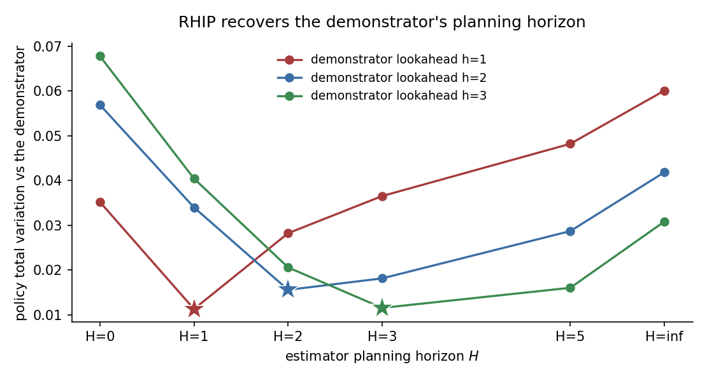

# RHIP recovers the demonstrator's planning horizon

A traveller moves through a road network one step at a time, choosing among the
nearest neighbours of the current node. The utility of an edge depends on its
length, the amenity of the destination, and the destination's distance to a fixed
goal. The true reward is linear in these three features with parameters
$\theta = [1.0, 0.5, 1.0]$.

## Why this study

RHIP makes the planning horizon $H$ a single knob. Within $H$ steps the agent
plans with the stochastic soft-Bellman policy. Beyond $H$ it falls back to a
deterministic planner. At $H=0$ this is Max-Margin Planning, at $H=\infty$ it is
Max Causal Entropy IRL, and finite $H$ interpolates.

On real Google Maps data the source paper finds that an interior horizon predicts
routes better than either endpoint, because real drivers are neither fully myopic
nor fully stochastic. They plan within a finite horizon and approximate beyond it.
The finite-horizon planner is a better-specified model of that behavior.

This study reproduces that mechanism on synthetic data with a known reward and a
known demonstrator. The demonstrator is a finite-lookahead planner with a true
lookahead $h$: it plans softly for $h$ steps,
then deterministically. We fit RHIP across a sweep of estimator horizons and
measure how far each recovered policy sits from the true demonstrator policy. The
demonstrator and estimator share the logit scale, so the only thing that can be
mis-set is the horizon.

## The data-generating process

Nodes are scattered uniformly in the unit square. Edges connect pairs within a
fixed radius, with a spanning tree overlaid for connectivity. Demonstrations are
drawn from the finite-lookahead policy at the true reward. Each demonstrator draws
300 agents over 40 periods, 3
replications, on a 25-node graph.

The finite-lookahead demonstrators are genuinely between the two endpoints.
The $h=1$ demonstrator sits 0.033 from the $H=0$ policy and 0.089 from the $H=\infty$ policy. The $h=2$ demonstrator sits 0.054 from the $H=0$ policy and 0.066 from the $H=\infty$ policy. The $h=3$ demonstrator sits 0.070 from the $H=0$ policy and 0.052 from the $H=\infty$ policy.

## Result

Policy total variation between the recovered policy and the true demonstrator
policy, by estimator horizon (rows) and demonstrator lookahead. The best horizon
in each row is in bold.

| Demonstrator | $H=0$ | $H=1$ | $H=2$ | $H=3$ | $H=5$ | $H=\infty$ |
| --- | ---: | ---: | ---: | ---: | ---: | ---: |
| lookahead $h=1$ | 0.0352 | **0.0113** | 0.0282 | 0.0365 | 0.0482 | 0.0601 |
| lookahead $h=2$ | 0.0569 | 0.0340 | **0.0156** | 0.0182 | 0.0287 | 0.0419 |
| lookahead $h=3$ | 0.0678 | 0.0404 | 0.0206 | **0.0116** | 0.0161 | 0.0309 |

The recovery-optimal estimator horizon is interior and tracks the demonstrator's lookahead exactly: $h=1 \to H=1$, $h=2 \to H=2$, $h=3 \to H=3$. In every case both endpoints, the myopic $H=0$ and the fully stochastic $H=\infty$, are worse. Neither classic method dominates. The matching horizon recovers the behavior, and the optimal horizon moves with the demonstrator.



The star on each curve marks the lowest-error horizon. The two stars sit at
different horizons, one per demonstrator. This is the planning horizon working as
an identifiable behavioral parameter, the synthetic analog of the interior optimum
the source paper finds on real route data.

## Reproduce

```bash
python scripts/study_rhip_lookahead.py            # run + write JSON + page + figure
python scripts/study_rhip_lookahead.py --page      # re-render from the saved JSON
```

Raw facts: `validation/results/study_rhip_lookahead.json`.
