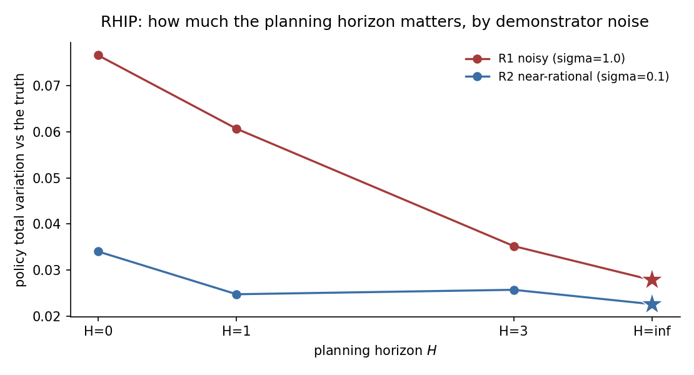

# RHIP: the planning horizon versus demonstrator noise

A traveller moves through a road network one step at a time, choosing among the nearest neighbours of the current node. The utility of an edge depends on its length, the amenity of the destination, and the destination's distance to a fixed goal. This is the route-choice problem of the small study, run twice under demonstrators of different rationality.

## Why this study

RHIP makes the planning horizon $H$ a single knob over Max Causal Entropy IRL. Within $H$ steps the agent plans with the expensive stochastic policy; beyond $H$ it falls back to a cheap deterministic planner. The horizon recovers three classic methods as special cases:

$$
H = 0 \;\to\; \text{Max-Margin Planning}, \quad H = 1 \;\to\; \text{Bayesian-IRL middle ground}, \quad H = \infty \;\to\; \text{Max Causal Entropy IRL}.
$$

The question is whether one horizon is always best, or whether the best horizon depends on the data. The demonstrators are generated by a soft Bellman policy with logit scale $\sigma$. Two regimes share the same reward and graph and differ only in $\sigma$:

- **R1, noisy ($\sigma = 1.0$).** Stochastic, exploratory drivers. The stochastic planner is correctly specified.
- **R2, near-rational ($\sigma = 0.1$).** Near-deterministic shortest-path drivers, close to the deterministic end.

## The data-generating process

Nodes are scattered uniformly in the unit square; edges connect pairs within a fixed radius, with a spanning tree overlaid for connectivity. The reward for traversing edge $(s, a) \to s'$ is linear in three features,

$$
u_\theta(s, a) = \theta_{\mathrm{cost}}\,(-d_{ss'}) + \theta_{\mathrm{am}}\,\mathrm{am}(s') + \theta_{\mathrm{goal}}\,(-\ell_{s'}),
$$

with true parameters $\theta = [1.0,\;0.5,\;1.0]$. All three are identified from observed choices because the features vary across edges. Each regime draws 200 agents over 35 periods, two replications.

## Route choice, noisy drivers (sigma=1.0, 25 nodes, 4 actions)

Synthetic route choice on a 25-node random geometric road network. ``road_network(num_nodes=25, num_actions=4, discount_factor=0.95, scale_parameter=1.0, seed=0)``. The demonstrator logit scale is sigma=1.0. 200 x 35 observations, 2 replications, seed 42. True theta `[1.0, 0.5, 1.0]`. Design rank 3/3, condition number 1.34e+01, action-contrast rank 3/3 (the rank that identification from choices actually uses). Generated 2026-06-24 with econirl 0.0.7.

### Estimators and data

| Estimator | Family | Uses transitions $P(s'\mid s,a)$ | Transferable reward | Standard errors |
|---|---|---|---|---|
| RHIP-H0 | behavioral | yes | yes | no |
| RHIP-H1 | behavioral | yes | yes | no |
| RHIP-H3 | behavioral | yes | yes | no |
| RHIP-Hinf | behavioral | yes | yes | no |
| NFXP | structural | yes | yes | yes |

Uses transitions is whether the estimator reads the transition kernel; model-free learners do not. Transferable reward is whether it recovers a reward that re-solves under a counterfactual. Standard errors is whether it returns inference. The last two are read from the run.

### Results

| Estimator | Family | Ran | Conv | Recovered params | Param RMSE | Policy TV | Regret base | Regret A | Regret B | Regret C | Time (s) |
|---|---|---|---|---|---|---|---|---|---|---|---|
| RHIP-H0 | behavioral | 2/2 | 0/2 | [1.907, 0.518, 1.268] | - | 0.0766 | 0.1376 | 0.1082 | 0.2366 | 0.1299 | 7.6 |
| RHIP-H1 | behavioral | 2/2 | 0/2 | [1.481, 0.513, 1.246] | - | 0.0606 | 0.1035 | 0.0740 | 0.1687 | 0.1115 | 7.2 |
| RHIP-H3 | behavioral | 2/2 | 0/2 | [1.181, 0.451, 1.084] | - | 0.0352 | 0.0668 | 0.0421 | 0.0600 | 0.0398 | 5.8 |
| RHIP-Hinf | behavioral | 2/2 | 0/2 | [0.983, 0.452, 0.836] | - | 0.0278 | 0.0339 | 0.0268 | 0.0705 | 0.0957 | 4.5 |
| NFXP | structural | 2/2 | 2/2 | [1.182, 0.508, 0.999] | 0.1052 | 0.0067 | 0.0044 | 0.0031 | 0.0044 | 0.0025 | 3.3 |

Param RMSE covers the structural family only, which shares the parameterization of the true model. Policy TV is the distance between estimated and true choice probabilities, lower is better. Conv is the estimator's own convergence indicator. A cautious estimator can report False while the recovered policy is accurate. Regret base is welfare lost in the observed environment. Types A, B, and C are welfare lost after a change. Type A shifts a payoff, Type B changes the transitions, Type C penalizes an action. Estimators with a recovered reward re-solve it and adapt. Those without one keep their old policy.

### Parameter recovery

| Estimator | Parameter | True | Mean est | Bias | Emp. SE | RMSE | 95% coverage | SE avail |
|---|---|---|---|---|---|---|---|---|
| NFXP | edge_cost | 1.000 | 1.182 | +0.182 | 0.083 | 0.191 | 1.00 +/- 0.00 | 100% (2 reps) |
| NFXP | amenity | 0.500 | 0.508 | +0.008 | 0.016 | 0.014 | 1.00 +/- 0.00 | 100% (2 reps) |
| NFXP | goal | 1.000 | 0.999 | -0.001 | 0.008 | 0.006 | 1.00 +/- 0.00 | 100% (2 reps) |

Coverage is the share of replications whose 95% interval contains the truth, shown with its Monte Carlo standard error. It is computed only where every replication produced a finite standard error. SE avail is the share of replications with finite standard errors.

Under noisy drivers the stochastic planner is correctly specified. Policy total variation is the scorecard for the RHIP horizon variants; NFXP recovers the reward and sets the floor. RHIP weights stay out of the recovery table because an IRL reward is only partially identified.

## Route choice, near-rational drivers (sigma=0.1, 25 nodes, 4 actions)

Synthetic route choice on a 25-node random geometric road network. ``road_network(num_nodes=25, num_actions=4, discount_factor=0.95, scale_parameter=0.1, seed=0)``. The demonstrator logit scale is sigma=0.1. 200 x 35 observations, 2 replications, seed 42. True theta `[1.0, 0.5, 1.0]`. Design rank 3/3, condition number 1.34e+01, action-contrast rank 3/3 (the rank that identification from choices actually uses). Generated 2026-06-24 with econirl 0.0.7.

### Estimators and data

| Estimator | Family | Uses transitions $P(s'\mid s,a)$ | Transferable reward | Standard errors |
|---|---|---|---|---|
| RHIP-H0 | behavioral | yes | yes | no |
| RHIP-H1 | behavioral | yes | yes | no |
| RHIP-H3 | behavioral | yes | yes | no |
| RHIP-Hinf | behavioral | yes | yes | no |
| NFXP | structural | yes | yes | yes |

Uses transitions is whether the estimator reads the transition kernel; model-free learners do not. Transferable reward is whether it recovers a reward that re-solves under a counterfactual. Standard errors is whether it returns inference. The last two are read from the run.

### Results

| Estimator | Family | Ran | Conv | Recovered params | Param RMSE | Policy TV | Regret base | Regret A | Regret B | Regret C | Time (s) |
|---|---|---|---|---|---|---|---|---|---|---|---|
| RHIP-H0 | behavioral | 2/2 | 0/2 | [0.883, 0.416, 0.868] | - | 0.0340 | 0.0290 | 0.0219 | 0.0017 | 0.0285 | 6.1 |
| RHIP-H1 | behavioral | 2/2 | 0/2 | [0.766, 0.433, 0.905] | - | 0.0248 | 0.0281 | 0.0232 | 0.0017 | 0.0305 | 7.0 |
| RHIP-H3 | behavioral | 2/2 | 0/2 | [0.853, 0.414, 0.854] | - | 0.0257 | 0.0274 | 0.0232 | 0.0017 | 0.0285 | 4.3 |
| RHIP-Hinf | behavioral | 2/2 | 0/2 | [0.890, 0.425, 0.855] | - | 0.0226 | 0.0137 | 0.0156 | 0.0013 | 0.0237 | 4.5 |
| NFXP | structural | 2/2 | 2/2 | [1.037, 0.494, 0.990] | 0.0240 | 0.0032 | 0.0002 | 0.0002 | 0.0000 | 0.0035 | 4.1 |

Param RMSE covers the structural family only, which shares the parameterization of the true model. Policy TV is the distance between estimated and true choice probabilities, lower is better. Conv is the estimator's own convergence indicator. A cautious estimator can report False while the recovered policy is accurate. Regret base is welfare lost in the observed environment. Types A, B, and C are welfare lost after a change. Type A shifts a payoff, Type B changes the transitions, Type C penalizes an action. Estimators with a recovered reward re-solve it and adapt. Those without one keep their old policy.

### Parameter recovery

| Estimator | Parameter | True | Mean est | Bias | Emp. SE | RMSE | 95% coverage | SE avail |
|---|---|---|---|---|---|---|---|---|
| NFXP | edge_cost | 1.000 | 1.037 | +0.037 | 0.012 | 0.038 | 1.00 +/- 0.00 | 100% (2 reps) |
| NFXP | amenity | 0.500 | 0.494 | -0.006 | 0.008 | 0.008 | 1.00 +/- 0.00 | 100% (2 reps) |
| NFXP | goal | 1.000 | 0.990 | -0.010 | 0.017 | 0.016 | 1.00 +/- 0.00 | 100% (2 reps) |

Coverage is the share of replications whose 95% interval contains the truth, shown with its Monte Carlo standard error. It is computed only where every replication produced a finite standard error. SE avail is the share of replications with finite standard errors.

Under near-rational drivers the true policy is close to deterministic, so the cheap short-horizon planner is already a good approximation and the extra soft backups buy little.

## How much the horizon matters

The figure traces policy total variation across the four horizons in each regime. $H=0$ is the Max-Margin-Planning end; $H=\infty$ matches Max Causal Entropy IRL. The star marks the lowest-error horizon in each regime.

The full stochastic planner ($H=\infty$) gives the lowest policy error in both regimes. It is the correctly-specified estimator, so this is expected: a longer horizon never hurts recovery here. What changes between the regimes is how much the horizon is worth. Under noisy drivers the curve is steep: $H=0$ carries 2.75 times the error of $H=\infty$, so the stochastic planner is essential. Under near-rational drivers the curve is flat: $H=0$ carries only 1.5 times the error of $H=\infty$, and a single backup ($H=1$) lands within a tenth of the full planner. A short, cheap horizon nearly recovers the reward.

The planning cost grows with the horizon. So as demonstrators become near-rational, the cost-effective horizon moves toward the cheap end, even though the accuracy-optimal endpoint stays at $H=\infty$. The horizon is the dial that adapts; the data sets how far it is worth turning.



## Notes per estimator

**RHIP-H0.** Receding Horizon Inverse Planning at horizon zero, the Max-Margin-Planning end. No soft backups run, so the policy is a softmax over the deterministic continuation value. Cheap, and the least robust to demonstrator noise.

**RHIP-H1.** One soft Bellman backup over the deterministic tail. A middle ground between the deterministic and the fully stochastic planner.

**RHIP-H3.** Three soft Bellman backups. Recovers most of the accuracy of the full stochastic planner at a fraction of its backups.

**RHIP-Hinf.** The infinite-horizon endpoint delegates to MCE-IRL with the same config, so it is the same computation as Max Causal Entropy IRL. This anchors the stochastic end of the spectrum.

**NFXP.** Full-solution maximum likelihood with a nested Bellman fixed point. It is told the logit scale, so it recovers the reward and sets the lowest policy total variation reachable in each regime, the recoverable floor.

## Reproduce

```bash
python scripts/study_rhip_two_regime.py                 # run + write JSON
python scripts/study_rhip_two_regime.py --page          # regenerate this page
python scripts/study_rhip_two_regime.py --verify        # re-derive the table from JSON
```

Raw facts: `validation/results/study_rhip_two_regime.json`.

Not shown on this page: IQ-Learn, f-IRL (not separately identified from choices on this problem; reward is only partially identified from behavior).