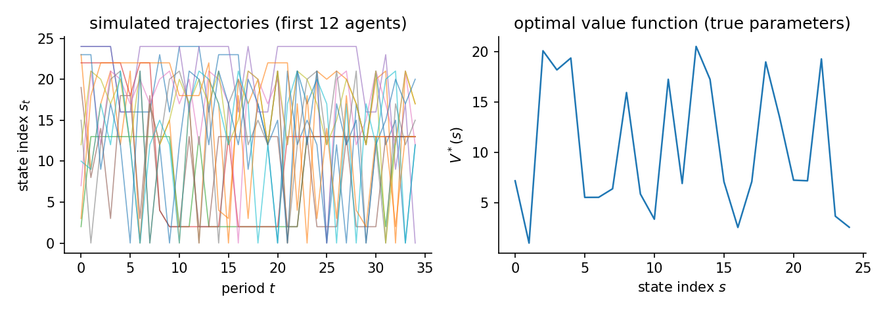
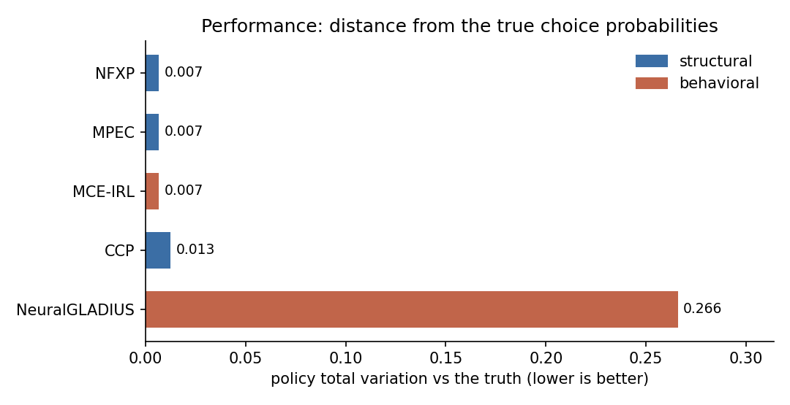
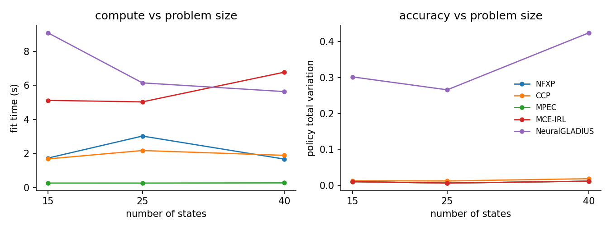

# Route choice on a synthetic road network

A traveller moves through a road network one step at a time. Each period, the agent chooses among the nearest neighbours of the current node. The utility depends on the edge: how long it is, how attractive the destination is, and how close the destination sits to a fixed goal node.

## The data-generating process

Nodes are scattered uniformly at random in the unit square. Edges connect pairs within a fixed Euclidean radius. A spanning tree is overlaid to keep the graph connected. The agent at node $s$ picks among $A$ nearest neighbours sorted by distance. Actions beyond the node degree self-loop.

The reward for traversing edge $(s, a) \to s'$ is linear in three features:

$$
u_\theta(s, a) = \theta_{\mathrm{cost}}\,(-d_{ss'}) + \theta_{\mathrm{am}}\,\mathrm{am}(s') + \theta_{\mathrm{goal}}\,(-\ell_{s'})
$$

where $d_{ss'}$ is the Euclidean edge length, $\mathrm{am}(s')$ is a node-level amenity draw, and $\ell_{s'}$ is the shortest-path distance from $s'$ to a fixed destination node. The true parameters are $\theta = [1.0,\;0.5,\;1.0]$.

Agents discount future payoffs at $\beta$ and face i.i.d. logit taste shocks (scale $\sigma = 1$). Their behaviour solves the soft Bellman equation. All three parameters are identified from observed route choices because the features vary across edges, not just states. The panel simulates $N$ agents for $T$ periods from the true optimal policy. The figure shows simulated paths and the optimal value function (lower at nodes far from the goal).

Synthetic route choice on a random geometric graph. ``road_network(num_nodes=25, num_actions=4, discount_factor=0.95, seed=0)``. 200 x 35 observations, 2 replications, seed 42. True theta `[1.0, 0.5, 1.0]`. Design rank 3/3, condition number 1.34e+01, action-contrast rank 3/3 (the rank that identification from choices actually uses). Generated 2026-06-23 with econirl 0.0.7.



## Estimators and data

| Estimator | Family | Uses transitions $P(s'\mid s,a)$ | Transferable reward | Standard errors |
|---|---|---|---|---|
| NFXP | structural | yes | yes | yes |
| CCP | structural | yes | yes | no |
| MPEC | structural | yes | yes | yes |
| MCE-IRL | behavioral | yes | yes | no |
| NeuralGLADIUS | behavioral | no | no | no |

Uses transitions is whether the estimator reads the transition kernel; model-free learners do not. Transferable reward is whether it recovers a reward that re-solves under a counterfactual. Standard errors is whether it returns inference. The last two are read from the run.

## Results

| Estimator | Family | Ran | Conv | Recovered params | Param RMSE | Policy TV | Regret base | Regret A | Regret B | Regret C | Time (s) |
|---|---|---|---|---|---|---|---|---|---|---|---|
| NFXP | structural | 2/2 | 2/2 | [1.182, 0.508, 0.999] | 0.1052 | 0.0067 | 0.0044 | 0.0031 | 0.0044 | 0.0025 | 3.0 |
| CCP | structural | 2/2 | 2/2 | [1.167, 0.488, 0.953] | 0.1025 | 0.0126 | 0.0058 | 0.0042 | 0.0086 | 0.0088 | 2.2 |
| MPEC | structural | 2/2 | 2/2 | [1.182, 0.508, 0.999] | 0.1052 | 0.0067 | 0.0044 | 0.0031 | 0.0044 | 0.0025 | 0.3 |
| MCE-IRL | behavioral | 2/2 | 0/2 | [1.182, 0.508, 0.999] | - | 0.0067 | 0.0044 | 0.0031 | 0.0044 | 0.0025 | 5.0 |
| NeuralGLADIUS | behavioral | 2/2 | 2/2 | - | - | 0.2658 | 4.2640 | 4.2552 | 3.3720 | 44.4197 | 6.1 |

Param RMSE covers the structural family only, which shares the parameterization of the true model. Policy TV is the distance between estimated and true choice probabilities, lower is better. Conv is the estimator's own convergence indicator. A cautious estimator can report False while the recovered policy is accurate. Regret base is welfare lost in the observed environment. Types A, B, and C are welfare lost after a change. Type A shifts a payoff, Type B changes the transitions, Type C penalizes an action. Estimators with a recovered reward re-solve it and adapt. Those without one keep their old policy.



## Parameter recovery

| Estimator | Parameter | True | Mean est | Bias | Emp. SE | RMSE | 95% coverage | SE avail |
|---|---|---|---|---|---|---|---|---|
| NFXP | edge_cost | 1.000 | 1.182 | +0.182 | 0.083 | 0.191 | 1.00 +/- 0.00 | 100% (2 reps) |
| NFXP | amenity | 0.500 | 0.508 | +0.008 | 0.016 | 0.014 | 1.00 +/- 0.00 | 100% (2 reps) |
| NFXP | goal | 1.000 | 0.999 | -0.001 | 0.008 | 0.006 | 1.00 +/- 0.00 | 100% (2 reps) |
| CCP | edge_cost | 1.000 | 1.167 | +0.167 | 0.085 | 0.178 | - | 0% (2 reps) |
| CCP | amenity | 0.500 | 0.488 | -0.012 | 0.020 | 0.018 | - | 0% (2 reps) |
| CCP | goal | 1.000 | 0.953 | -0.047 | 0.018 | 0.049 | - | 0% (2 reps) |
| MPEC | edge_cost | 1.000 | 1.182 | +0.182 | 0.083 | 0.191 | 1.00 +/- 0.00 | 100% (2 reps) |
| MPEC | amenity | 0.500 | 0.508 | +0.008 | 0.016 | 0.014 | 1.00 +/- 0.00 | 100% (2 reps) |
| MPEC | goal | 1.000 | 0.999 | -0.001 | 0.008 | 0.006 | 1.00 +/- 0.00 | 100% (2 reps) |

Coverage is the share of replications whose 95% interval contains the truth, shown with its Monte Carlo standard error. It is computed only where every replication produced a finite standard error. SE avail is the share of replications with finite standard errors.

The structural family (NFXP, CCP, MPEC) recovers all three parameters on the same scale as the truth, so Param RMSE applies to them alone. MCE-IRL here uses the same linear features and recovers the same values, but its weights stay out of the recovery table because an IRL reward is only partially identified in general. NeuralGLADIUS learns a model-free policy with no reward weights to compare. Policy TV and regret are the right scorecards for the behavioral family.

## Scaling

The same study at three problem sizes (15, 25, 40 states). Each line is one estimator: fit time on the left, policy total variation on the right. The structural methods stay accurate across sizes, with MPEC the fastest. NeuralGLADIUS is the least accurate at every size. The fits run from sub-second to a few seconds, so the compute lines reflect fixed overhead more than asymptotics at this scale.



## Notes per estimator

**NFXP.** Full-solution MLE with a nested Bellman fixed-point inner loop. Quadratic convergence near the optimum; all three parameters are identified from the edge-feature contrast.

**CCP.** CCP uses a first-step nonparametric policy estimate to avoid the inner Bellman loop. One policy-iteration step corrects the bias from the nonparametric first stage.

**MPEC.** Mathematical programming with equilibrium constraints. MPEC is not in the CAPABILITIES registry (so run_form does not surface it automatically) but runs correctly via the direct .estimate() path. Uses solver='sqp' for real constrained MLE; the legacy 'slsqp' alias checks only Bellman feasibility.

**MCE-IRL.** Its convergence indicator reports whether the gradient norm crossed the tolerance. The objective often plateaus before that, so it can read False while the recovered policy is accurate.

**NeuralGLADIUS.** Model-free neural policy learner. Uses only the feature matrix and the observed panel; it does not use transition matrices. Capped at 200 epochs here for short compute.

## Reproduce

```bash
python scripts/study_route_choice.py                 # run + write JSON
python scripts/study_route_choice.py --page          # regenerate this page
python scripts/study_route_choice.py --verify        # re-derive the table from JSON
```

Raw facts: `validation/results/study_route_choice.json`.

Not shown on this page: IQ-Learn, f-IRL (not separately identified from choices on this problem; reward is only partially identified from behavior); NNES, SEES, TD-CCP, UFXP (correct structural estimators but slower on a 25-node graph; NFXP and CCP already cover the structural family); MaxEnt-IRL, MaxMargin-IRL, NeuralAIRL, Deep-MCE-IRL (trajectory-entropy and max-margin objectives are not the choice model that generated the data; neural AIRL adds compute without new information here).