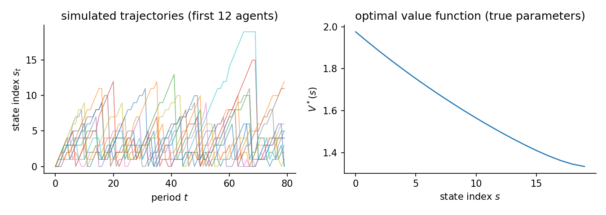
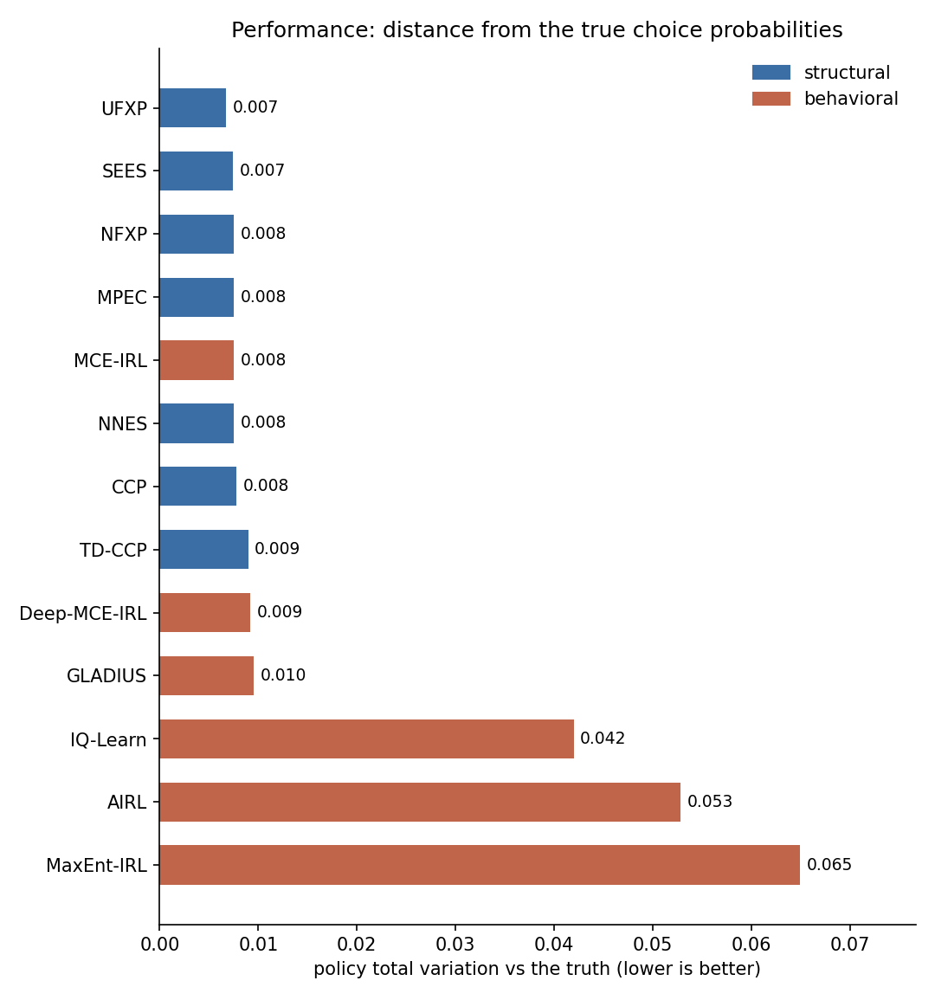
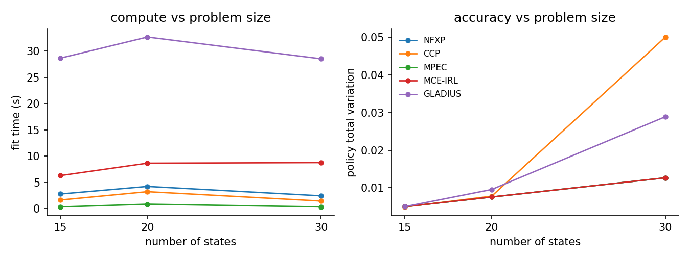
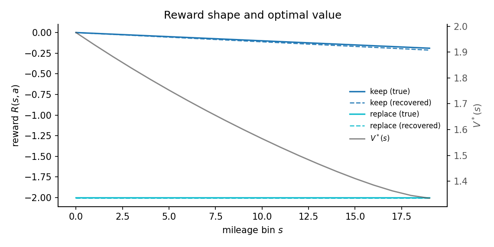
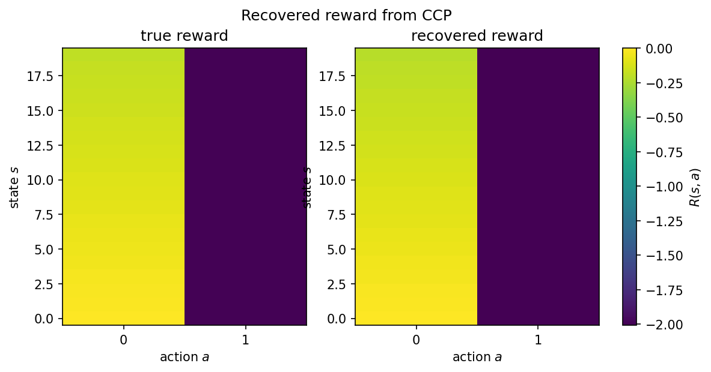

# Bus engine replacement

The canonical structural benchmark (Rust 1987). A single agent decides each period whether to keep paying a mileage-dependent operating cost or pay a fixed replacement cost to reset the bus engine. The data-generating process is fully known, so the table reports the exact recovered cost parameters, the distance between each estimator's policy and the true one, and the welfare lost when the recovered model is carried into three counterfactual worlds.

## The data-generating process

Mileage sits on a discrete grid $s \in \{0, \ldots, S-1\}$. Keeping the engine (action $0$) pays a per-bin operating cost and lets mileage drift up by $\Delta s \in \{0, 1, 2\}$. Replacing it (action $1$) pays a flat cost and resets the engine:

$$
u_\theta(s, a) =
\begin{cases}
-\theta_{\mathrm{oc}}\, s & a = 0 \ (\text{keep}) \\
-\theta_{\mathrm{rc}} & a = 1 \ (\text{replace}),
\end{cases}
\qquad
P(s' \mid s, 1) = p_{\Delta s'},\ s' \in \{0, 1, 2\},
$$

where replacement resets the engine and the same one-period drift $p = (p_0, p_1, p_2)$ then applies from zero, so the post-replacement state lands on $\{0, 1, 2\}$ rather than exactly on zero.

The true parameters are $\theta_{\mathrm{oc}} = 0.01$ and $\theta_{\mathrm{rc}} = 2.0$. The agent discounts at $\beta$ and faces i.i.d. logit taste shocks (scale $\sigma = 1$), so behavior solves the soft Bellman equation

$$
V(s) = \log \sum_{a} \exp\Bigl(u_\theta(s,a) + \beta\, \mathbb{E}\bigl[V(s') \mid s,a\bigr]\Bigr),
\qquad \pi^*(a \mid s) \propto \exp\Bigl(u_\theta(s,a) + \beta\, \mathbb{E}\bigl[V(s') \mid s,a\bigr]\Bigr),
$$

and the panel simulates $N$ buses for $T$ periods from $\pi^*$. The figure shows the sawtooth mileage paths (rising drift, replacement resets) and the declining value of holding higher mileage. Every estimator below sees the same panels.

The study uses 20 mileage bins, 500 buses, 80 periods, and 3 replications.
The true parameters are $[0.01,\;2.0]$. The action-contrast feature matrix
has full rank, so the operating-cost and replacement-cost parameters are both
identified from choices.



## Estimators and data

| Estimator | Family | Uses transitions $P(s'\mid s,a)$ | Transferable reward | Standard errors |
|---|---|---|---|---|
| NFXP | structural | yes | yes | yes |
| CCP | structural | yes | yes | yes |
| TD-CCP | structural | yes | yes | no |
| MCE-IRL | behavioral | yes | yes | no |
| GLADIUS | behavioral | yes | yes | no |

Uses transitions is whether the estimator reads the transition kernel; model-free learners do not. Transferable reward is whether it recovers a reward that re-solves under a counterfactual. Standard errors is whether it returns inference. The last two are read from the run.

## Results

| Estimator | Family | Ran | Conv | Recovered params | Param RMSE | Policy TV | Regret base | Regret A | Regret B | Regret C | Time (s) |
|---|---|---|---|---|---|---|---|---|---|---|---|
| NFXP | structural | 3/3 | 3/3 | [0.012, 2.011] | 0.0130 | 0.0075 | 0.0007 | 0.0008 | 0.0005 | 0.0000 | 4.2 |
| CCP | structural | 3/3 | 3/3 | [0.011, 2.008] | 0.0125 | 0.0078 | 0.0005 | 0.0006 | 0.0004 | 0.0000 | 3.2 |
| TD-CCP | structural | 3/3 | 3/3 | [0.012, 2.013] | 0.0118 | 0.0090 | 0.0010 | 0.0011 | 0.0007 | 0.0000 | 3.9 |
| MCE-IRL | behavioral | 3/3 | 0/3 | [0.012, 2.011] | - | 0.0075 | 0.0007 | 0.0008 | 0.0005 | 0.0000 | 8.6 |
| GLADIUS | behavioral | 3/3 | 3/3 | [0.029, 2.031] | - | 0.0095 | 0.0773 | 0.0795 | 0.0631 | 0.0542 | 32.7 |

Param RMSE covers the structural family only, which shares the parameterization of the true model. Policy TV is the distance between estimated and true choice probabilities, lower is better. Conv is the estimator's own convergence indicator. A cautious estimator can report False while the recovered policy is accurate. Regret base is welfare lost in the observed environment. Types A, B, and C are welfare lost after a change. Type A shifts a payoff, Type B changes the transitions, Type C penalizes an action. Estimators with a recovered reward re-solve it and adapt. Those without one keep their old policy.



The structural family (NFXP, CCP, MPEC, NNES, SEES, TD-CCP, UFXP) recovers the cost parameters on the same scale as the truth, so Param RMSE applies to it alone. MCE-IRL uses the same linear cost features and recovers the same scale, but the IRL family is scored on behavior and regret because reward is only partially identified from behavior in general. Estimators that recover a transferable reward adapt under the interventions. Policy-only methods keep their old policy, which is why their Type C regret is large.

## Scaling

The same study at three mileage-grid sizes (15, 20, 30 bins). Each line is one estimator: fit time on the left, policy total variation on the right. The structural methods stay cheap and accurate across sizes. The neural and IRL methods cost more and are less accurate. These are small fits, so the compute lines reflect fixed overhead as much as problem size, and the trend is not a clean monotone curve.



## Reward and structure

Mileage is the natural ordering, so reward plots cleanly against the state index. The keep cost slopes down with mileage. The replacement cost is flat. Where they cross is near the replacement threshold. The recovered reward (dashed) tracks the true reward, and the optimal value falls as mileage rises.



The same reward as a state-by-action heatmap puts the true and recovered rewards side by side on one color scale.



## Notes per estimator

**MCE-IRL.** Its convergence indicator reports whether the gradient norm crossed the tolerance. The objective often plateaus first, so it can read False while the policy is essentially exact.

## Reproduce

```bash
python scripts/sim_rust_bus.py                 # run + write JSON
python scripts/sim_rust_bus.py --page          # regenerate this page
python scripts/sim_rust_bus.py --verify        # re-derive the table from JSON
```

Results file: `validation/results/sim_rust_bus.json`.

The page focuses on the core structural family and two reward-recovery
comparators. Gridworld carries the state-only IRL comparison. Content
consumption carries the heterogeneous AIRL comparison.
