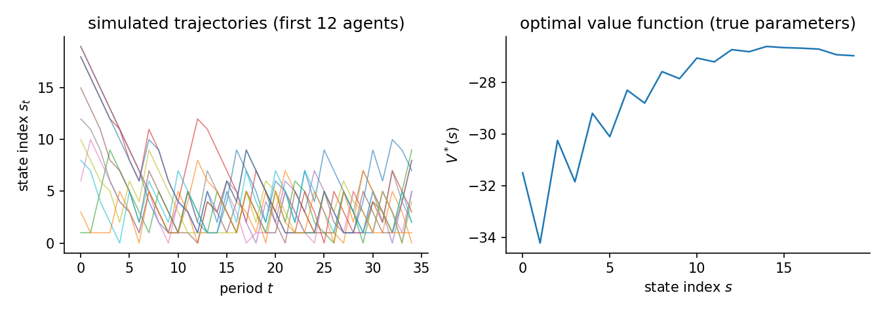
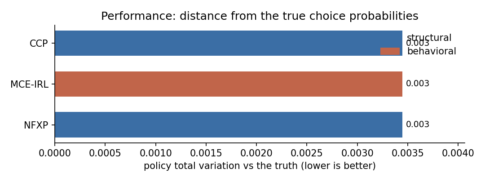
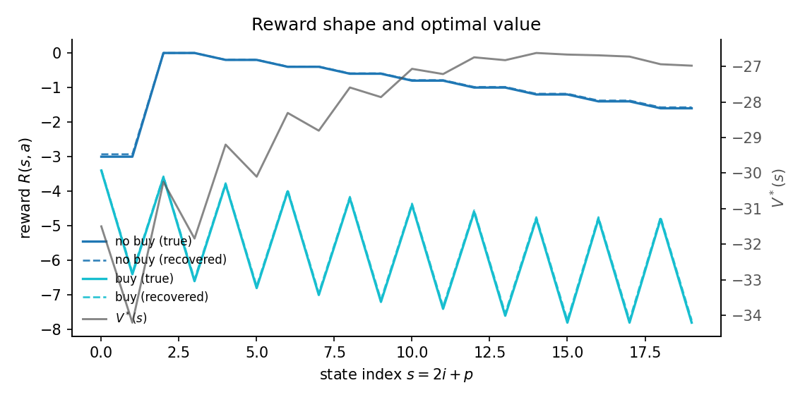
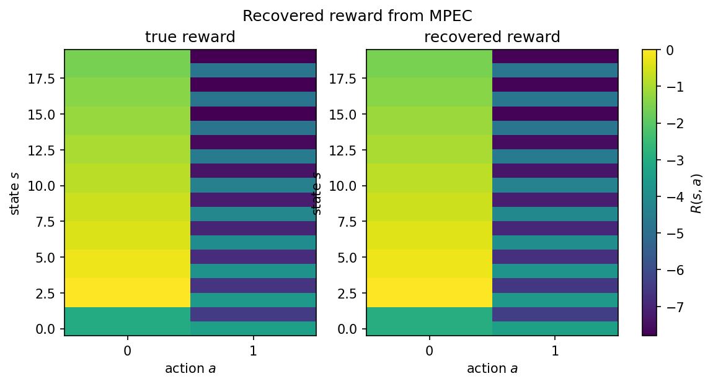

# Consumer stockpiling of a storable good

A household buys a storable good over time. It consumes one unit each period. The shelf price swings between a low sale price and a high regular price. The household can buy a pack now to avoid paying the high price later. The cost of doing so is the holding cost on the inventory it carries.

## The data-generating process

The state is a pair: inventory $i$ and price regime $p$. Inventory runs from 0 to 9 units. The price regime is sale or regular and follows a two-state Markov chain. Sales are short. Regular spells are longer. The flat state index is $s = 2i + p$, giving 20 states.

Each period the household chooses to buy a pack of 3 units or not. Then it consumes one unit if any is on hand. Inventory carried to the next period is the post-purchase stock minus one, capped at 9.

The reward is linear in three features:

$$
u_\theta(s, a) = \theta_{\mathrm{spend}}\,(-c_p B a) + \theta_{\mathrm{hold}}\,(-i') + \theta_{\mathrm{stock}}\,(-\mathbf{1}\{i + B a = 0\})
$$

where $c_p$ is the per-unit price (1 on sale, 2 regular), $B = 3$ is the pack size, $a \in \{0, 1\}$ is the buy decision, $i'$ is the inventory carried forward, and the last term is a stockout penalty paid when the household wanted a unit but had none. The true parameters are $\theta = [1.0,\;0.2,\;3.0]$.

Agents discount future payoffs at $\beta$ and face i.i.d. logit taste shocks (scale $\sigma = 1$). Their behaviour solves the soft Bellman equation. The stockout feature is action-dependent, because buying when inventory is empty avoids the penalty, so all three parameters are identified from observed purchases. The optimal policy stockpiles: it buys more often on sale than at the regular price, at every inventory level, and buys less as inventory rises. The panel simulates $N$ agents for $T$ periods from the true optimal policy. The figure shows simulated inventory-price paths and the optimal value function.

Consumer stockpiling of a storable good. A household holds inventory $i \in \{0, \dots, 9\}$ and faces a price regime $p \in \{\text{sale}, \text{regular}\}$ that follows an exogenous two-state Markov chain. State $s = 2i + p$ gives 20 states. Each period the household consumes one unit and chooses whether to buy a pack of 3 units. Reward is linear in three features: spending on the purchase, holding cost on carried inventory, and a stockout penalty when no unit is on hand. ``storable_goods(max_inventory=9, pack_size=3, discount_factor=0.95, seed=0)``. 200 x 35 observations, 2 replications, seed 42. True theta `[1.0, 0.2, 3.0]`. Design rank 3/3, condition number 2.81e+01, action-contrast rank 3/3 (the rank that identification from choices actually uses). Generated 2026-06-16 with econirl 0.0.6.



## Estimators and data

| Estimator | Family | Uses transitions $P(s'\mid s,a)$ | Transferable reward | Standard errors |
|---|---|---|---|---|
| NFXP | structural | yes | yes | yes |
| CCP | structural | yes | yes | yes |
| MPEC | structural | yes | yes | yes |
| MCE-IRL | behavioral | yes | yes | no |
| NeuralGLADIUS | behavioral | no | no | no |

Uses transitions is whether the estimator reads the transition kernel; model-free learners do not. Transferable reward is whether it recovers a reward that re-solves under a counterfactual. Standard errors is whether it returns inference. The last two are read from the run.

## Results

| Estimator | Family | Ran | Conv | Recovered params | Param RMSE | Policy TV | Regret base | Regret A | Regret B | Regret C | Time (s) |
|---|---|---|---|---|---|---|---|---|---|---|---|
| NFXP | structural | 2/2 | 2/2 | [0.993, 0.197, 2.930] | 0.0572 | 0.0026 | 0.0055 | 0.0056 | 0.0010 | 0.0009 | 2.4 |
| CCP | structural | 2/2 | 2/2 | [0.994, 0.196, 2.930] | 0.0572 | 0.0026 | 0.0054 | 0.0055 | 0.0010 | 0.0009 | 2.2 |
| MPEC | structural | 2/2 | 2/2 | [0.993, 0.197, 2.930] | 0.0572 | 0.0026 | 0.0055 | 0.0056 | 0.0010 | 0.0009 | 0.3 |
| MCE-IRL | behavioral | 2/2 | 0/2 | [0.993, 0.197, 2.930] | - | 0.0026 | 0.0055 | 0.0056 | 0.0010 | 0.0009 | 7.4 |
| NeuralGLADIUS | behavioral | 2/2 | 2/2 | - | - | 0.0647 | 2.4105 | 2.5216 | 5.5947 | 38.9062 | 7.5 |

Param RMSE covers the structural family only, which shares the parameterization of the true model. Policy TV is the distance between estimated and true choice probabilities, lower is better. Conv is the estimator's own convergence indicator. A cautious estimator can report False while the recovered policy is accurate. Regret base is welfare lost in the observed environment. Types A, B, and C are welfare lost after a change. Type A shifts a payoff, Type B changes the transitions, Type C penalizes an action. Estimators with a recovered reward re-solve it and adapt. Those without one keep their old policy.



## Parameter recovery

| Estimator | Parameter | True | Mean est | Bias | Emp. SE | RMSE | 95% coverage | SE avail |
|---|---|---|---|---|---|---|---|---|
| NFXP | spend | 1.000 | 0.993 | -0.007 | 0.027 | 0.020 | 1.00 +/- 0.00 | 100% (2 reps) |
| NFXP | holding | 0.200 | 0.197 | -0.003 | 0.004 | 0.004 | 1.00 +/- 0.00 | 100% (2 reps) |
| NFXP | stockout | 3.000 | 2.930 | -0.070 | 0.137 | 0.119 | 1.00 +/- 0.00 | 100% (2 reps) |
| CCP | spend | 1.000 | 0.994 | -0.006 | 0.027 | 0.020 | 0.50 +/- 0.35 | 100% (2 reps) |
| CCP | holding | 0.200 | 0.196 | -0.004 | 0.004 | 0.005 | 1.00 +/- 0.00 | 100% (2 reps) |
| CCP | stockout | 3.000 | 2.930 | -0.070 | 0.136 | 0.119 | 0.50 +/- 0.35 | 100% (2 reps) |
| MPEC | spend | 1.000 | 0.993 | -0.007 | 0.027 | 0.020 | 1.00 +/- 0.00 | 100% (2 reps) |
| MPEC | holding | 0.200 | 0.197 | -0.003 | 0.004 | 0.004 | 1.00 +/- 0.00 | 100% (2 reps) |
| MPEC | stockout | 3.000 | 2.930 | -0.070 | 0.137 | 0.119 | 1.00 +/- 0.00 | 100% (2 reps) |

Coverage is the share of replications whose 95% interval contains the truth, shown with its Monte Carlo standard error. It is computed only where every replication produced a finite standard error. SE avail is the share of replications with finite standard errors.

The structural family (NFXP, CCP, MPEC) recovers all three parameters on the same scale as the truth, so Param RMSE applies to them alone. MCE-IRL here uses the same linear features and recovers the same values, but its weights stay out of the recovery table because an IRL reward is only partially identified in general. NeuralGLADIUS learns a model-free policy with no reward weights to compare. Policy TV and regret are the right scorecards for the behavioral family.

## Reward and structure

The state index is $s = 2i + p$: inventory $i$ rises in steps of two, and the sale and regular price regimes interleave. The reward against $s$ shows the buy and no-buy lines, with the recovered reward dashed over the true reward. The zigzag is the price regime alternating. The optimal value falls as inventory and holding cost rise.



The same reward as a state-by-action heatmap puts the true and recovered rewards side by side on one color scale.



## Notes per estimator

**NFXP.** Full-solution MLE with a nested Bellman fixed-point inner loop. Quadratic convergence near the optimum; all three parameters are identified from the action-dependent stockout feature and the price-varying spending feature.

**CCP.** CCP uses a first-step nonparametric policy estimate to avoid the inner Bellman loop. One policy-iteration step corrects the bias from the nonparametric first stage.

**MPEC.** Mathematical programming with equilibrium constraints. MPEC is not in the CAPABILITIES registry (so run_form does not surface it automatically) but runs correctly via the direct .estimate() path. Uses solver='sqp' for real constrained MLE; the legacy 'slsqp' alias checks only Bellman feasibility.

**MCE-IRL.** Its convergence indicator mirrors the inner optimizer's success status. The optimizer can stop short while the recovered policy is already accurate, so it can read False on an accurate fit.

**NeuralGLADIUS.** Model-free neural policy learner. Uses only the feature matrix and the observed panel; it does not use transition matrices. Capped at 200 epochs here for short compute.

## Reproduce

```bash
python scripts/study_stockpiling.py                 # run + write JSON
python scripts/study_stockpiling.py --page          # regenerate this page
python scripts/study_stockpiling.py --verify        # re-derive the table from JSON
```

Raw facts: `validation/results/study_stockpiling.json`.

Not shown on this page: IQ-Learn, f-IRL (not separately identified from choices on this problem; reward is only partially identified from behavior); NNES, SEES, TD-CCP, UFXP (correct structural estimators but slower here; NFXP and CCP already cover the structural family); MaxEnt-IRL, MaxMargin-IRL, NeuralAIRL, Deep-MCE-IRL (trajectory-entropy and max-margin objectives are not the choice model that generated the data; neural AIRL adds compute without new information here).