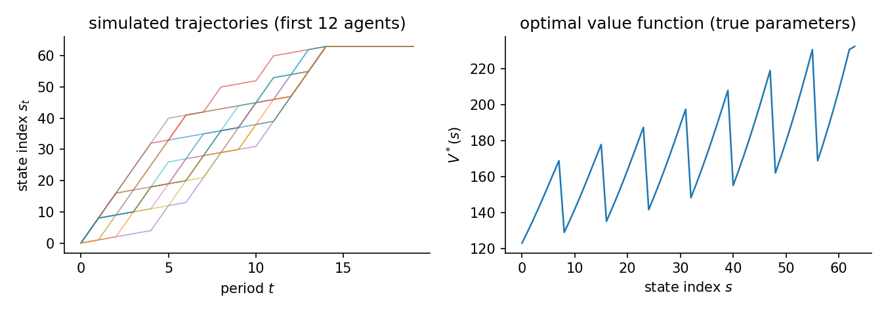
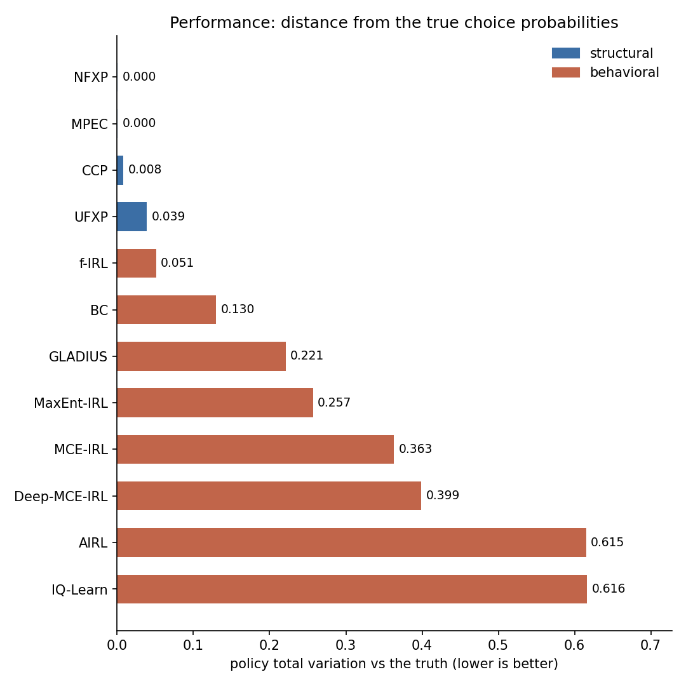
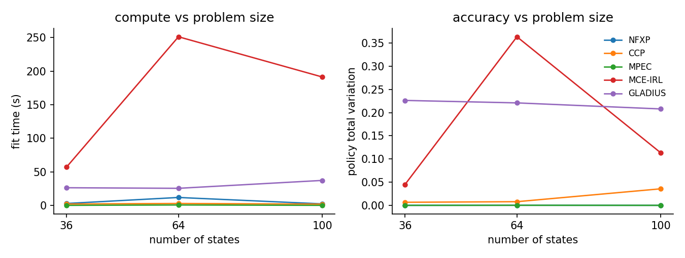

# Gridworld navigation

Gridworld navigation is the home turf of the maximum-entropy IRL tradition of Ziebart's MaxEnt and its descendants, so this page weights the roster toward IRL methods. NFXP, CCP, MPEC, and UFXP run as the structural contrast. The environment also supplies a stress the bus engine does not. Every trajectory starts at the same corner and walks toward the goal, so states off that path are visited rarely or never. Methods that invert state-by-state choice frequencies feel that thinness. Methods that share strength through features or networks do not.

## The data-generating process

States are cells of an $N \times N$ grid indexed $s = \mathrm{row} \cdot N + \mathrm{col}$, with five actions (left, right, up, down, stay), deterministic moves, and an absorbing goal at the bottom-right corner. The reward has three parts: a per-step penalty, a terminal bonus when the chosen move reaches the goal, and a shaping term in the Manhattan distance $d(s)$ to the goal:

$$
u_\theta(s, a) = \theta_{\mathrm{step}}\, \mathbf{1}\{s \neq s_{\mathrm{goal}}\}
+ \theta_{\mathrm{goal}}\, \mathbf{1}\{s'(s, a) = s_{\mathrm{goal}}\}
- \theta_{\mathrm{dist}}\, \frac{d(s)}{2N},
$$

with $\theta_{\mathrm{step}} = -0.1$, $\theta_{\mathrm{goal}} = 10$, $\theta_{\mathrm{dist}} = 0.1$. The agent discounts at $\beta$ and faces i.i.d. logit taste shocks (scale $\sigma = 1$), so behavior solves the soft Bellman equation

$$
V(s) = \log \sum_{a} \exp\Bigl(u_\theta(s,a) + \beta\, \mathbb{E}\bigl[V(s') \mid s,a\bigr]\Bigr),
\qquad \pi^*(a \mid s) \propto \exp\Bigl(u_\theta(s,a) + \beta\, \mathbb{E}\bigl[V(s') \mid s,a\bigr]\Bigr),
$$

and every trajectory starts at the top-left corner (state 0). The figure shows the resulting paths climbing the state index toward the absorbing goal and the value function rising with proximity to it. The horizon is deliberately short (20 periods) because the goal is absorbing: once there, an agent generates no further information.

`GridworldEnvironment(grid_size=8, step_penalty=-0.1, terminal_reward=10.0, distance_weight=0.1, discount_factor=0.95)`. Transitions are deterministic; 64 states, 5 actions (left, right, up, down, stay). 500 x 20 observations, 3 replications, seed 7. True theta `[-0.1, 10.0, 0.1]`. Design rank 3/3, condition number 7.45e+00, action-contrast rank 1/3 (the rank that identification from choices actually uses). Generated 2026-06-12 with econirl 0.0.4.



## Estimators and data

| Estimator | Family | Uses transitions $P(s'\mid s,a)$ | Transferable reward | Standard errors |
|---|---|---|---|---|
| MaxEnt-IRL | behavioral | yes | yes | no |
| MCE-IRL | behavioral | yes | yes | no |
| Deep-MCE-IRL | behavioral | yes | yes | no |
| AIRL | behavioral | yes | yes | no |
| IQ-Learn | behavioral | yes | yes | no |
| f-IRL | behavioral | yes | no | no |
| GLADIUS | behavioral | yes | yes | no |
| BC | behavioral | yes | no | no |
| NFXP | structural | yes | yes | yes |
| CCP | structural | yes | yes | yes |
| MPEC | structural | yes | yes | yes |
| UFXP | structural | yes | yes | yes |

Uses transitions is whether the estimator reads the transition kernel; model-free learners do not. Transferable reward is whether it recovers a reward that re-solves under a counterfactual. Standard errors is whether it returns inference. The last two are read from the run.

## Results

| Estimator | Family | Ran | Conv | Policy TV | Time (s) |
|---|---|---|---|---|---|
| MaxEnt-IRL | behavioral | 3/3 | 0/3 | 0.2567 | 22.5 |
| MCE-IRL | behavioral | 3/3 | 0/3 | 0.3632 | 251.1 |
| Deep-MCE-IRL | behavioral | 3/3 | 3/3 | 0.3986 | 11.1 |
| AIRL | behavioral | 3/3 | 0/3 | 0.6152 | 113.7 |
| IQ-Learn | behavioral | 3/3 | 3/3 | 0.6165 | 2.1 |
| f-IRL | behavioral | 3/3 | 3/3 | 0.0509 | 28.4 |
| GLADIUS | behavioral | 3/3 | 3/3 | 0.2208 | 25.6 |
| BC | behavioral | 3/3 | 3/3 | 0.1298 | 0.2 |
| NFXP | structural | 3/3 | 3/3 | 0.0004 | 12.0 |
| CCP | structural | 3/3 | 3/3 | 0.0081 | 3.1 |
| MPEC | structural | 3/3 | 3/3 | 0.0004 | 0.9 |
| UFXP | structural | 3/3 | 0/3 | 0.0388 | 0.1 |

Policy TV is the distance between estimated and true choice probabilities, lower is better. Conv is the estimator's own convergence indicator. A cautious estimator can report False while the recovered policy is accurate.



The structural rows match behavior almost perfectly, but their parameters are not separately identified here, so the parameter columns are omitted. The raw feature design has full rank, while the action-contrast design has rank 1. The step-penalty and distance features take the same value for every action at a state, so they cancel out of every choice probability. The regret columns are omitted for the same reason, because transferring an unidentified reward is not a meaningful exercise. The lesson is to check the rank of the action-differenced features before estimating.

## Scaling

The same study at three grid sizes (36, 64, 100 states). Each line is one estimator: fit time on the left, policy total variation on the right. The structural rows track behavior closely across sizes. The compute lines reflect fixed overhead as much as problem size at this scale, so the time curves need not rise cleanly with the state count. Policy total variation is the right scorecard here because the reward parameters are not separately identified on this grid.



## Notes per estimator

**MCE-IRL.** Two of its three reward directions, the state-only step and distance features, are unidentified here. Its gradient ascent can drift along them, and in one replication of three the policy collapsed. Read the per-rep records, not just the mean.

**f-IRL.** The strongest behavioral score on this page. It recovers a tabular reward, one value per state-action pair, which does not depend on the deficient feature basis at all.

## Reproduce

```bash
python scripts/sim_taxi_gridworld.py                 # run + write JSON
python scripts/sim_taxi_gridworld.py --page          # regenerate this page
python scripts/sim_taxi_gridworld.py --verify        # re-derive the table from JSON
```

Raw facts: `validation/results/sim_taxi_gridworld.json`.

Not shown on this page: SEES (its spline value basis is built for an ordered 1-D state index. A 2-D grid breaks that geometry, so running it here would be misspecification by construction); NNES, TD-CCP (the structural contrast is carried by NFXP/CCP/MPEC/UFXP here. The full structural roster runs on the bus engine and abstract MDP pages); MMP, GAIL, GCL, DeepMaxEnt-IRL, Bayesian-IRL (research code or too slow; not benchmarked in this study).