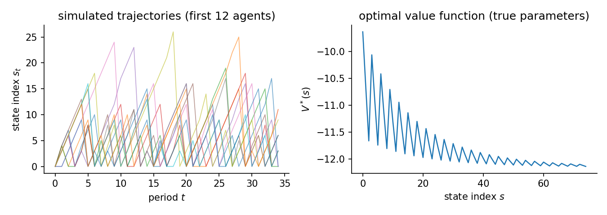
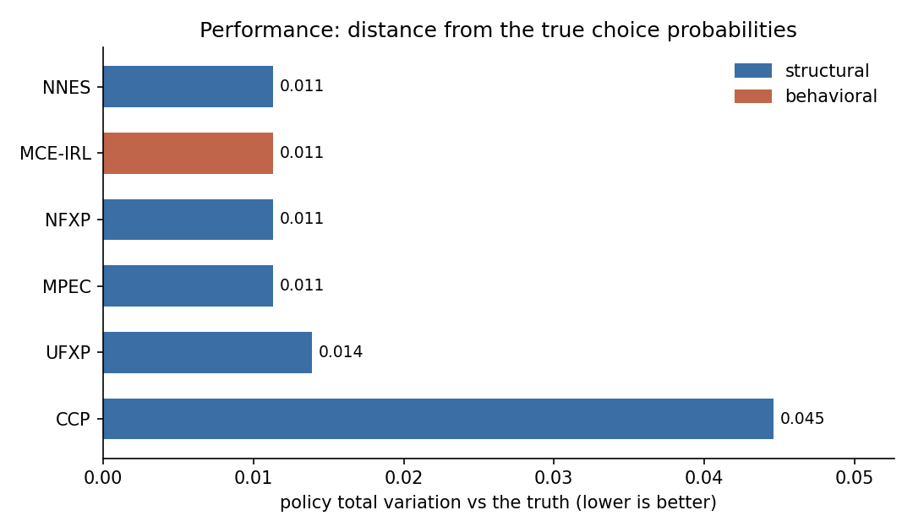
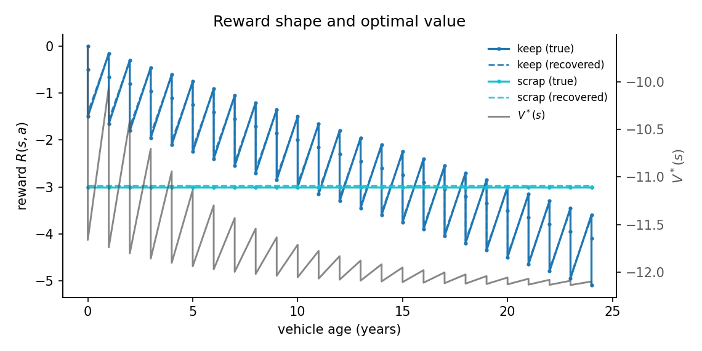
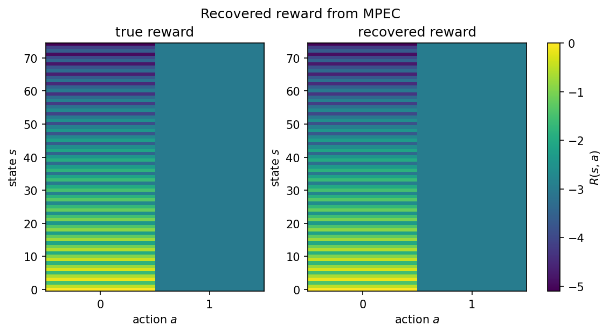

# Optimal replacement: vehicle scrappage (RDW)

A vehicle owner decides each year whether to keep running a car or scrap it and buy a new one. The decision depends on the car's age and how well it passed the mandatory Dutch APK roadworthiness inspection. The model is an optimal stopping problem in the spirit of Rust (1987), applied to vehicle scrappage.

## The data-generating process

The state is a pair: vehicle age bin $a$ and APK defect level $d$. Age runs from 0 to 24 years. The defect level is pass (0), minor defects (1), or major defects / rejection (2). The flat state index is $s = 3a + d$, giving 75 states.

Each period the owner chooses to keep or scrap the vehicle. If keeping: age increments by one year and the defect level transitions stochastically. Older cars face higher probabilities of moving to a worse defect level. If scrapping: the state resets to a new car at $(a = 0,\;d = 0)$.

The reward is linear in four features:

$$
u_\theta(s, a) = \begin{cases}
-\theta_{\text{age}}\,a - \theta_{\text{minor}}\,\mathbf{1}\{d=1\} - \theta_{\text{major}}\,\mathbf{1}\{d=2\} & a = \text{keep} \\
-\theta_{\text{rc}} & a = \text{scrap}
\end{cases}
$$

where $\theta_{\text{age}}$ is the per-year operating cost, $\theta_{\text{minor}}$ is the penalty for minor defects, $\theta_{\text{major}}$ is the penalty for major defects, and $\theta_{\text{rc}}$ is the replacement cost. The true parameters are $\theta = [0.15,\;0.5,\;1.5,\;3.0]$.

Agents discount future payoffs at $\beta = 0.95$ and face i.i.d. logit taste shocks (scale $\sigma = 1$). Their behaviour solves the soft Bellman equation. The action-contrast feature vector is $[-a,\;-\mathbf{1}\{d=1\},\;-\mathbf{1}\{d=2\},\;1]$ for the keep-minus-scrap difference at each state. Because age $a$ and both defect indicators vary independently across the 75 states, the contrast feature matrix has rank 4 and all four parameters are identified from observed choices. The optimal policy scraps at high ages and after major defect findings: only part of the state space lies on the equilibrium path, because vehicles that reach old age with clean inspections are rare. The panel simulates $N$ agents for $T$ periods from the true optimal policy. The figure shows simulated age-defect paths and the optimal value function.

Vehicle scrappage decision based on Dutch RDW inspection data. A vehicle owner observes the car's age bin $a \in \{0, \ldots, 24\}$ and the APK defect severity $d \in \{\text{pass}, \text{minor}, \text{major}\}$ from the annual inspection and decides whether to keep or scrap the vehicle. The flat state index is $s = 3a + d$, giving 75 states and 2 actions. Reward is linear in four features:

$U(s, \text{keep}) = -\theta_{\text{age}}\,a - \theta_{\text{minor}}\,\mathbf{1}\{d=1\} - \theta_{\text{major}}\,\mathbf{1}\{d=2\}$; $U(s, \text{scrap}) = -\theta_{\text{rc}}$.

True parameters: $\theta = [0.15,\;0.5,\;1.5,\;3.0]$. If keep: age increments by 1, defect level transitions stochastically with age-dependent probabilities. If scrap: state resets to $(a=0,\;d=0)$. ``RDWScrapageEnvironment(discount_factor=0.95, seed=0)``. 200 x 35 observations, 2 replications, seed 42. True theta `[0.15, 0.5, 1.5, 3.0]`. Design rank 4/4, condition number 3.40e+01, action-contrast rank 4/4 (the rank that identification from choices actually uses). Generated 2026-06-17 with econirl 0.0.6.



## Estimators and data

| Estimator | Family | Uses transitions $P(s'\mid s,a)$ | Transferable reward | Standard errors |
|---|---|---|---|---|
| NFXP | structural | yes | yes | yes |
| CCP | structural | yes | yes | yes |
| MPEC | structural | yes | yes | yes |
| UFXP | structural | yes | yes | yes |
| NNES | structural | yes | yes | no |
| MCE-IRL | behavioral | yes | yes | no |

Uses transitions is whether the estimator reads the transition kernel; model-free learners do not. Transferable reward is whether it recovers a reward that re-solves under a counterfactual. Standard errors is whether it returns inference. The last two are read from the run.

## Results

| Estimator | Family | Ran | Conv | Recovered params | Param RMSE | Policy TV | Regret base | Regret A | Regret B | Regret C | Time (s) |
|---|---|---|---|---|---|---|---|---|---|---|---|
| NFXP | structural | 2/2 | 2/2 | [0.152, 0.511, 1.415, 2.963] | 0.0721 | 0.0113 | 0.0051 | 0.0051 | 0.0208 | 0.0120 | 5.6 |
| CCP | structural | 2/2 | 2/2 | [0.143, 0.512, 1.410, 2.926] | 0.0767 | 0.0446 | 0.0046 | 0.0046 | 0.0198 | 0.0230 | 3.9 |
| MPEC | structural | 2/2 | 2/2 | [0.152, 0.511, 1.415, 2.963] | 0.0721 | 0.0113 | 0.0051 | 0.0051 | 0.0208 | 0.0120 | 0.5 |
| UFXP | structural | 2/2 | 2/2 | [0.141, 0.513, 1.387, 2.905] | 0.0884 | 0.0139 | 0.0061 | 0.0061 | 0.0303 | 0.0361 | 0.1 |
| NNES | structural | 2/2 | 2/2 | [0.152, 0.511, 1.415, 2.963] | 0.0721 | 0.0113 | 0.0051 | 0.0051 | 0.0208 | 0.0120 | 11.6 |
| MCE-IRL | behavioral | 2/2 | 0/2 | [0.152, 0.511, 1.415, 2.963] | - | 0.0113 | 0.0051 | 0.0051 | 0.0208 | 0.0120 | 13.6 |

Param RMSE covers the structural family only, which shares the parameterization of the true model. Policy TV is the distance between estimated and true choice probabilities, lower is better. Conv is the estimator's own convergence indicator. A cautious estimator can report False while the recovered policy is accurate. Regret base is welfare lost in the observed environment. Types A, B, and C are welfare lost after a change. Type A shifts a payoff, Type B changes the transitions, Type C penalizes an action. Estimators with a recovered reward re-solve it and adapt. Those without one keep their old policy.



## Parameter recovery

| Estimator | Parameter | True | Mean est | Bias | Emp. SE | RMSE | 95% coverage | SE avail |
|---|---|---|---|---|---|---|---|---|
| NFXP | age_cost | 0.150 | 0.152 | +0.002 | 0.015 | 0.011 | 1.00 +/- 0.00 | 100% (2 reps) |
| NFXP | minor_defect_cost | 0.500 | 0.511 | +0.011 | 0.009 | 0.013 | 1.00 +/- 0.00 | 100% (2 reps) |
| NFXP | major_defect_cost | 1.500 | 1.415 | -0.085 | 0.088 | 0.105 | 1.00 +/- 0.00 | 100% (2 reps) |
| NFXP | replacement_cost | 3.000 | 2.963 | -0.037 | 0.128 | 0.098 | 1.00 +/- 0.00 | 100% (2 reps) |
| CCP | age_cost | 0.150 | 0.143 | -0.007 | 0.012 | 0.011 | 1.00 +/- 0.00 | 100% (2 reps) |
| CCP | minor_defect_cost | 0.500 | 0.512 | +0.012 | 0.009 | 0.014 | 1.00 +/- 0.00 | 100% (2 reps) |
| CCP | major_defect_cost | 1.500 | 1.410 | -0.090 | 0.086 | 0.109 | 1.00 +/- 0.00 | 100% (2 reps) |
| CCP | replacement_cost | 3.000 | 2.926 | -0.074 | 0.108 | 0.107 | 1.00 +/- 0.00 | 100% (2 reps) |
| MPEC | age_cost | 0.150 | 0.152 | +0.002 | 0.015 | 0.011 | 1.00 +/- 0.00 | 100% (2 reps) |
| MPEC | minor_defect_cost | 0.500 | 0.511 | +0.011 | 0.009 | 0.013 | 1.00 +/- 0.00 | 100% (2 reps) |
| MPEC | major_defect_cost | 1.500 | 1.415 | -0.085 | 0.088 | 0.105 | 1.00 +/- 0.00 | 100% (2 reps) |
| MPEC | replacement_cost | 3.000 | 2.963 | -0.037 | 0.128 | 0.098 | 1.00 +/- 0.00 | 100% (2 reps) |
| UFXP | age_cost | 0.150 | 0.141 | -0.009 | 0.014 | 0.014 | 1.00 +/- 0.00 | 100% (2 reps) |
| UFXP | minor_defect_cost | 0.500 | 0.513 | +0.013 | 0.007 | 0.013 | 1.00 +/- 0.00 | 100% (2 reps) |
| UFXP | major_defect_cost | 1.500 | 1.387 | -0.113 | 0.077 | 0.126 | 1.00 +/- 0.00 | 100% (2 reps) |
| UFXP | replacement_cost | 3.000 | 2.905 | -0.095 | 0.111 | 0.123 | 0.50 +/- 0.35 | 100% (2 reps) |
| NNES | age_cost | 0.150 | 0.152 | +0.002 | 0.015 | 0.011 | - | 0% (2 reps) |
| NNES | minor_defect_cost | 0.500 | 0.511 | +0.011 | 0.009 | 0.013 | - | 0% (2 reps) |
| NNES | major_defect_cost | 1.500 | 1.415 | -0.085 | 0.088 | 0.105 | - | 0% (2 reps) |
| NNES | replacement_cost | 3.000 | 2.963 | -0.037 | 0.128 | 0.098 | - | 0% (2 reps) |

Coverage is the share of replications whose 95% interval contains the truth, shown with its Monte Carlo standard error. It is computed only where every replication produced a finite standard error. SE avail is the share of replications with finite standard errors.

The structural family (NFXP, CCP, MPEC, UFXP, NNES) recovers all four parameters on the same scale as the truth, so Param RMSE applies to them alone. MCE-IRL here uses the same linear features and recovers the same values, but its weights stay out of the recovery table because an IRL reward is only partially identified in general. Policy TV and regret are the right scorecards for the behavioral family.

## Reward and structure

Reward plots against vehicle age. Each age carries three defect levels, so the keep line spreads into a band as defects raise the running cost. The scrap line is flat. The recovered reward (dashed) tracks the truth, and the optimal value falls as the car ages.



The same reward as a state-by-action heatmap puts the true and recovered rewards side by side on one color scale.



## Notes per estimator

**NFXP.** Full-solution MLE with a nested Bellman fixed-point inner loop. Quadratic convergence near the optimum. All four parameters are identified because the scrap action has a constant feature vector while the keep action varies with age and defect level, so the action-contrast covers all four reward dimensions.

**CCP.** CCP uses a first-step nonparametric policy estimate to avoid the inner Bellman loop. One policy-iteration step corrects the bias from the nonparametric first stage. The replacement state is absorbing in reverse: scrapping always resets to age 0, so the stationary distribution has good coverage near the reset state but sparser coverage at very high ages.

**MPEC.** Mathematical programming with equilibrium constraints. MPEC is not in the CAPABILITIES registry (so run_form does not surface it automatically) but runs correctly via the direct .estimate() path. Uses solver='sqp' for real constrained MLE; the legacy 'slsqp' alias checks only Bellman feasibility.

**UFXP.** Bray's unnested fixed point with optimal GMM weighting (OUFXP). Closed form for linear utility: no inner Bellman solve and no outer gradient iteration. MLE-efficient for the linear reward class. Standard errors come from the efficient moment variance.

**NNES.** Semi-parametric structural estimator that approximates the value function with a neural network (NPL-based, Nguyen 2025). Phase 1 trains a V-network on the NPL value target; Phase 2 maximizes the profiled pseudo-likelihood through the network. The zero Jacobian property of the NPL mapping makes first-order errors in the V-network orthogonal to the score.

**MCE-IRL.** Its convergence indicator mirrors the inner optimizer's success status. The optimizer can stop short while the recovered policy is already accurate, so the flag can read False on an accurate fit.

## Reproduce

```bash
python scripts/study_vehicle_scrappage.py                 # run + write JSON
python scripts/study_vehicle_scrappage.py --page          # regenerate this page
python scripts/study_vehicle_scrappage.py --verify        # re-derive the table from JSON
```

Raw facts: `validation/results/study_vehicle_scrappage.json`.

Not shown on this page: IQ-Learn, f-IRL (not separately identified from choices on this problem; reward is only partially identified from behavior); NeuralGLADIUS, SEES, TD-CCP (correct behavioral or structural estimators but slower on the 75-state space; the roster already covers the structural and behavioral families); MaxEnt-IRL, MaxMargin-IRL, NeuralAIRL, Deep-MCE-IRL (trajectory-entropy and max-margin objectives are not the choice model that generated the data; neural AIRL adds compute without new information here).